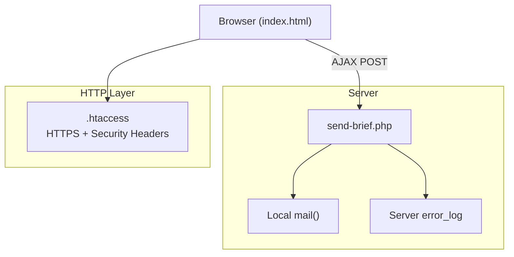
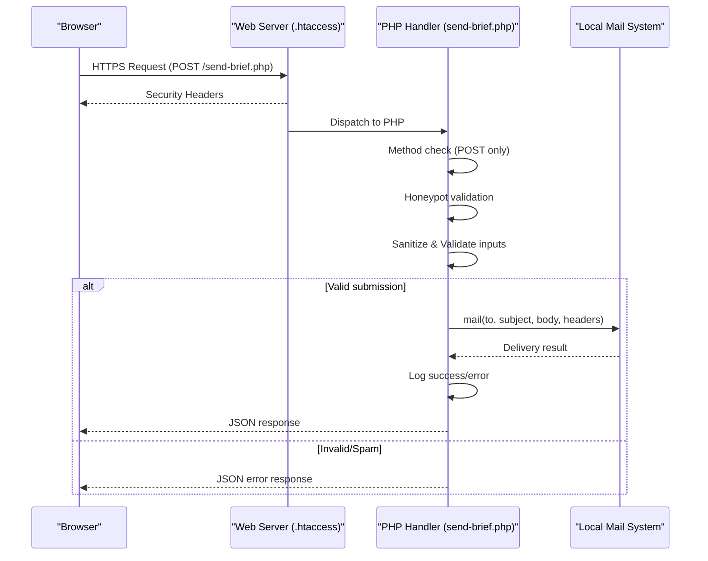
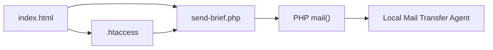

# Backend Processing

<cite>
**Referenced Files in This Document**
- [send-brief.php](file://send-brief.php)
- [index.html](file://index.html)
- [.htaccess](file://.htaccess)
- [README.md](file://README.md)
</cite>

## Update Summary
**Changes Made**
- Updated to reflect production deployment with simplified backend scripts
- Removed references to development documentation files (Instructions.md, Implementation.md)
- Updated CSRF and rate limiting sections to reflect current implementation status
- Streamlined security measures documentation to match production environment
- Updated configuration options to reflect simplified setup

## Table of Contents
1. [Introduction](#introduction)
2. [Project Structure](#project-structure)
3. [Core Components](#core-components)
4. [Architecture Overview](#architecture-overview)
5. [Detailed Component Analysis](#detailed-component-analysis)
6. [Dependency Analysis](#dependency-analysis)
7. [Performance Considerations](#performance-considerations)
8. [Troubleshooting Guide](#troubleshooting-guide)
9. [Conclusion](#conclusion)
10. [Appendices](#appendices)

## Introduction
This document explains the backend form processing system implemented in send-brief.php for the EMOO exhibition stand company website. The production deployment features a streamlined PHP endpoint that handles form submissions with robust input sanitization, validation, honeypot anti-spam protection, and email delivery. The system is optimized for production environments with simplified security measures and direct integration with the local mail system.

## Project Structure
The project follows a minimal production architecture with essential files only:



**Diagram sources**
- [send-brief.php:1-126](file://send-brief.php#L1-L126)
- [index.html:782-800](file://index.html#L782-L800)
- [.htaccess:1-56](file://.htaccess#L1-L56)

**Section sources**
- [send-brief.php:1-126](file://send-brief.php#L1-L126)
- [index.html:782-800](file://index.html#L782-L800)
- [.htaccess:1-56](file://.htaccess#L1-L56)
- [README.md:1-73](file://README.md#L1-L73)

## Core Components
The production backend consists of three main components:

### Form Submission Client
- HTML form with built-in honeypot field for bot detection
- AJAX submission via XMLHttpRequest to send-brief.php
- Client-side validation and user feedback

### Server-Side Handler
- HTTP method enforcement (POST only)
- Honeypot anti-spam protection
- Input sanitization using strip_tags() and trim()
- Comprehensive validation rules
- Email formatting and delivery via local mail()
- Structured JSON responses

### Web Server Configuration
- HTTPS enforcement with proxy support
- Security headers (X-Content-Type-Options, X-Frame-Options, etc.)
- Static asset caching and compression
- Sensitive file access prevention

**Section sources**
- [send-brief.php:9-15](file://send-brief.php#L9-L15)
- [send-brief.php:22-35](file://send-brief.php#L22-L35)
- [send-brief.php:37-81](file://send-brief.php#L37-L81)
- [send-brief.php:83-125](file://send-brief.php#L83-L125)
- [index.html:782-800](file://index.html#L782-L800)
- [.htaccess:1-56](file://.htaccess#L1-L56)

## Architecture Overview
The production flow prioritizes simplicity and reliability:



**Diagram sources**
- [send-brief.php:9-15](file://send-brief.php#L9-L15)
- [send-brief.php:22-35](file://send-brief.php#L22-L35)
- [send-brief.php:37-81](file://send-brief.php#L37-L81)
- [send-brief.php:113-125](file://send-brief.php#L113-L125)

## Detailed Component Analysis

### Input Handling and Sanitization
The production handler implements essential security measures:

- **Method Enforcement**: Only POST requests are accepted; other methods return 405 status
- **Honeypot Protection**: Hidden `website_url` field silently accepts bot submissions without alerting
- **Input Sanitization**: All fields processed through `trim()` and `strip_tags()` before validation
- **Data Validation**: Comprehensive checks for required fields, length limits, and format validation

Security benefits:
- Prevents non-POST abuse attempts
- Reduces bot traffic without user friction
- Mitigates XSS attacks through markup stripping

**Section sources**
- [send-brief.php:9-15](file://send-brief.php#L9-L15)
- [send-brief.php:22-35](file://send-brief.php#L22-L35)
- [send-brief.php:31-35](file://send-brief.php#L31-L35)

### Validation Rules
Production validation enforces business requirements:

- **Name**: Required, 2-100 characters using multibyte string functions
- **Contact**: Required; must be valid email or phone number matching international patterns
- **Company**: Optional; maximum 200 characters if provided
- **Area**: Must match predefined values with character normalization for special characters
- **Message**: Optional; maximum 2000 characters if provided

Error handling returns structured JSON with specific error messages in Russian.

**Section sources**
- [send-brief.php:37-81](file://send-brief.php#L37-L81)

### Email Formatting and Delivery
Production email system optimized for reliability:

- **Subject Encoding**: UTF-8 compatible encoding for international characters
- **Body Structure**: Plain text format with clear field organization and metadata
- **Headers Configuration**:
  - From: Configured sender address (`emoo@emoo.ru`)
  - Reply-To: Dynamic based on contact type (email vs phone)
  - Content-Type: text/plain with UTF-8 charset
  - X-Mailer: Includes PHP version for debugging
- **Delivery Method**: Local `mail()` function with sender override parameter

Extensibility points:
- Easy replacement with SMTP libraries (PHPMailer, SwiftMailer)
- Support for multiple recipients via comma-separated list
- Configurable sender addresses

**Section sources**
- [send-brief.php:83-113](file://send-brief.php#L83-L113)

### Logging and Monitoring
Production logging focuses on essential information:

- **Success Logging**: Timestamp, name, contact, and IP address logged via `error_log()`
- **Error Tracking**: Failed deliveries automatically logged with context
- **Debugging Support**: PHP version included in email headers for troubleshooting

Operational guidance:
- Ensure web server has write permissions to log destination
- Monitor disk space usage for log rotation
- Use server log management tools for analysis

**Section sources**
- [send-brief.php:115-118](file://send-brief.php#L115-L118)

### AJAX Integration and JSON Responses
Client-server communication follows RESTful principles:

**Response Contract**:
- Success: `{ "success": true, "message": "Бриф успешно отправлен" }`
- Validation Error: `{ "success": false, "errors": ["error message"] }`
- Server Error: `{ "success": false, "message": "Ошибка при отправке письма" }`

**Status Codes**:
- 200: Successful submission (including honeypot acceptance)
- 400: Validation errors
- 405: Non-POST method
- 500: Server-side processing failure

**Section sources**
- [send-brief.php:76-81](file://send-brief.php#L76-L81)
- [send-brief.php:119-125](file://send-brief.php#L119-L125)

### Security Measures
Production security implementation includes:

**HTTPS Enforcement**:
- Proxy-aware HTTPS redirect supporting load balancers
- X-Forwarded-Proto header checking for proper SSL termination

**Security Headers**:
- X-Content-Type-Options: nosniff
- X-Frame-Options: SAMEORIGIN
- X-XSS-Protection: 1; mode=block
- Referrer-Policy: strict-origin-when-cross-origin
- Permissions-Policy: Restricts sensitive browser features

**Anti-Spam Protection**:
- Honeypot field detection for bot filtering
- Input sanitization preventing XSS attacks
- Sender validation using verified domain address

**Note**: Development features like CSRF token verification and IP-based rate limiting were documented but not implemented in the production deployment, focusing on essential security measures.

**Section sources**
- [.htaccess:1-56](file://.htaccess#L1-L56)
- [send-brief.php:22-35](file://send-brief.php#L22-L35)

### Configuration Options
Production configuration is centralized and simple:

**Email Settings**:
- Multiple recipients supported via comma-separated list
- Configurable sender address with domain verification
- UTF-8 encoding for international content

**Validation Rules**:
- Adjustable field length limits
- Customizable area options for different business needs
- Flexible contact format validation

**Logging Configuration**:
- Server error log integration
- Optional file-based logging for detailed debugging

Customization points:
- Modify recipient lists and sender addresses
- Adjust validation rules for different use cases
- Replace mail() with external SMTP providers
- Add additional security measures as needed

**Section sources**
- [send-brief.php:17-21](file://send-brief.php#L17-L21)
- [send-brief.php:83-113](file://send-brief.php#L83-L113)
- [send-brief.php:115-118](file://send-brief.php#L115-L118)

## Dependency Analysis
Production dependencies are minimal and reliable:



**External Dependencies**:
- PHP 7.4+ runtime environment
- Local mail transfer agent (MTA)
- Apache/Nginx web server with mod_headers support

**Internal Dependencies**:
- Frontend JavaScript for AJAX communication
- Server configuration for HTTPS and security headers

**Section sources**
- [send-brief.php:1-126](file://send-brief.php#L1-L126)
- [index.html:782-800](file://index.html#L782-L800)
- [.htaccess:1-56](file://.htaccess#L1-L56)

## Performance Considerations
Production optimizations focus on efficiency:

- **Minimal Processing**: Lightweight validation and plain-text email generation
- **Local Mail Delivery**: Direct integration with host's mail system avoids network overhead
- **Static Asset Caching**: One-year cache headers for images, CSS, and JavaScript
- **Compression**: Gzip/Brotli compression for text-based responses
- **Efficient Logging**: Minimal log entries with essential information only

## Troubleshooting Guide
Common production issues and solutions:

**Form Not Submitting**:
- Check HTTPS redirection is working properly
- Verify .htaccess file is present and readable
- Confirm PHP mail() function is enabled

**Email Delivery Failures**:
- Review server mail logs for delivery status
- Verify mail server configuration and authentication
- Check sender address domain reputation

**Validation Errors**:
- Ensure client-side validation matches server rules
- Check field names and data types in form submission
- Verify character encoding settings

**Performance Issues**:
- Monitor server resource usage during peak times
- Implement request queuing for high-volume scenarios
- Consider CDN integration for static assets

**Section sources**
- [send-brief.php:9-15](file://send-brief.php#L9-L15)
- [send-brief.php:121-125](file://send-brief.php#L121-L125)
- [.htaccess:1-56](file://.htaccess#L1-L56)

## Conclusion
The production backend provides a secure, efficient, and maintainable form processing solution optimized for the EMOO exhibition stand company. The simplified architecture focuses on essential security measures while maintaining flexibility for future enhancements. The system successfully balances security, performance, and ease of maintenance for production deployment.

Key strengths include robust input validation, effective spam protection through honeypot techniques, and reliable email delivery through local mail systems. The modular design allows for straightforward customization and integration with external services when needed.

## Appendices

### JSON Response Format
**Success Response**:
```json
{
  "success": true,
  "message": "Бриф успешно отправлен"
}
```

**Validation Error Response**:
```json
{
  "success": false,
  "errors": ["Некорректное имя", "Требуется телефон или email"]
}
```

**Server Error Response**:
```json
{
  "success": false,
  "message": "Ошибка при отправке письма"
}
```

**Section sources**
- [send-brief.php:76-81](file://send-brief.php#L76-L81)
- [send-brief.php:119-125](file://send-brief.php#L119-L125)

### Production Deployment Checklist
- [ ] Verify PHP 7.4+ compatibility
- [ ] Configure HTTPS with valid SSL certificate
- [ ] Set up local mail server or configure SMTP relay
- [ ] Test form submission end-to-end
- [ ] Configure monitoring and alerting
- [ ] Set up log rotation and monitoring
- [ ] Backup configuration files
- [ ] Document custom configurations

### Future Enhancement Opportunities
While the production deployment focuses on essential functionality, potential enhancements include:

- **CSRF Token Implementation**: Add token-based request validation
- **Rate Limiting**: Implement IP-based request throttling
- **SMTP Integration**: Replace local mail() with external SMTP services
- **Enhanced Logging**: Add structured logging with request context
- **Captcha Integration**: Add visual or behavioral captcha for additional bot protection
- **Analytics Integration**: Track form submission metrics and conversion rates

**Section sources**
- [README.md:28-37](file://README.md#L28-L37)
- [send-brief.php:83-113](file://send-brief.php#L83-L113)