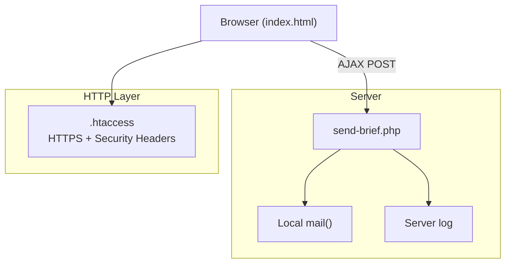
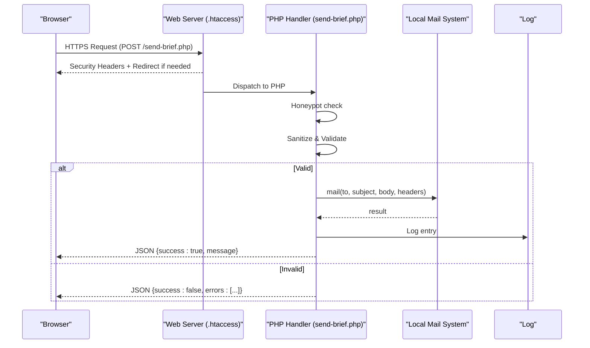
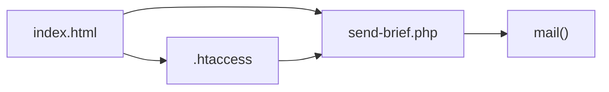

# Backend Processing

<cite>
**Referenced Files in This Document**
- [send-brief.php](file://send-brief.php)
- [index.html](file://index.html)
- [.htaccess](file://.htaccess)
- [README.md](file://README.md)
</cite>

## Table of Contents
1. [Introduction](#introduction)
2. [Project Structure](#project-structure)
3. [Core Components](#core-components)
4. [Architecture Overview](#architecture-overview)
5. [Detailed Component Analysis](#detailed-component-analysis)
6. [Dependency Analysis](#dependency-analysis)
7. [Performance Considerations](#performance-considerations)
8. [Troubleshooting Guide](#troubleshooting-guide)
9. [Conclusion](#conclusion)
10. [Appendices](#appendices)

## Introduction
This document explains the backend form processing system implemented in send-brief.php. It covers input sanitization and validation, CSRF token verification (as documented), rate limiting protection (as documented), email formatting and delivery, security measures including honeypot anti-spam protection, IP-based request throttling (as documented), and data sanitization techniques. It also documents the JSON response format for AJAX requests, error handling strategies, configuration options for email settings, logging capabilities, and customization points to extend functionality while maintaining security best practices.

## Project Structure
The project is a minimal site with an HTML form that submits via AJAX to a PHP endpoint. The PHP script processes the form, validates inputs, formats and sends an email, and returns a structured JSON response. Security headers and HTTPS enforcement are configured at the server level.

**Diagram sources**
- [send-brief.php:1-126](file://send-brief.php#L1-L126)
- [index.html:1009-1067](file://index.html#L1009-L1067)
- [.htaccess:1-53](file://.htaccess#L1-L53)

**Section sources**
- [send-brief.php:1-126](file://send-brief.php#L1-L126)
- [index.html:1009-1067](file://index.html#L1009-L1067)
- [.htaccess:1-53](file://.htaccess#L1-L53)
- [README.md:1-73](file://README.md#L1-L73)

## Core Components
- Form submission client: index.html constructs a FormData payload and posts it to send-brief.php via XMLHttpRequest.
- Server-side handler: send-brief.php enforces HTTP method, applies honeypot anti-spam checks, sanitizes inputs, validates fields, builds email content, sends mail, logs activity, and returns JSON.
- Web server configuration: .htaccess forces HTTPS and sets security headers; robots.txt disallows crawling of sensitive endpoints.

Key responsibilities:
- Input sanitization: trimming and stripping tags from all user inputs.
- Validation: enforcing length limits, required fields, allowed values, and contact format (email or phone).
- Email assembly: subject encoding, body composition, headers including From and Reply-To, and charset.
- Delivery: using local mail() with sender override.
- Response: consistent JSON structure with success flag, message, and optional errors array.

**Section sources**
- [send-brief.php:9-15](file://send-brief.php#L9-L15)
- [send-brief.php:22-35](file://send-brief.php#L22-L35)
- [send-brief.php:37-81](file://send-brief.php#L37-L81)
- [send-brief.php:83-125](file://send-brief.php#L83-L125)
- [index.html:1009-1067](file://index.html#L1009-L1067)
- [.htaccess:1-21](file://.htaccess#L1-L21)

## Architecture Overview
The flow begins with the browser submitting the form via AJAX. The server enforces HTTPS and security headers before the request reaches the PHP script. The script performs anti-bot checks, sanitizes and validates inputs, composes an email, sends it locally, logs the event, and responds with JSON.

**Diagram sources**
- [send-brief.php:9-15](file://send-brief.php#L9-L15)
- [send-brief.php:22-35](file://send-brief.php#L22-L35)
- [send-brief.php:37-81](file://send-brief.php#L37-L81)
- [send-brief.php:83-125](file://send-brief.php#L83-L125)
- [.htaccess:1-21](file://.htaccess#L1-L21)

## Detailed Component Analysis

### Input Handling and Sanitization
- Method enforcement: Only POST is accepted; other methods receive a 405 status and a JSON error.
- Honeypot field: A hidden field (website_url) is ignored by legitimate users; if present, the request is silently accepted to avoid alerting bots.
- Sanitization: All inputs are trimmed and stripped of HTML tags before use.

Security benefits:
- Prevents non-POST abuse.
- Reduces bot traffic without friction.
- Mitigates XSS by removing markup from user inputs.

**Section sources**
- [send-brief.php:9-15](file://send-brief.php#L9-L15)
- [send-brief.php:22-35](file://send-brief.php#L22-L35)

### Validation Rules
- Name: Required, between defined min/max lengths.
- Contact: Required; must be a valid email or match a phone pattern.
- Company: Optional; if provided, must not exceed max length.
- Area: Must be one of the predefined values; normalization handles variant characters.
- Message: Optional; if provided, must not exceed max length.

Error responses:
- On validation failure, returns 400 with a JSON object containing an errors array.

**Section sources**
- [send-brief.php:37-81](file://send-brief.php#L37-L81)

### Email Formatting and Delivery
- Subject: Encoded for UTF-8 compatibility.
- Body: Plain text with structured fields and metadata (date, IP).
- Headers:
  - From: Configured sender address.
  - Reply-To: Set to the user’s email if valid; otherwise falls back to the configured sender.
  - Content-Type: text/plain with UTF-8 charset.
  - X-Mailer: Includes PHP version for diagnostics.
- Delivery: Uses local mail() with a sender override parameter.

Extensibility:
- To integrate with external SMTP services, replace the mail() call with an SMTP library (e.g., PHPMailer, SwiftMailer) while preserving sanitized inputs and headers.

**Section sources**
- [send-brief.php:83-113](file://send-brief.php#L83-L113)

### Logging
- On successful send, a log entry is written with timestamp, name, contact, and IP.
- For debugging, additional file-based logging can be enabled per documentation notes.

Operational guidance:
- Ensure the web server has write permissions to the log destination.
- Rotate logs regularly to prevent disk exhaustion.

**Section sources**
- [send-brief.php:115-118](file://send-brief.php#L115-L118)
- [README.md:59-62](file://README.md#L59-L62)

### AJAX Integration and JSON Responses
Client behavior:
- The form collects data into FormData and posts to send-brief.php.
- On success (status 2xx and success flag true), the UI shows a confirmation state.
- On failure, errors are displayed; network errors are handled separately.

Response contract:
- Success: { "success": true, "message": "..." }
- Validation error: { "success": false, "errors": ["...", "..."] }
- Server error: { "success": false, "message": "..." }

Notes:
- The client expects application/json responses; ensure no extra output precedes JSON.

**Section sources**
- [index.html:1009-1067](file://index.html#L1009-L1067)
- [send-brief.php:76-81](file://send-brief.php#L76-L81)
- [send-brief.php:119-125](file://send-brief.php#L119-L125)

### Security Measures
- HTTPS enforcement and security headers:
  - Forces HTTPS with a permanent redirect.
  - Sets security headers to mitigate common vulnerabilities.
- Honeypot anti-spam:
  - Hidden field detection to silently accept bot submissions.
- Data sanitization:
  - Trimming and tag stripping on all inputs.
- Sender validation:
  - Uses a verified domain address in From header to improve deliverability.

Documentation references:
- CSRF token mechanism and rate limiting are described in the project README. Note: the current send-brief.php does not implement CSRF token verification or IP-based rate limiting directly; these are documented features to be integrated alongside this endpoint.

**Section sources**
- [.htaccess:1-21](file://.htaccess#L1-L21)
- [send-brief.php:22-35](file://send-brief.php#L22-L35)
- [send-brief.php:31-35](file://send-brief.php#L31-L35)
- [README.md:28-37](file://README.md#L28-L37)

### Configuration Options
- Recipients and sender:
  - Multiple recipients supported via comma-separated list.
  - Sender address used in From and as fallback Reply-To.
- Email charset and headers:
  - UTF-8 encoding for subject and body.
  - Explicit Content-Type and X-Mailer headers.
- Logging:
  - Server log entries on success; optional file logging per documentation.

Customization points:
- Adjust recipient list and sender address.
- Modify validation rules and allowed area values.
- Replace mail() with an SMTP provider integration.
- Add CSRF token verification and IP-based rate limiting as documented.

**Section sources**
- [send-brief.php:17-21](file://send-brief.php#L17-L21)
- [send-brief.php:83-113](file://send-brief.php#L83-L113)
- [send-brief.php:115-118](file://send-brief.php#L115-L118)
- [README.md:28-37](file://README.md#L28-L37)

## Dependency Analysis
- Frontend dependency: index.html posts to send-brief.php and interprets JSON responses.
- Server dependency: .htaccess enforces HTTPS and security headers prior to PHP execution.
- Runtime dependency: PHP mail() function and server mail transfer agent.
- External dependencies: None beyond standard PHP functions and server mail infrastructure.

**Diagram sources**
- [index.html:1009-1067](file://index.html#L1009-L1067)
- [send-brief.php:1-126](file://send-brief.php#L1-L126)
- [.htaccess:1-21](file://.htaccess#L1-L21)

**Section sources**
- [index.html:1009-1067](file://index.html#L1009-L1067)
- [send-brief.php:1-126](file://send-brief.php#L1-L126)
- [.htaccess:1-21](file://.htaccess#L1-L21)

## Performance Considerations
- Minimal processing: Lightweight validation and plain-text email generation keep CPU usage low.
- Local mail delivery: Using the host’s local mail system avoids network overhead.
- Compression and caching: .htaccess enables compression and long-term caching for static assets.
- Logging: Keep log volume reasonable; consider rotating logs to avoid I/O bottlenecks.

[No sources needed since this section provides general guidance]

## Troubleshooting Guide
Common issues and resolutions:
- Non-POST requests:
  - Symptom: 405 status with JSON error.
  - Cause: Script only accepts POST.
  - Fix: Ensure the client uses POST.
- Validation failures:
  - Symptom: 400 status with errors array.
  - Cause: Missing or invalid fields.
  - Fix: Update client-side validation to match server rules.
- Email delivery failures:
  - Symptom: 500 status with failure message.
  - Cause: mail() returned false.
  - Fix: Verify mail server configuration and permissions.
- Network errors:
  - Symptom: Client-side network error alert.
  - Cause: Connectivity issues or CORS/server misconfiguration.
  - Fix: Check connectivity and server availability.

Operational tips:
- Enable detailed logging during development.
- Confirm HTTPS redirection and security headers are active.
- Review server mail logs for delivery details.

**Section sources**
- [send-brief.php:9-15](file://send-brief.php#L9-L15)
- [send-brief.php:76-81](file://send-brief.php#L76-L81)
- [send-brief.php:121-125](file://send-brief.php#L121-L125)
- [index.html:1032-1067](file://index.html#L1032-L1067)
- [.htaccess:1-21](file://.htaccess#L1-L21)

## Conclusion
The send-brief.php endpoint provides a secure, validated, and reliable form processing pipeline with robust input sanitization, clear validation rules, and structured JSON responses. It integrates seamlessly with the frontend via AJAX and leverages server-level security through .htaccess. While CSRF token verification and IP-based rate limiting are documented as part of the solution, they are not currently implemented in the endpoint; adding them would further harden the system. The design allows straightforward customization for different email providers and extended logging, enabling scalable and maintainable operations.

[No sources needed since this section summarizes without analyzing specific files]

## Appendices

### JSON Response Format
- Success:
  - Status: 200
  - Body: { "success": true, "message": "..." }
- Validation Error:
  - Status: 400
  - Body: { "success": false, "errors": ["...", "..."] }
- Server Error:
  - Status: 500
  - Body: { "success": false, "message": "..." }

**Section sources**
- [send-brief.php:76-81](file://send-brief.php#L76-L81)
- [send-brief.php:119-125](file://send-brief.php#L119-L125)

### Extending Functionality Safely
- Integrate SMTP:
  - Replace mail() with an SMTP library while preserving sanitized inputs and headers.
  - Maintain UTF-8 encoding and explicit Content-Type.
- Add CSRF verification:
  - Implement token generation and validation as documented; reject requests without valid tokens.
- Add rate limiting:
  - Track requests per IP within a time window; return appropriate errors when exceeded.
- Enhance logging:
  - Include request context (user agent, referrer) and structured log formats for better observability.

**Section sources**
- [README.md:28-37](file://README.md#L28-L37)
- [send-brief.php:83-113](file://send-brief.php#L83-L113)