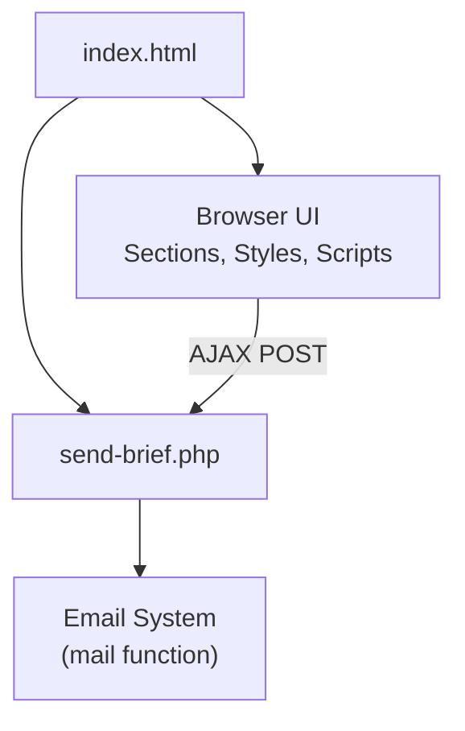
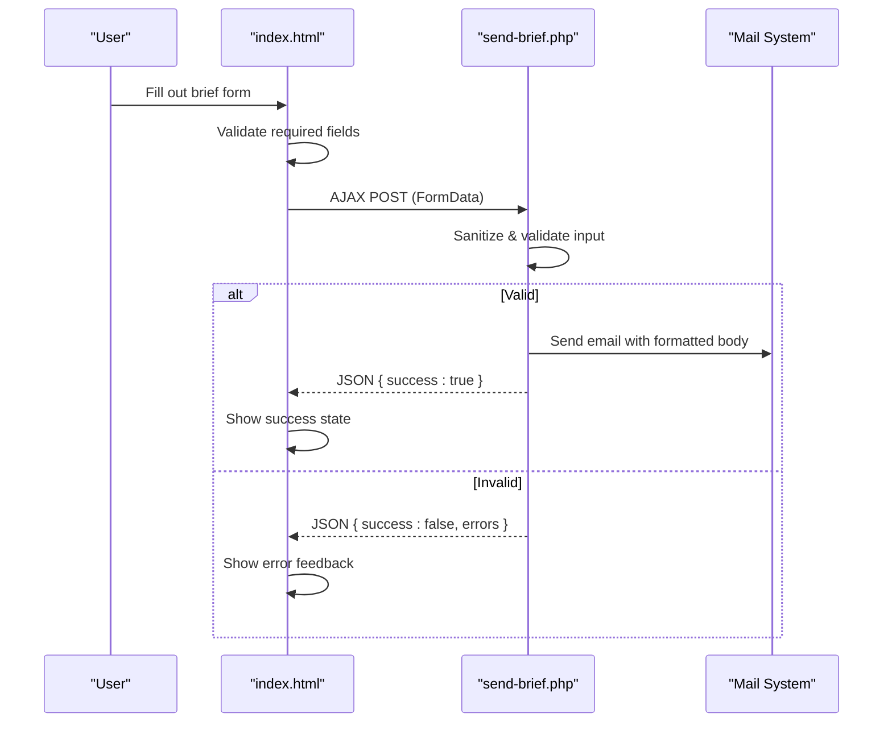
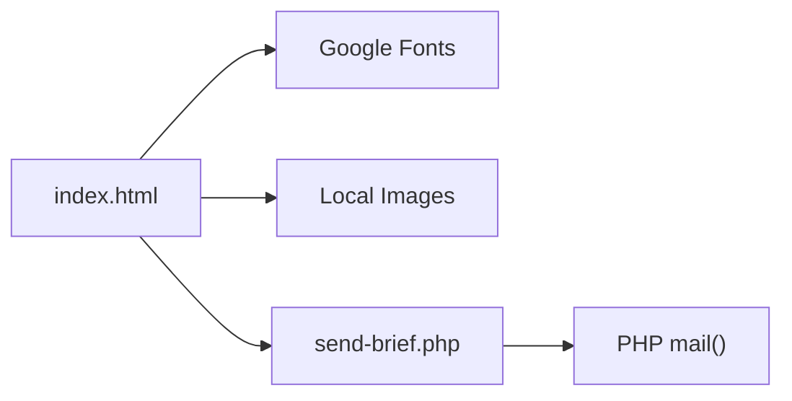

# Customization Guide

<cite>
**Referenced Files in This Document**
- [index.html](file://index.html)
- [send-brief.php](file://send-brief.php)
- [README.md](file://README.md)
</cite>

## Table of Contents
1. [Introduction](#introduction)
2. [Project Structure](#project-structure)
3. [Core Components](#core-components)
4. [Architecture Overview](#architecture-overview)
5. [Detailed Component Analysis](#detailed-component-analysis)
6. [Dependency Analysis](#dependency-analysis)
7. [Performance Considerations](#performance-considerations)
8. [Troubleshooting Guide](#troubleshooting-guide)
9. [Conclusion](#conclusion)
10. [Appendices](#appendices)

## Introduction
This guide explains how to customize the EMOO website to meet specific business needs. It covers content updates (text, images, services, portfolio), styling customization (CSS variables, colors, typography, responsive behavior), form field and validation changes, email template editing, and language content updates. Practical examples and best practices are included to help you maintain consistency and performance while making long-term improvements.

## Project Structure
The site is a single-page HTML application with embedded CSS and JavaScript, plus a PHP handler for form submissions:
- index.html: Main page containing all sections, styles, and client-side logic
- send-brief.php: Server-side handler that validates, sanitizes, and emails brief submissions
- README.md: Setup notes, security measures, and installation guidance

**Diagram sources**
- [index.html:729-1009](file://index.html#L729-L1009)
- [send-brief.php:1-116](file://send-brief.php#L1-L116)

**Section sources**
- [index.html:1-1013](file://index.html#L1-L1013)
- [send-brief.php:1-116](file://send-brief.php#L1-L116)
- [README.md:1-73](file://README.md#L1-L73)

## Core Components
- Content sections: Hero, Services, Formula, Stages, Works, Stats, Contacts, Footer
- Styling system: CSS custom properties (variables) for colors, fonts, lines, and theme tokens
- Language system: Dual-language support (Russian/English) controlled by data attributes and JS
- Form system: Client-side validation and AJAX submission to send-brief.php
- Interactive behaviors: Scroll reveals, active nav tracking, counters, service preview, mobile menu

Key areas to modify:
- Text and media: Edit section text and image paths within index.html
- Colors and typography: Adjust CSS variables in the :root block
- Responsive layout: Modify media queries for breakpoints and component behavior
- Form fields and rules: Update inputs, labels, and validation in both index.html and send-brief.php
- Email content: Customize subject and body in send-brief.php
- Language strings: Update data-en/data-ru attributes across the page

**Section sources**
- [index.html:16-328](file://index.html#L16-L328)
- [index.html:333-819](file://index.html#L333-L819)
- [index.html:823-1013](file://index.html#L823-L1013)
- [send-brief.php:17-116](file://send-brief.php#L17-L116)

## Architecture Overview
The site uses a simple architecture:
- Frontend: Single HTML file with embedded CSS and JS
- Backend: Lightweight PHP script handling form submissions via mail()
- Data flow: User interacts with the form; JS validates and sends data via AJAX; PHP processes and emails results

**Diagram sources**
- [index.html:953-1009](file://index.html#L953-L1009)
- [send-brief.php:29-71](file://send-brief.php#L29-L71)
- [send-brief.php:73-116](file://send-brief.php#L73-L116)

## Detailed Component Analysis

### Content Customization
- Text modifications:
  - Update bilingual text using spans with data-en and data-ru attributes throughout the page
  - Example locations: hero kicker, headings, descriptions, buttons, labels, footer links
- Image updates:
  - Replace image src values for hero, services previews, and works gallery
  - Ensure aspect ratios and alt texts remain descriptive and accessible
- Service descriptions:
  - Edit titles, descriptions, and preview images in the services list
  - Maintain consistent structure for hover effects and previews
- Portfolio additions:
  - Add new work items in the works grid with appropriate classes and aspect ratios
  - Keep captions concise and include location and size where relevant

Practical tips:
- Keep bilingual pairs aligned to avoid mismatched translations
- Use meaningful alt text for accessibility and SEO
- Optimize images for web (size, format) to maintain performance

**Section sources**
- [index.html:372-424](file://index.html#L372-L424)
- [index.html:446-488](file://index.html#L446-L488)
- [index.html:642-672](file://index.html#L642-L672)

### Styling Customization
- CSS variables:
  - Colors: deep, sea, foam, sand, ink, muted, line variants
  - Typography: display, body, mono font families
  - Lines and borders: line and line-light for subtle separators
- Color schemes:
  - Change primary accent color by updating sand-related variables
  - Adjust dark/light contrast by modifying deep and foam values
- Typography changes:
  - Swap font families or weights in the :root block
  - Update sizes and spacing if needed in section styles
- Responsive design adjustments:
  - Modify media queries for breakpoints at 1080px, 900px, 560px
  - Adjust grid layouts, navigation visibility, and spacing per device

Best practices:
- Centralize theme tokens in :root for easy maintenance
- Test changes across devices and screen sizes
- Respect reduced motion preferences for accessibility

**Section sources**
- [index.html:16-328](file://index.html#L16-L328)

### Form Field Modifications
- Adding/removing fields:
  - Insert new input/select/textarea elements inside the form card
  - Provide placeholders and labels in both languages using data-en/data-ru
- Validation rules:
  - Extend client-side checks in the submit handler to include new fields
  - Update server-side validation in send-brief.php to accept and sanitize new inputs
- Error feedback:
  - Style invalid states consistently using border color and messages
  - Ensure accessibility with proper labels and aria attributes when needed

Example steps:
- Add a new field in index.html under the form card
- Update JS validation to check the new field’s value
- In send-brief.php, add sanitization and validation for the new field
- Include the new field in the email body formatting

**Section sources**
- [index.html:728-775](file://index.html#L728-L775)
- [index.html:953-1009](file://index.html#L953-L1009)
- [send-brief.php:29-71](file://send-brief.php#L29-L71)

### Validation Rule Customization
- Client-side:
  - Check required fields and formats before submission
  - Highlight invalid inputs and prevent sending until corrected
- Server-side:
  - Validate presence and format of each field
  - Enforce length limits and allowed values (e.g., area options)
  - Return structured JSON responses for success or errors

Guidelines:
- Mirror validation rules on both frontend and backend for consistency
- Provide clear, user-friendly error messages in both languages
- Log errors appropriately for debugging without exposing sensitive details

**Section sources**
- [index.html:953-1009](file://index.html#L953-L1009)
- [send-brief.php:36-71](file://send-brief.php#L36-L71)

### Email Template Editing
- Subject and body:
  - Customize the email subject line and message body in send-brief.php
  - Include dynamic fields like name, contact, company, area, message, date, IP
- Headers:
  - Set From and Reply-To headers appropriately
  - Ensure UTF-8 encoding for international characters

Tips:
- Keep the email body readable and well-structured
- Avoid including unnecessary or sensitive information
- Test email rendering across clients

**Section sources**
- [send-brief.php:73-100](file://send-brief.php#L73-L100)

### Language Content Updates
- Switching language:
  - Toggle between RU and EN using language buttons
  - The script updates document attributes and content dynamically
- Updating strings:
  - Edit data-en and data-ru attributes for all translatable elements
  - Ensure consistent phrasing and tone across languages
- Default language:
  - Change default language in the script initialization

Best practices:
- Keep translations synchronized to avoid missing content
- Use concise, clear language suitable for UI contexts
- Test language switching thoroughly for all interactive elements

**Section sources**
- [index.html:831-866](file://index.html#L831-L866)

### Extending Functionality
Common extensions:
- Add analytics: Insert tracking scripts in the head or before closing body
- Integrate CRM: Replace mail() with API calls to your CRM platform
- Enhance UX: Add additional animations or micro-interactions carefully
- Security hardening: Implement CSRF tokens and rate limiting as noted in documentation

Implementation approach:
- Keep changes modular and well-commented
- Test integrations in staging before production deployment
- Monitor performance impact of added features

[No sources needed since this section provides general guidance]

## Dependency Analysis
- index.html depends on:
  - Google Fonts for typography
  - Local images for hero, services, and works
  - send-brief.php for form processing
- send-brief.php depends on:
  - PHP environment with mail() enabled
  - Proper server configuration for HTTPS and security headers

**Diagram sources**
- [index.html:7-9](file://index.html#L7-L9)
- [index.html:413-415](file://index.html#L413-L415)
- [index.html:457-483](file://index.html#L457-L483)
- [index.html:653-669](file://index.html#L653-L669)
- [send-brief.php:102-104](file://send-brief.php#L102-L104)

**Section sources**
- [index.html:7-9](file://index.html#L7-L9)
- [send-brief.php:102-104](file://send-brief.php#L102-L104)

## Performance Considerations
- Image optimization:
  - Use modern formats (WebP/AVIF) and compress images
  - Set appropriate dimensions and lazy loading where applicable
- CSS efficiency:
  - Minify and combine styles if necessary
  - Avoid excessive animations on low-power devices
- JavaScript performance:
  - Debounce scroll listeners if adding heavy computations
  - Respect prefers-reduced-motion for accessibility and performance
- Network requests:
  - Preconnect to external domains (fonts) already configured
  - Limit third-party scripts to essential ones

Recommendations:
- Audit assets regularly for size and relevance
- Use browser caching for static resources
- Monitor Core Web Vitals after changes

[No sources needed since this section provides general guidance]

## Troubleshooting Guide
Common issues and resolutions:
- Form not sending:
  - Verify send-brief.php is accessible and PHP is enabled
  - Check server logs for mail() errors
  - Ensure AJAX endpoint URL is correct in index.html
- Validation errors:
  - Confirm client-side and server-side rules match
  - Inspect network tab for response payloads
- Language not switching:
  - Ensure data-en/data-ru attributes exist for all elements
  - Check console for JS errors preventing language updates
- Images not loading:
  - Validate file paths and permissions
  - Check browser dev tools for 404 errors

Debugging steps:
- Open browser console and network panel during form submission
- Temporarily enable verbose logging in send-brief.php for diagnostics
- Test on different browsers and devices to isolate issues

**Section sources**
- [index.html:953-1009](file://index.html#L953-L1009)
- [send-brief.php:10-15](file://send-brief.php#L10-L15)
- [send-brief.php:105-116](file://send-brief.php#L105-L116)

## Conclusion
This guide provides a comprehensive approach to customizing the EMOO website for business needs. By focusing on content, styling, forms, email templates, and language updates, you can tailor the site effectively while maintaining performance and accessibility. Follow best practices for consistency, test changes thoroughly, and leverage the provided diagrams and references to implement modifications confidently.

[No sources needed since this section summarizes without analyzing specific files]

## Appendices

### Quick Reference: Key Modification Points
- Colors and fonts: index.html :root block
- Section text: index.html spans with data-en/data-ru
- Images: index.html img src attributes
- Form fields: index.html form card and send-brief.php validation
- Email content: send-brief.php subject/body formatting
- Language default: index.html script initialization

**Section sources**
- [index.html:16-328](file://index.html#L16-L328)
- [index.html:728-775](file://index.html#L728-L775)
- [send-brief.php:73-100](file://send-brief.php#L73-L100)