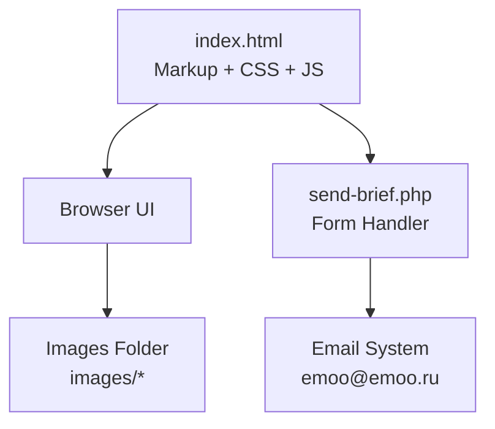
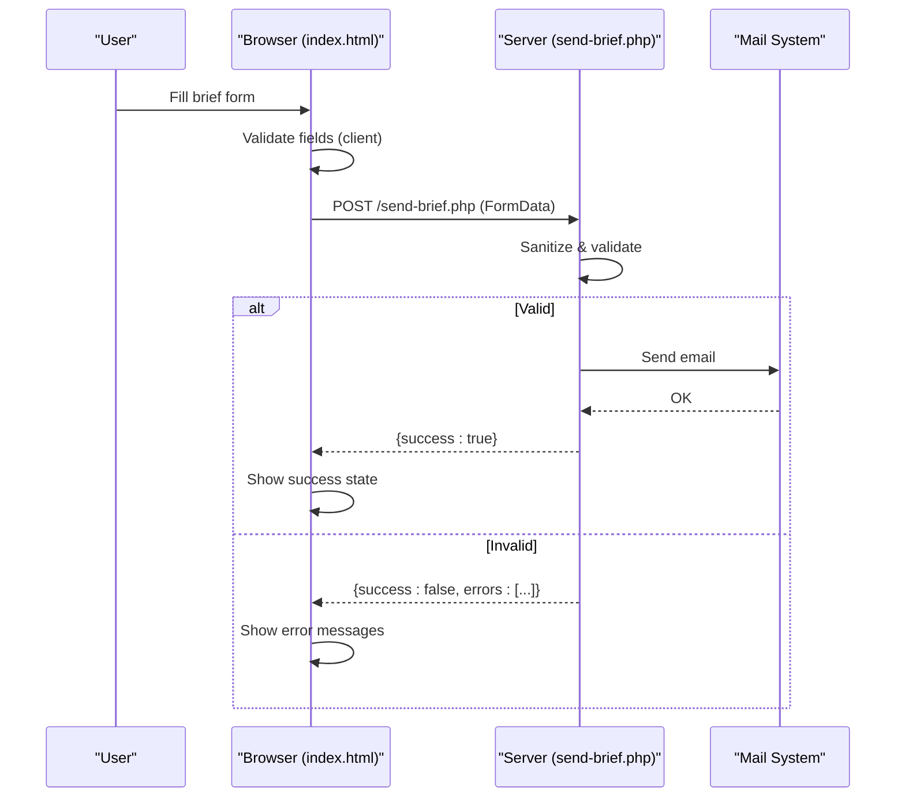
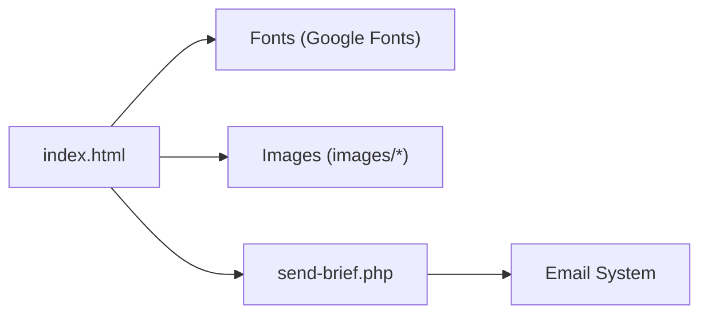

# Customization Guide

<cite>
**Referenced Files in This Document**
- [index.html](file://index.html)
- [send-brief.php](file://send-brief.php)
- [README.md](file://README.md)
</cite>

## Table of Contents
1. [Introduction](#introduction)
2. [Project Structure](#project-structure)
3. [Core Components](#core-components)
4. [Architecture Overview](#architecture-overview)
5. [Detailed Component Analysis](#detailed-component-analysis)
6. [Dependency Analysis](#dependency-analysis)
7. [Performance Considerations](#performance-considerations)
8. [Troubleshooting Guide](#troubleshooting-guide)
9. [Conclusion](#conclusion)
10. [Appendices](#appendices)

## Introduction
This guide explains how to customize the EMOO exhibition company website for your business needs. It covers adding new languages, editing content sections (hero, services, portfolio), styling via CSS custom properties and theme variables, updating contact form fields and email templates, integrating analytics/tracking scripts, maintaining responsive design, optimizing images/assets, and updating SEO meta tags. The goal is to extend functionality while preserving the site’s clean architecture and performance characteristics.

## Project Structure
The project is a single-page site with all styles and scripts embedded in one HTML file and a PHP handler for form submissions:
- index.html: Contains markup, inline CSS, and inline JavaScript for language switching, animations, navigation, and form handling.
- send-brief.php: Server-side script that validates, sanitizes, and emails brief submissions.
- README.md: Installation and security notes for the form handler.

**Diagram sources**
- [index.html:1-1082](file://index.html#L1-L1082)
- [send-brief.php:1-126](file://send-brief.php#L1-L126)

**Section sources**
- [index.html:1-1082](file://index.html#L1-L1082)
- [send-brief.php:1-126](file://send-brief.php#L1-L126)
- [README.md:1-73](file://README.md#L1-L73)

## Core Components
- Language system: Uses data attributes on elements to switch between Russian and English at runtime.
- Content sections: Hero, Services, Formula, Process stages, Works (portfolio), Stats, Contacts, Footer.
- Styling: CSS custom properties define colors, fonts, and visual tokens used across components.
- Form: Client-side validation and AJAX submission to send-brief.php; success state shown inline.
- Analytics/Tracking: Ready to add third-party scripts in the head or before closing body tag.

**Section sources**
- [index.html:68-381](file://index.html#L68-L381)
- [index.html:879-1080](file://index.html#L879-L1080)
- [send-brief.php:1-126](file://send-brief.php#L1-L126)

## Architecture Overview
The site follows a simple client-server model:
- The browser renders index.html, applies CSS variables for theming, and runs inline JS for interactivity.
- When users submit the brief form, the client sends an AJAX POST to send-brief.php.
- The server validates input, constructs an email, and returns a JSON response indicating success or errors.

**Diagram sources**
- [index.html:1009-1079](file://index.html#L1009-L1079)
- [send-brief.php:9-126](file://send-brief.php#L9-L126)

## Detailed Component Analysis

### Adding New Languages
- Add a new language code (e.g., fr) and update default language selection if needed.
- For each translatable element, add a data attribute for the new language (data-fr).
- Update the language switcher buttons to include the new language option.
- Ensure the title and any dynamic text are updated when the language changes.

Key areas to update:
- Language buttons: header, mobile nav, footer.
- Elements with data-en/data-ru: kicker, headings, paragraphs, labels, placeholders, options.
- Title updates in the language switch logic.

Where to look:
- Language toggle buttons and initial language setup.
- Text elements with bilingual spans and data attributes.
- Dynamic title assignment during language change.

**Section sources**
- [index.html:398-421](file://index.html#L398-L421)
- [index.html:429-462](file://index.html#L429-L462)
- [index.html:879-922](file://index.html#L879-L922)

### Modifying Content Sections
- Hero: Edit kicker, headline lines, lead paragraph, button texts, and metadata items. Use bilingual spans for RU/EN.
- Services: Update service titles, descriptions, and preview image paths per row.
- Portfolio (Works): Uncomment and edit the works section to add or remove projects, captions, and images.
- Stats: Adjust counters by changing numeric targets and labels.
- Contact: Update contact links, locations, and form field labels.

Guidelines:
- Keep bilingual structure intact (span.en and span.ru).
- Maintain aspect ratios for images to avoid layout shifts.
- Preserve semantic markup and aria attributes for accessibility.

**Section sources**
- [index.html:425-477](file://index.html#L425-L477)
- [index.html:499-541](file://index.html#L499-L541)
- [index.html:695-725](file://index.html#L695-L725)
- [index.html:742-754](file://index.html#L742-L754)
- [index.html:756-831](file://index.html#L756-L831)

### Styling Customization via CSS Custom Properties and Theme Variables
- Colors: Modify deep, sea, sand, ink, foam, line, and other color tokens in :root.
- Typography: Change font families and weights for display, body, and mono fonts.
- Spacing and layout: Adjust container widths, section padding, grid gaps, and media queries for responsiveness.
- Effects: Tweak noise overlay, marquee speed, hover transitions, and reduced motion behavior.

Best practices:
- Keep variable names consistent and grouped logically.
- Test contrast and readability after color changes.
- Verify responsive breakpoints still work as expected.

**Section sources**
- [index.html:68-381](file://index.html#L68-L381)

### Updating Contact Form Fields
To add or modify fields:
- Add corresponding inputs/selects in the form markup with appropriate name attributes.
- If you add new fields, update server-side validation and email template in send-brief.php to include them.
- Optionally add client-side validation rules in the inline script.

Important considerations:
- Keep honeypot field hidden to reduce spam.
- Ensure labels and placeholders are bilingual where applicable.
- Maintain accessible labeling and focus states.

**Section sources**
- [index.html:781-827](file://index.html#L781-L827)
- [send-brief.php:30-74](file://send-brief.php#L30-L74)
- [send-brief.php:83-113](file://send-brief.php#L83-L113)

### Modifying Email Templates
- Subject and body construction occur in send-brief.php.
- Update subject prefix, message formatting, and additional fields included in the email body.
- You can add headers like CC/BCC or adjust Reply-To behavior based on contact type.

Security and deliverability:
- Keep From address aligned with domain to improve deliverability.
- Sanitize and validate inputs to prevent injection and malformed emails.

**Section sources**
- [send-brief.php:17-21](file://send-brief.php#L17-L21)
- [send-brief.php:83-113](file://send-brief.php#L83-L113)

### Integrating Additional Analytics or Tracking Scripts
- Insert tracking snippets (Google Analytics, Meta Pixel, etc.) in the <head> or just before </body>.
- Respect user privacy and regional compliance (GDPR, CCPA) by implementing consent management if required.
- Avoid blocking critical rendering; use async or defer where possible.

Recommendations:
- Place analytics after core styles and scripts to minimize impact on first paint.
- Use event listeners to track interactions (form submissions, language switches) without altering existing logic.

[No sources needed since this section provides general guidance]

### Maintaining Responsive Design When Adding New Content
- Follow existing grid patterns and aspect ratio classes for images.
- Use clamp() for fluid typography and ensure text remains readable on small screens.
- Test new content across breakpoints defined in media queries.
- Prefer semantic HTML and avoid fixed widths that break layouts.

**Section sources**
- [index.html:339-380](file://index.html#L339-L380)

### Optimizing Images and Assets
- Use modern formats (WebP/AVIF) with fallbacks.
- Set appropriate dimensions and loading="lazy" for below-the-fold images.
- Compress images and maintain aspect ratios to prevent layout shifts.
- Provide descriptive alt text for accessibility and SEO.

**Section sources**
- [index.html:466-468](file://index.html#L466-L468)
- [index.html:705-723](file://index.html#L705-L723)

### Updating SEO Meta Tags
- Update page title, description, keywords, author, robots, canonical URL.
- Configure Open Graph and Twitter Card metadata for social sharing.
- Add hreflang tags for multi-language support and structured data for organization and website.

Where to find:
- Head section with meta tags, OG/Twitter cards, hreflang, and schema.org JSON-LD.

**Section sources**
- [index.html:3-67](file://index.html#L3-L67)

## Dependency Analysis
- index.html depends on:
  - Inline CSS for styling and responsive behavior.
  - Inline JavaScript for language switching, scroll-based animations, active navigation, counters, and form submission.
  - External fonts loaded from Google Fonts.
- send-brief.php depends on:
  - PHP mail() function enabled on the hosting environment.
  - Proper server configuration for HTTPS and security headers.

**Diagram sources**
- [index.html:33-38](file://index.html#L33-L38)
- [index.html:466-468](file://index.html#L466-L468)
- [index.html:1009-1079](file://index.html#L1009-L1079)
- [send-brief.php:112-125](file://send-brief.php#L112-L125)

**Section sources**
- [index.html:33-38](file://index.html#L33-L38)
- [index.html:1009-1079](file://index.html#L1009-L1079)
- [send-brief.php:112-125](file://send-brief.php#L112-L125)

## Performance Considerations
- Minimize render-blocking resources: keep essential CSS inline but consider moving non-critical styles to external files if the site grows.
- Defer or async-load analytics and non-essential scripts.
- Optimize images and use lazy loading for offscreen content.
- Respect prefers-reduced-motion to improve accessibility and performance on low-power devices.

[No sources needed since this section provides general guidance]

## Troubleshooting Guide
Common issues and resolutions:
- Form not sending:
  - Check network tab for errors; ensure send-brief.php is reachable and returns valid JSON.
  - Verify PHP mail() is enabled and configured on the host.
  - Confirm HTTPS is enforced and no mixed-content warnings block requests.
- Validation errors:
  - Review client-side validation and server-side checks in send-brief.php for required fields and formats.
- Language not switching:
  - Ensure all translatable elements have data-en and data-ru attributes.
  - Verify language buttons call setLang with correct language codes.
- Layout shifts:
  - Check image aspect ratios and container sizes; ensure responsive breakpoints are respected.

**Section sources**
- [index.html:1009-1079](file://index.html#L1009-L1079)
- [send-brief.php:37-81](file://send-brief.php#L37-L81)
- [README.md:28-38](file://README.md#L28-L38)

## Conclusion
You can confidently customize the EMOO website by extending its bilingual content model, leveraging CSS custom properties for theming, and using the provided form handler for reliable submissions. Follow the guidelines above to maintain responsiveness, optimize assets, and enhance SEO while keeping the site performant and accessible.

[No sources needed since this section summarizes without analyzing specific files]

## Appendices

### Quick Reference: Where to Edit Key Areas
- Hero text and CTAs: [index.html:425-477](file://index.html#L425-L477)
- Services list: [index.html:499-541](file://index.html#L499-L541)
- Portfolio (works): [index.html:695-725](file://index.html#L695-L725)
- Stats counters: [index.html:742-754](file://index.html#L742-L754)
- Contact form fields: [index.html:781-827](file://index.html#L781-L827)
- Email template: [send-brief.php:83-113](file://send-brief.php#L83-L113)
- SEO meta tags: [index.html:3-67](file://index.html#L3-L67)
- Theme variables: [index.html:68-76](file://index.html#L68-L76)

[No sources needed since this section lists references already cited above]