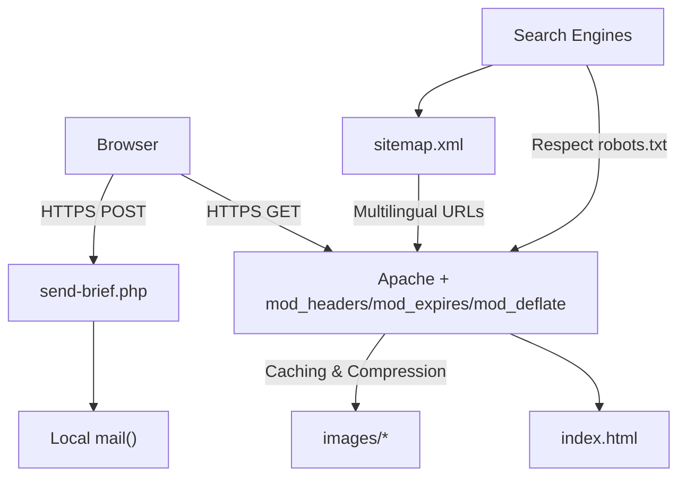
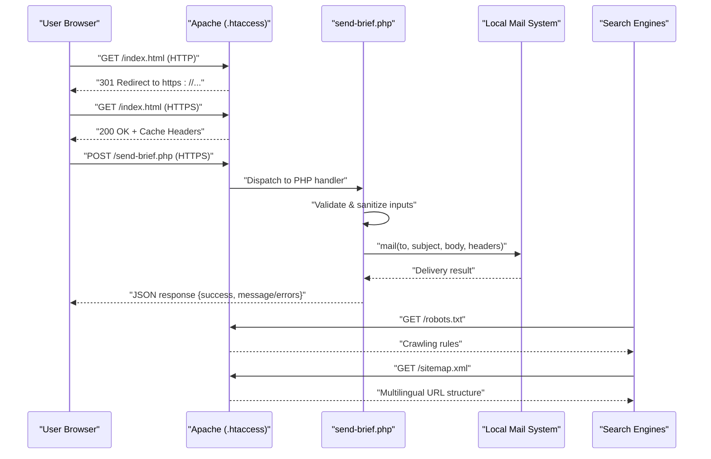
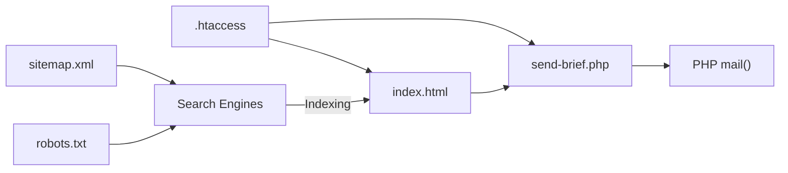

# Deployment Checklist

<cite>
**Referenced Files in This Document**
- [README.md](file://README.md)
- [.htaccess](file://.htaccess)
- [index.html](file://index.html)
- [send-brief.php](file://send-brief.php)
- [robots.txt](file://robots.txt)
- [sitemap.xml](file://sitemap.xml)
</cite>

## Update Summary
**Changes Made**
- Updated robots.txt section to reflect new search engine crawling control configuration
- Enhanced sitemap.xml documentation with multilingual SEO support details
- Expanded .htaccess production configuration coverage including proxy-safe HTTPS and security headers
- Added comprehensive SEO and crawling verification procedures
- Updated performance monitoring to include caching and compression effectiveness

## Table of Contents
1. [Introduction](#introduction)
2. [Project Structure](#project-structure)
3. [Core Components](#core-components)
4. [Architecture Overview](#architecture-overview)
5. [Detailed Component Analysis](#detailed-component-analysis)
6. [Dependency Analysis](#dependency-analysis)
7. [Performance Considerations](#performance-considerations)
8. [Troubleshooting Guide](#troubleshooting-guide)
9. [Conclusion](#conclusion)
10. [Appendices](#appendices)

## Introduction
This deployment checklist ensures the EMOO exhibition company website is securely and reliably deployed to production. It covers server requirements, SSL/HTTPS configuration, file upload and permissions, domain setup, testing procedures (form submission, email delivery, cross-browser compatibility, mobile responsiveness), post-deployment verification, performance monitoring, backups, and security hardening. The guidance is based on the project's configuration and scripts included in the repository, including the newly added SEO and crawling control features.

## Project Structure
The site is a lightweight static frontend with a single PHP form handler for brief submissions. Key files:
- index.html: Main page with embedded styles and a contact/brief form that posts to send-brief.php
- send-brief.php: Server-side handler that validates input, sanitizes data, and sends emails via local mail()
- .htaccess: Enforces HTTPS, sets security headers, enables caching and compression, and blocks direct access to sensitive files
- robots.txt: Instructs crawlers to avoid backend endpoints and points to sitemap
- sitemap.xml: Declares canonical URLs and language alternates for multilingual SEO
- README.md: Installation notes, requirements, and security measures

**Diagram sources**
- [.htaccess:1-56](file://.htaccess#L1-L56)
- [index.html:11-29](file://index.html#L11-L29)
- [send-brief.php:1-126](file://send-brief.php#L1-L126)
- [robots.txt:1-11](file://robots.txt#L1-L11)
- [sitemap.xml:1-14](file://sitemap.xml#L1-L14)

**Section sources**
- [README.md:21-73](file://README.md#L21-L73)
- [.htaccess:1-56](file://.htaccess#L1-L56)
- [index.html:11-29](file://index.html#L11-L29)
- [send-brief.php:1-126](file://send-brief.php#L1-L126)
- [robots.txt:1-11](file://robots.txt#L1-L11)
- [sitemap.xml:1-14](file://sitemap.xml#L1-L14)

## Core Components
- Frontend (index.html): Responsive layout, multilingual support, and a brief form posting to send-brief.php
- Form Handler (send-brief.php): Validates and sanitizes inputs, enforces rate limiting via honeypot, constructs email, and returns JSON responses
- Security and Performance (.htaccess): Forces HTTPS with proxy support, sets security headers, enables browser caching and gzip compression, restricts access to sensitive files
- SEO and Crawling (robots.txt, sitemap.xml): Controls crawler behavior, prevents indexing of backend endpoints, declares canonical URLs with language alternates for multilingual support

**Section sources**
- [index.html:11-29](file://index.html#L11-L29)
- [send-brief.php:1-126](file://send-brief.php#L1-L126)
- [.htaccess:1-56](file://.htaccess#L1-L56)
- [robots.txt:1-11](file://robots.txt#L1-L11)
- [sitemap.xml:1-14](file://sitemap.xml#L1-L14)

## Architecture Overview
The request flow emphasizes secure, fast, and reliable delivery with enhanced SEO capabilities:
- All HTTP requests are redirected to HTTPS with proxy-aware configuration
- Static assets benefit from long-term caching and compression
- The form endpoint validates and sanitizes inputs before sending emails via the host's local mail system
- Crawler directives prevent indexing of backend endpoints while optimizing search engine visibility
- Multilingual content is properly declared through hreflang tags and sitemap alternates

**Diagram sources**
- [.htaccess:4-11](file://.htaccess#L4-L11)
- [send-brief.php:9-15](file://send-brief.php#L9-L15)
- [send-brief.php:30-81](file://send-brief.php#L30-L81)
- [send-brief.php:83-125](file://send-brief.php#L83-L125)
- [robots.txt:4-11](file://robots.txt#L4-L11)
- [sitemap.xml:4-12](file://sitemap.xml#L4-L12)

## Detailed Component Analysis

### Server Requirements Verification
- PHP 7.4+ required; ensure PHP version meets or exceeds this requirement
- Apache must have:
  - mod_headers enabled (for security headers)
  - mod_expires enabled (for cache control)
  - mod_deflate enabled (for compression)
- Ensure PHP mail() function is available and configured on the hosting environment
- Confirm sessions are supported by PHP (default on most hosts)

Verification steps:
- Check PHP version via phpinfo or CLI
- Verify Apache modules are loaded
- Test mail() with a simple script if needed
- Confirm .htaccess rules are processed by Apache

**Updated** Enhanced .htaccess now includes proxy-safe HTTPS redirection with X-Forwarded-Proto support for load balancers and reverse proxies.

**Section sources**
- [README.md:21-27](file://README.md#L21-L27)
- [.htaccess:1-56](file://.htaccess#L1-L56)

### SSL Certificate Installation and HTTPS Configuration
- Install a valid SSL certificate for your domain
- Ensure Apache serves HTTPS and .htaccess forces redirect from HTTP to HTTPS
- Validate that all resources load over HTTPS to avoid mixed content warnings

Validation:
- Access http://yourdomain.com and confirm 301 redirect to https://yourdomain.com
- Inspect security headers set by .htaccess
- Use browser dev tools to verify no insecure resource loads

**Updated** HTTPS configuration now includes proxy-aware redirection that works correctly behind load balancers and reverse proxies using X-Forwarded-Proto header detection.

**Section sources**
- [.htaccess:4-11](file://.htaccess#L4-L11)
- [.htaccess:17-24](file://.htaccess#L17-L24)

### File Upload Procedures and Permissions
- Upload all site files to the web root directory where index.html resides
- Set file permissions to 644 for files (e.g., index.html, send-brief.php)
- Set directory permissions to 755 for folders (e.g., images/)
- Ensure send-brief.php is executable by the web server process

Post-upload checks:
- Confirm .htaccess is present and readable
- Verify robots.txt and sitemap.xml are accessible at their expected paths
- Test write permissions only if you enable logging to files (not recommended without strict controls)

**Section sources**
- [README.md:41-43](file://README.md#L41-L43)
- [.htaccess:48-52](file://.htaccess#L48-L52)

### Domain Configuration Steps
- Point your domain DNS to the hosting server
- Configure virtual host to serve the correct document root
- Ensure the domain resolves to HTTPS and honors .htaccess rules
- Update any hardcoded references if necessary (the site uses relative paths and canonical HTTPS URLs)

Validation:
- Confirm canonical URL and hreflang tags in index.html
- Verify sitemap.xml lists the correct domain and alternates
- Check robots.txt disallows sensitive endpoints

**Updated** Domain configuration now includes verification of multilingual SEO elements including hreflang tags and sitemap alternates for proper international targeting.

**Section sources**
- [index.html:11-29](file://index.html#L11-L29)
- [sitemap.xml:1-14](file://sitemap.xml#L1-L14)
- [robots.txt:4-11](file://robots.txt#L4-L11)

### Testing Procedures

#### Form Submission Validation
- Open the brief form in index.html and submit via HTTPS
- Expected behaviors:
  - Valid submission returns a success JSON response
  - Invalid fields return error messages in JSON
  - Bot submissions via honeypot field are silently accepted without sending email
- Verify server logs for successful deliveries or errors

**Section sources**
- [index.html:782-800](file://index.html#L782-L800)
- [send-brief.php:22-28](file://send-brief.php#L22-L28)
- [send-brief.php:30-81](file://send-brief.php#L30-L81)
- [send-brief.php:112-125](file://send-brief.php#L112-L125)

#### Email Delivery Verification
- Confirm recipients include the intended addresses configured in send-brief.php
- Check that Reply-To is set appropriately when the contact is an email
- Validate that emails arrive in the inbox and not spam folder
- If using a shared host, ensure local mail() delivers correctly

**Section sources**
- [send-brief.php:17-20](file://send-brief.php#L17-L20)
- [send-brief.php:99-110](file://send-brief.php#L99-L110)
- [send-brief.php:112-125](file://send-brief.php#L112-L125)

#### Cross-Browser Compatibility Checks
- Test on latest versions of Chrome, Firefox, Safari, Edge
- Validate responsive layouts and interactions across devices
- Ensure animations respect reduced motion preferences

**Section sources**
- [index.html:339-380](file://index.html#L339-L380)

#### Mobile Responsiveness Testing
- Use device emulators and real devices to test breakpoints
- Confirm navigation collapses to burger menu on smaller screens
- Verify form usability and touch targets on mobile

**Section sources**
- [index.html:350-370](file://index.html#L350-L370)

#### SEO and Crawling Verification
- Verify robots.txt is accessible and contains correct directives
- Confirm sitemap.xml is properly formatted with multilingual support
- Test that search engines can crawl public pages but not backend endpoints
- Validate hreflang tags and canonical URLs in HTML source
- Check Google Search Console for indexing status

**New Section** Added comprehensive SEO verification procedures to ensure proper search engine visibility and crawling behavior.

**Section sources**
- [robots.txt:1-11](file://robots.txt#L1-L11)
- [sitemap.xml:1-14](file://sitemap.xml#L1-L14)
- [index.html:11-29](file://index.html#L11-L29)

### Post-Deployment Verification
- Confirm HTTPS redirect works globally
- Validate security headers are present (X-Content-Type-Options, X-Frame-Options, etc.)
- Check caching headers for static assets
- Ensure robots.txt prevents crawling of backend endpoints
- Verify sitemap.xml accessibility and correctness
- Perform end-to-end form submission and email receipt tests
- Test multilingual functionality and hreflang tag implementation

**Updated** Post-deployment verification now includes comprehensive SEO and crawling checks to ensure optimal search engine visibility and proper multilingual content handling.

**Section sources**
- [.htaccess:4-24](file://.htaccess#L4-L24)
- [.htaccess:26-46](file://.htaccess#L26-L46)
- [robots.txt:4-11](file://robots.txt#L4-L11)
- [sitemap.xml:1-14](file://sitemap.xml#L1-L14)

### Performance Monitoring Setup
- Enable server-side access and error logs for Apache and PHP
- Monitor uptime and response times using a monitoring service
- Track core web vitals via analytics or performance tools
- Review caching effectiveness and compression ratios
- Monitor bandwidth usage and optimize asset delivery

**Updated** Performance monitoring now includes specific checks for caching effectiveness and compression ratios to validate .htaccess performance optimizations.

[No sources needed since this section provides general guidance]

### Backup Procedures
- Regularly back up:
  - Web root files (index.html, send-brief.php, .htaccess, assets)
  - Database if used elsewhere on the host
  - Configuration files and logs
- Store backups offsite and test restoration periodically
- Version control your codebase and configuration changes

[No sources needed since this section provides general guidance]

## Dependency Analysis
- index.html depends on send-brief.php for form processing
- send-brief.php depends on PHP mail() and server environment
- .htaccess affects all requests (redirects, headers, caching, compression)
- robots.txt influences search engine behavior and crawling
- sitemap.xml informs search engines about canonical URLs and language variants

**Diagram sources**
- [index.html:782-800](file://index.html#L782-L800)
- [send-brief.php:1-126](file://send-brief.php#L1-L126)
- [.htaccess:1-56](file://.htaccess#L1-L56)
- [robots.txt:1-11](file://robots.txt#L1-L11)
- [sitemap.xml:1-14](file://sitemap.xml#L1-L14)

**Section sources**
- [index.html:782-800](file://index.html#L782-L800)
- [send-brief.php:1-126](file://send-brief.php#L1-L126)
- [.htaccess:1-56](file://.htaccess#L1-L56)
- [robots.txt:1-11](file://robots.txt#L1-L11)
- [sitemap.xml:1-14](file://sitemap.xml#L1-L14)

## Performance Considerations
- Leverage browser caching via Expires headers for static assets (1 year cache duration)
- Enable gzip compression for text-based resources (HTML, CSS, JavaScript, JSON)
- Keep payloads minimal; defer non-critical JS/CSS if added later
- Monitor server CPU and memory usage under load
- Consider CDN for global image delivery if traffic increases
- Optimize multilingual content delivery with proper hreflang implementation

**Updated** Performance considerations now include specific caching durations and compression types configured in .htaccess, plus multilingual content optimization strategies.

[No sources needed since this section provides general guidance]

## Troubleshooting Guide

Common issues and resolutions:
- 403 Forbidden when accessing site by HTTP: Ensure HTTPS is enforced and .htaccess is active
- Form does not send email: Verify PHP mail() is enabled and configured; check server logs for errors
- Mixed content warnings: Confirm all assets load over HTTPS; update any absolute URLs
- Caching issues: Clear browser cache or add cache-busting parameters after updates
- Robots blocking: Ensure robots.txt allows crawling of public pages while blocking sensitive endpoints
- SEO indexing problems: Verify sitemap.xml is accessible and robots.txt doesn't block critical pages
- Proxy-related HTTPS loops: Check X-Forwarded-Proto configuration if behind load balancer

**Updated** Troubleshooting guide now includes SEO-specific issues and proxy-related HTTPS loop prevention.

Security checks:
- Confirm security headers are applied
- Validate that backend endpoints are not indexed
- Restrict direct access to sensitive files via .htaccess
- Verify robots.txt properly blocks sensitive endpoints

**Section sources**
- [.htaccess:4-11](file://.htaccess#L4-L11)
- [.htaccess:17-24](file://.htaccess#L17-L24)
- [.htaccess:48-52](file://.htaccess#L48-L52)
- [robots.txt:4-11](file://robots.txt#L4-L11)
- [send-brief.php:9-15](file://send-brief.php#L9-L15)
- [send-brief.php:112-125](file://send-brief.php#L112-L125)

## Conclusion
By following this checklist, you will deploy the EMOO website with strong security, optimal performance, reliable form/email functionality, and enhanced SEO capabilities. The updated configuration includes robust crawling control, multilingual SEO support, and production-ready server optimizations. Ensure all prerequisites are met, validate each step thoroughly, and maintain ongoing monitoring and backups to keep the site stable and secure in production.

[No sources needed since this section summarizes without analyzing specific files]

## Appendices

### Pre-Launch Security Checklist
- Force HTTPS and enforce security headers
- Disable unnecessary PHP features and functions
- Sanitize and validate all user inputs
- Restrict access to sensitive files and directories
- Ensure robots.txt blocks backend endpoints
- Verify SSL certificate validity and auto-renewal
- Test proxy-aware HTTPS redirection if behind load balancer

**Updated** Security checklist now includes proxy-aware HTTPS redirection testing for environments behind load balancers or reverse proxies.

**Section sources**
- [.htaccess:4-11](file://.htaccess#L4-L11)
- [.htaccess:17-24](file://.htaccess#L17-L24)
- [robots.txt:4-11](file://robots.txt#L4-L11)
- [send-brief.php:30-81](file://send-brief.php#L30-L81)

### Post-Launch Maintenance Tasks
- Monitor server logs and application errors
- Review performance metrics and optimize as needed
- Update dependencies and security patches regularly
- Back up files and configurations frequently
- Test form and email delivery periodically
- Monitor SEO performance and crawling status
- Verify multilingual content indexing across search engines

**Updated** Maintenance tasks now include SEO monitoring and multilingual content verification to ensure ongoing search engine visibility.

[No sources needed since this section provides general guidance]

### SEO Configuration Reference
- robots.txt: Controls crawler access to sensitive endpoints
- sitemap.xml: Declares canonical URLs and language alternates
- hreflang tags: Implement proper multilingual content signaling
- Canonical URLs: Prevent duplicate content issues
- Structured data: Enhance search result appearance

**New Section** Added comprehensive SEO configuration reference covering all search engine optimization elements in the deployment.

**Section sources**
- [robots.txt:1-11](file://robots.txt#L1-L11)
- [sitemap.xml:1-14](file://sitemap.xml#L1-L14)
- [index.html:11-29](file://index.html#L11-L29)