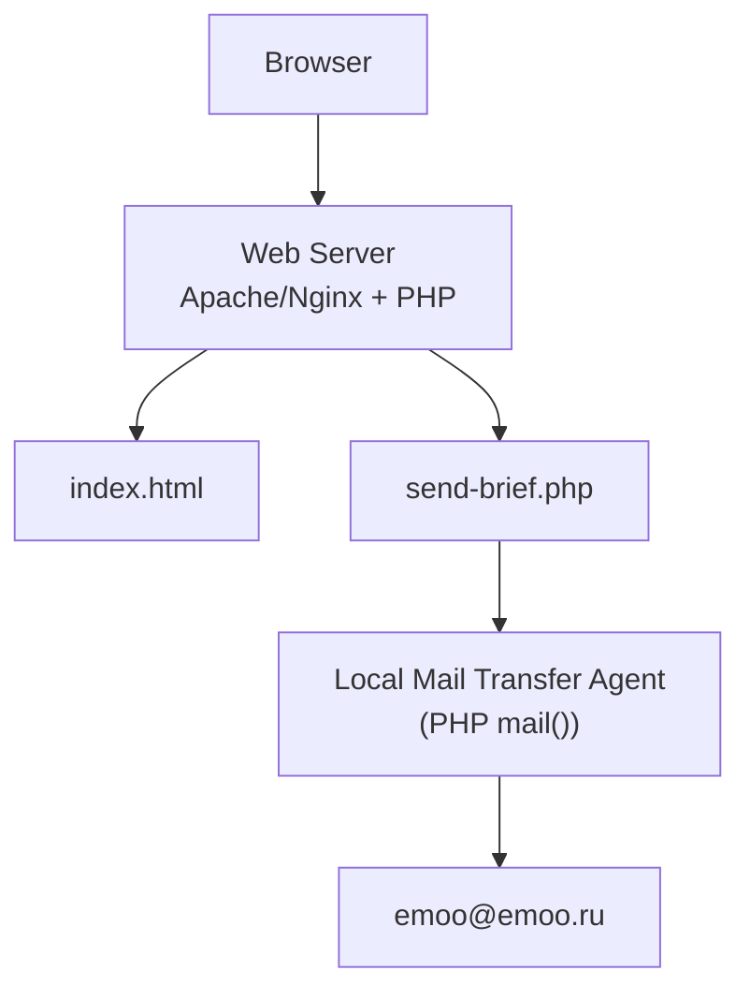
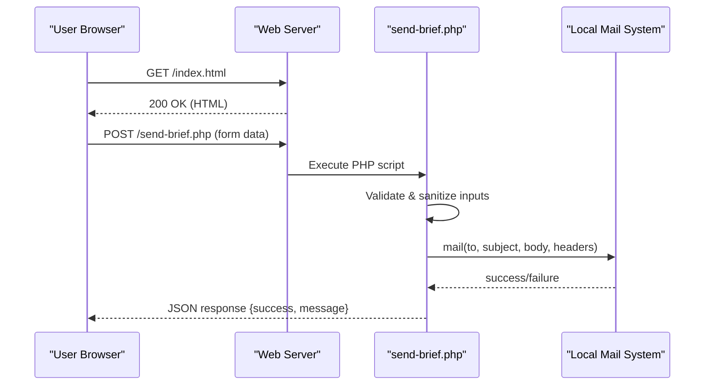
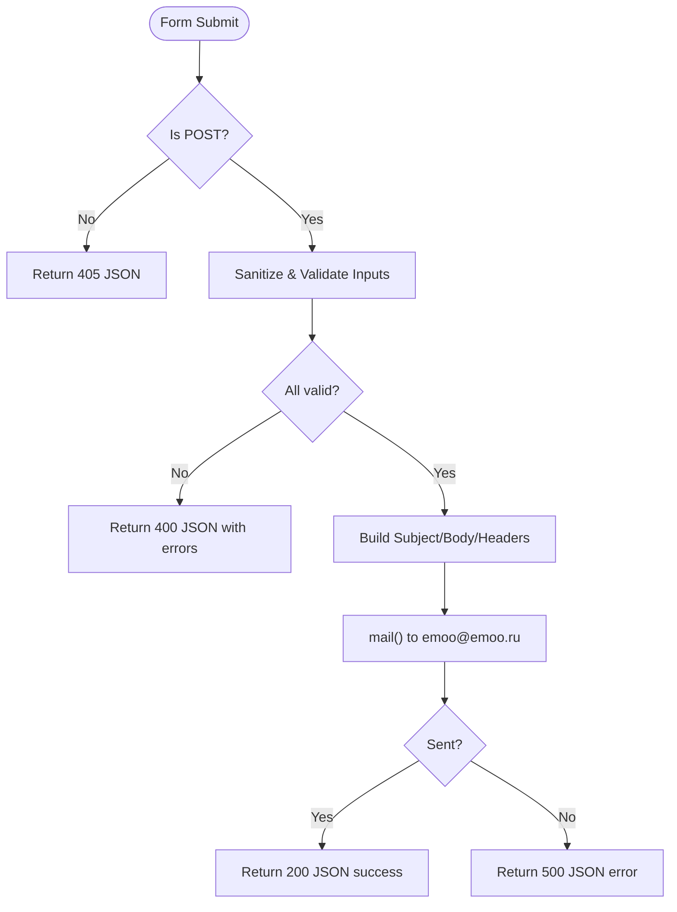
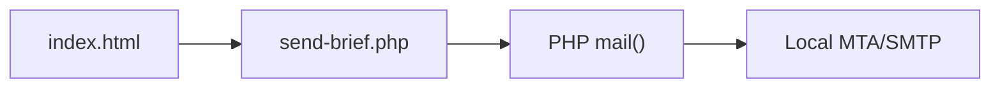

# Deployment Instructions

<cite>
**Referenced Files in This Document**
- [README.md](file://README.md)
- [index.html](file://index.html)
- [send-brief.php](file://send-brief.php)
- [.gitignore](file://.gitignore)
</cite>

## Table of Contents
1. [Introduction](#introduction)
2. [Project Structure](#project-structure)
3. [Core Components](#core-components)
4. [Architecture Overview](#architecture-overview)
5. [Detailed Component Analysis](#detailed-component-analysis)
6. [Dependency Analysis](#dependency-analysis)
7. [Performance Considerations](#performance-considerations)
8. [Troubleshooting Guide](#troubleshooting-guide)
9. [Conclusion](#conclusion)
10. [Appendices](#appendices)

## Introduction
This document provides step-by-step deployment instructions for hosting the EMOO website on shared hosting and cloud platforms. It covers server requirements, file upload procedures, domain configuration, SSL setup, .htaccess HTTPS enforcement, mail server configuration, permissions, post-deployment verification, monitoring, common issues, migration between providers, and platform-specific guidance. The site includes a static HTML page with an integrated form that submits to a PHP handler to send emails via the local mail() function.

## Project Structure
The repository contains:
- A single-page website (index.html) with embedded styles and scripts
- A PHP form handler (send-brief.php) that processes submissions and sends emails using the host’s local mail() function
- Documentation (README.md) describing installation steps, security measures, and troubleshooting
- A minimal .gitignore

**Diagram sources**
- [index.html:728-765](file://index.html#L728-L765)
- [send-brief.php:1-116](file://send-brief.php#L1-L116)

**Section sources**
- [README.md:9-27](file://README.md#L9-L27)
- [index.html:728-765](file://index.html#L728-L765)
- [send-brief.php:1-116](file://send-brief.php#L1-L116)

## Core Components
- index.html: Main landing page with a contact/brief form that POSTs to send-brief.php.
- send-brief.php: Validates input, sanitizes data, constructs email content, sets headers, and uses PHP mail() to deliver messages locally.
- README.md: Installation checklist, security notes, .htaccess guidance, and FAQs.

Key responsibilities:
- Form submission flow from client to server-side handler
- Input validation and sanitization
- Local email delivery via mail()
- Security protections (HTTPS enforcement via .htaccess, CSRF token generation referenced in docs, rate limiting concept)

**Section sources**
- [index.html:728-765](file://index.html#L728-L765)
- [send-brief.php:1-116](file://send-brief.php#L1-L116)
- [README.md:21-37](file://README.md#L21-L37)

## Architecture Overview
The deployment architecture is straightforward:
- Static assets served by the web server
- PHP processing for form handling
- Local MTA integration through PHP mail()
- Optional .htaccess rules to enforce HTTPS

**Diagram sources**
- [index.html:728-765](file://index.html#L728-L765)
- [send-brief.php:10-115](file://send-brief.php#L10-L115)

## Detailed Component Analysis

### Form Submission Flow
- The form in index.html posts to send-brief.php.
- send-brief.php enforces POST-only requests, validates fields, sanitizes inputs, builds email content, sets proper headers, and calls mail().
- Responses are returned as JSON for client-side handling.

**Diagram sources**
- [send-brief.php:10-115](file://send-brief.php#L10-L115)

**Section sources**
- [index.html:728-765](file://index.html#L728-L765)
- [send-brief.php:10-115](file://send-brief.php#L10-L115)

### Security Notes
- HTTPS enforcement via .htaccess (referenced in documentation).
- CSRF token generator mentioned in documentation (get-csrf-token.php), though not present in this repository snapshot.
- Honeypot field to deter bots.
- Input sanitization and strict validation.
- Rate limiting concept described in documentation.

**Section sources**
- [README.md:28-37](file://README.md#L28-L37)
- [send-brief.php:21-27](file://send-brief.php#L21-L27)
- [send-brief.php:29-71](file://send-brief.php#L29-L71)

## Dependency Analysis
- index.html depends on send-brief.php for form submission.
- send-brief.php depends on:
  - PHP runtime (version 7.4+ per documentation)
  - PHP mail() function enabled
  - Local mail server or SMTP relay configured on the host
  - Optional .htaccess for HTTPS redirection
- No external libraries or frameworks are used.

**Diagram sources**
- [index.html:728-765](file://index.html#L728-L765)
- [send-brief.php:1-116](file://send-brief.php#L1-L116)

**Section sources**
- [README.md:21-27](file://README.md#L21-L27)
- [send-brief.php:1-116](file://send-brief.php#L1-L116)

## Performance Considerations
- Keep index.html lightweight; avoid large inline assets if possible.
- Ensure PHP execution time limits are sufficient for mail() operations.
- Use caching at the CDN or edge layer for static assets if needed.
- Monitor mail queue performance and delivery latency.

[No sources needed since this section provides general guidance]

## Troubleshooting Guide
Common issues and resolutions:
- 403 Forbidden when accessing HTTP:
  - Ensure HTTPS is enforced via .htaccess and access via https://.
- Email not received:
  - Verify PHP mail() is enabled and local MTA is configured.
  - Check spam/junk folders.
  - Confirm sender address matches domain hosting environment.
- Validation errors:
  - Review required fields and formats in the form and server-side validation.
- Incorrect method error:
  - Ensure form POSTs to send-brief.php and not GET.

Verification steps:
- Open the site via HTTPS and submit the form.
- Confirm JSON success response and receipt of email at emoo@emoo.ru.
- Inspect server logs for errors and mail delivery status.

**Section sources**
- [README.md:48-73](file://README.md#L48-L73)
- [send-brief.php:10-15](file://send-brief.php#L10-L15)
- [send-brief.php:66-71](file://send-brief.php#L66-L71)
- [send-brief.php:105-115](file://send-brief.php#L105-L115)

## Conclusion
Deploying the EMOO website involves uploading static files and the PHP handler to a PHP-enabled host, ensuring HTTPS and mail functionality, and verifying end-to-end form delivery. Follow the platform-specific sections below for detailed steps across popular hosting services and cloud platforms.

[No sources needed since this section summarizes without analyzing specific files]

## Appendices

### Server Requirements
- PHP version: 7.4+ (per project documentation)
- PHP mail() function enabled
- Sessions support (standard)
- SSL certificate active for HTTPS
- Local mail server or SMTP relay configured on the host

**Section sources**
- [README.md:21-27](file://README.md#L21-L27)

### File Upload Procedures (FTP or Control Panel)
- Place all files in the same directory where your site root or subdirectory resides (e.g., public_html or docs).
- Required files:
  - index.html
  - send-brief.php
  - .htaccess (for HTTPS enforcement)
  - get-csrf-token.php (if you implement CSRF protection as referenced in documentation)
- Set permissions:
  - PHP files: 644
  - Directories: 755

**Section sources**
- [README.md:9-20](file://README.md#L9-L20)
- [README.md:41-43](file://README.md#L41-L43)

### Domain Configuration
- Point your domain DNS to the hosting provider’s nameservers or IP.
- Ensure the correct document root points to the folder containing index.html and send-brief.php.
- If hosting under a subdirectory (e.g., /docs), update links accordingly.

[No sources needed since this section provides general guidance]

### SSL Certificate Installation
- Install an SSL certificate via your hosting control panel (Let’s Encrypt, cPanel, Plesk, etc.).
- After installation, ensure .htaccess enforces HTTPS redirection.

**Section sources**
- [README.md:21-25](file://README.md#L21-L25)
- [README.md:48-57](file://README.md#L48-L57)

### .htaccess Configuration for HTTPS Enforcement
- Add or merge the following rules into your .htaccess to redirect HTTP to HTTPS:
  - Enable rewrite engine
  - Redirect non-HTTPS requests to HTTPS
- If you already have .htaccess, prepend these rules carefully to avoid conflicts.

**Section sources**
- [README.md:48-57](file://README.md#L48-L57)

### Mail Server Configuration
- Ensure PHP mail() is enabled on your host.
- Configure local MTA or SMTP relay according to your provider’s guidelines.
- Use a sender address matching your domain to improve deliverability.

**Section sources**
- [README.md:21-27](file://README.md#L21-L27)
- [send-brief.php:17-20](file://send-brief.php#L17-L20)
- [send-brief.php:89-103](file://send-brief.php#L89-L103)

### Post-Deployment Verification
- Access the site via HTTPS.
- Submit the brief form and confirm:
  - JSON success response
  - Email received at emoo@emoo.ru
- Test error scenarios:
  - Invalid inputs return appropriate validation errors
  - Non-POST methods return method-not-allowed

**Section sources**
- [index.html:728-765](file://index.html#L728-L765)
- [send-brief.php:10-15](file://send-brief.php#L10-L15)
- [send-brief.php:66-71](file://send-brief.php#L66-L71)
- [send-brief.php:105-115](file://send-brief.php#L105-L115)

### Monitoring Procedures
- Enable server error logs and PHP error logging.
- Monitor mail queue and delivery logs provided by your host.
- Optionally log successful submissions for auditing (ensure privacy compliance).

[No sources needed since this section provides general guidance]

### Common Deployment Scenarios
- Shared Hosting (cPanel/Plesk):
  - Upload files via FTP or File Manager
  - Install SSL via One-Click Let’s Encrypt
  - Ensure PHP version meets requirements
  - Verify mail() works with local MTA
- Cloud Platforms (AWS Lightsail, DigitalOcean, Linode):
  - Install Apache/Nginx + PHP + MySQL (if needed)
  - Configure virtual host to point to your site directory
  - Install and enable PHP mail() or configure SMTP relay
  - Set up firewall and SSL certificates (Certbot/Let’s Encrypt)
- Managed WordPress Hosts:
  - Use custom plugin or theme to serve static HTML and PHP handler
  - Ensure PHP mail() or SMTP settings are configured per provider

[No sources needed since this section provides general guidance]

### Migration Between Providers
- Export current files and database (if any).
- Provision new hosting environment with PHP 7.4+ and mail() enabled.
- Upload files and configure domain/DNS.
- Install SSL and set up .htaccess for HTTPS.
- Test form submission and email delivery thoroughly.
- Switch DNS records to point to the new host.
- Monitor logs during transition.

[No sources needed since this section provides general guidance]

### Platform-Specific Guidance
- cPanel:
  - Use “Setup SSL/TLS” to install certificates
  - Use “File Manager” to upload files
  - Check “Select PHP Version” to ensure 7.4+
  - Verify “Configure PHP mailer” settings
- Plesk:
  - Use “Websites & Domains” > “SSL/TLS Settings”
  - Use “File Manager” for uploads
  - Adjust PHP settings and extensions
  - Configure outbound mail settings
- AWS Lightsail:
  - Launch instance with LAMP stack
  - Deploy files to /var/www/html
  - Configure Apache virtual host
  - Install Certbot for SSL
  - Ensure PHP mail() or SMTP relay is configured
- DigitalOcean:
  - Create Droplet with LAMP or LEMP
  - Deploy files to /var/www/html or /var/www/example.com
  - Configure Nginx/Apache and PHP-FPM
  - Use Certbot for SSL
  - Configure mail relay if needed

[No sources needed since this section provides general guidance]