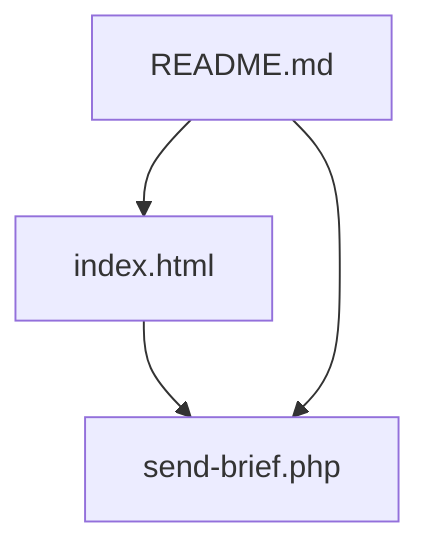
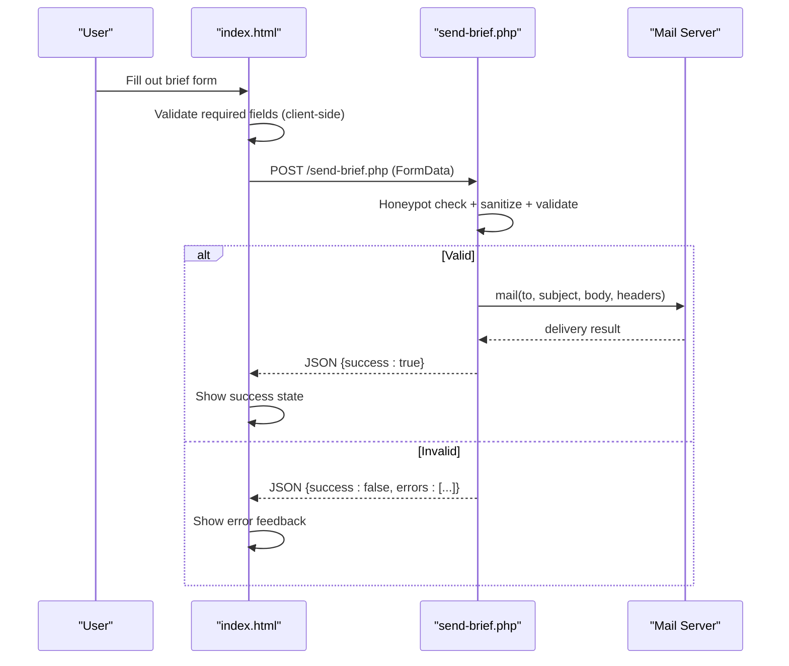
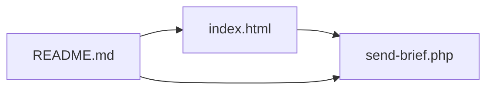

# File Reference

<cite>
**Referenced Files in This Document**
- [index.html](file://index.html)
- [send-brief.php](file://send-brief.php)
- [README.md](file://README.md)
</cite>

## Table of Contents
1. [Introduction](#introduction)
2. [Project Structure](#project-structure)
3. [Core Components](#core-components)
4. [Architecture Overview](#architecture-overview)
5. [Detailed Component Analysis](#detailed-component-analysis)
6. [Dependency Analysis](#dependency-analysis)
7. [Performance Considerations](#performance-considerations)
8. [Troubleshooting Guide](#troubleshooting-guide)
9. [Conclusion](#conclusion)

## Introduction
This document provides comprehensive file reference documentation for the EMOO project’s core files:
- index.html: The main website frontend with embedded CSS, JavaScript functionality, bilingual content management (Russian/English), and responsive design.
- send-brief.php: The backend form processor that validates and sanitizes input, enforces security controls, and delivers emails via PHP mail().
- README.md: The primary setup and configuration guide describing requirements, security measures, installation steps, and troubleshooting.

The goal is to help developers understand code structure, key functions, configuration options, integration points, and practical usage patterns directly from the codebase.

## Project Structure
The project consists of three primary files located at the repository root:
- index.html: Single-page site with sections for hero, services, formula, process stages, stats, contact brief form, and footer.
- send-brief.php: PHP script handling POST submissions from the brief form.
- README.md: Setup instructions, environment requirements, and security notes.

**Diagram sources**
- [index.html:729-1009](file://index.html#L729-L1009)
- [send-brief.php:1-116](file://send-brief.php#L1-L116)
- [README.md:1-73](file://README.md#L1-L73)

**Section sources**
- [index.html:1-1013](file://index.html#L1-L1013)
- [send-brief.php:1-116](file://send-brief.php#L1-L116)
- [README.md:1-73](file://README.md#L1-L73)

## Core Components
- Frontend (index.html):
  - Embedded CSS defines a cohesive design system using CSS custom properties, grid layouts, animations, and media queries for responsiveness.
  - JavaScript handles language switching, scroll-based animations, active navigation highlighting, counters, service preview cursor tracking, and AJAX form submission.
  - Bilingual support toggles between Russian and English by manipulating DOM attributes and text content.
- Backend (send-brief.php):
  - Accepts only POST requests.
  - Implements honeypot anti-bot protection.
  - Sanitizes inputs and validates fields (name, contact, company, area, message).
  - Builds email body and headers, sets Reply-To appropriately, and sends via mail().
  - Returns JSON responses for success, validation errors, or server errors.
- Documentation (README.md):
  - Describes deployment location, PHP version compatibility, SSL requirement, mail() availability, sessions, and multi-layered security features.
  - Provides installation steps, .htaccess guidance, logging tips, and FAQ.

**Section sources**
- [index.html:15-328](file://index.html#L15-L328)
- [index.html:823-1010](file://index.html#L823-L1010)
- [send-brief.php:1-116](file://send-brief.php#L1-L116)
- [README.md:1-73](file://README.md#L1-L73)

## Architecture Overview
The frontend collects user input through a styled form and submits it asynchronously to the backend via XMLHttpRequest. The backend validates and sanitizes data, constructs an email, and returns a JSON response indicating success or failure. The frontend updates the UI accordingly.

**Diagram sources**
- [index.html:953-1009](file://index.html#L953-L1009)
- [send-brief.php:9-71](file://send-brief.php#L9-L71)
- [send-brief.php:73-115](file://send-brief.php#L73-L115)

## Detailed Component Analysis

### index.html — Frontend
Key responsibilities:
- Responsive layout and visual design via embedded CSS.
- Bilingual content management (RU/EN) with dynamic text updates and title changes.
- Interactive behaviors: header scroll effect, mobile menu toggle, reveal-on-scroll animations, active nav highlighting, animated counters, service hover previews, and form submission via AJAX.

Important implementation areas:
- Language switching:
  - Toggles body attribute and HTML lang.
  - Updates placeholders, option texts, and special elements like kicker with scramble animation.
  - Sets default language on load.
- Form submission:
  - Prevents default submit behavior.
  - Performs client-side validation for required fields.
  - Sends FormData via XMLHttpRequest to send-brief.php.
  - Handles success/error states and shows confirmation UI.

Practical customization examples:
- Change default language by modifying the initial setLang call.
- Adjust form fields by adding/removing inputs and updating both frontend validation and backend expected fields.
- Customize styles via CSS variables and media queries for different breakpoints.

**Section sources**
- [index.html:831-866](file://index.html#L831-L866)
- [index.html:953-1009](file://index.html#L953-L1009)
- [index.html:15-328](file://index.html#L15-L328)

### send-brief.php — Backend Form Processor
Security and processing flow:
- Enforces POST-only access; returns 405 for other methods.
- Honeypot field rejects bot submissions silently while returning success to avoid detection.
- Sanitizes all inputs using trim and strip_tags.
- Validates:
  - Name length constraints.
  - Contact must be either a valid email or phone number pattern.
  - Optional company length limit.
  - Area must match allowed values.
  - Message length limit.
- Constructs email body and headers:
  - Subject and structured body including name, contact, optional company, area, message, timestamp, and IP.
  - Sets From and Reply-To based on contact type.
  - Adds Content-Type and X-Mailer headers.
- Sends email via mail() and logs successful submissions.
- Returns JSON responses:
  - Success: {success:true, message:...}
  - Validation errors: {success:false, errors:[...]}
  - Server error: {success:false, message:...}

Configuration options:
- Email addresses: $to_email and $from_email can be updated to your domain’s mailbox.
- Allowed area values: Modify the whitelist array to match your offerings.
- Logging: Error log entries are written on success; additional file logging can be enabled per README guidance.

Integration points:
- Expects form fields: name, phone, company, area, message.
- Requires PHP mail() enabled on the hosting environment.
- Works with HTTPS enforced by .htaccess (per README).

**Section sources**
- [send-brief.php:9-27](file://send-brief.php#L9-L27)
- [send-brief.php:29-71](file://send-brief.php#L29-L71)
- [send-brief.php:73-115](file://send-brief.php#L73-L115)

### README.md — Setup and Configuration Guide
Highlights:
- Deployment location: All files should reside in the same directory as the site (e.g., docs folder).
- Requirements: PHP 7.4+, SSL enabled, mail() function available, PHP sessions supported.
- Security measures: Local mail delivery, HTTPS enforcement, CSRF token mechanism (referenced), rate limiting (referenced), input sanitization, and valid sender address.
- Installation steps: Upload files, set permissions, test form submission.
- .htaccess guidance: Redirect HTTP to HTTPS.
- Logging: Enable file logging for debugging.
- FAQ: Explains CSRF token purpose, sender address rationale, and common 403 errors.

Note: While the current send-brief.php does not implement CSRF tokens or explicit rate limiting, the README references these mechanisms. For production hardening, consider implementing CSRF tokens and rate limiting as described.

**Section sources**
- [README.md:1-73](file://README.md#L1-L73)

## Dependency Analysis
- index.html depends on send-brief.php for form submission via AJAX.
- send-brief.php depends on PHP runtime and mail() function configured on the host.
- README.md documents dependencies and configuration but is not executed by the application.

**Diagram sources**
- [index.html:953-1009](file://index.html#L953-L1009)
- [send-brief.php:1-116](file://send-brief.php#L1-L116)
- [README.md:1-73](file://README.md#L1-L73)

**Section sources**
- [index.html:953-1009](file://index.html#L953-L1009)
- [send-brief.php:1-116](file://send-brief.php#L1-L116)
- [README.md:1-73](file://README.md#L1-L73)

## Performance Considerations
- CSS animations and transitions are used extensively; reduced motion preferences are respected to disable animations for accessibility.
- IntersectionObserver is used for efficient scroll-triggered animations and active section highlighting.
- RequestAnimationFrame drives smooth counter animations and cursor-following previews.
- Client-side validation reduces unnecessary server requests.
- Backend uses lightweight string operations and regex validation; ensure minimal overhead by keeping allowed lists concise.

[No sources needed since this section provides general guidance]

## Troubleshooting Guide
Common issues and resolutions:
- Form submission fails:
  - Check browser console for network errors.
  - Ensure send-brief.php is accessible and returns JSON responses.
  - Verify PHP mail() is enabled and configured on the host.
- Emails not received:
  - Confirm recipient address matches $to_email.
  - Check server spam filters and local mail queue.
  - Review server logs for mail() errors.
- 403 Forbidden when accessing site:
  - Ensure HTTPS is enforced and .htaccess is present per README instructions.
- Validation errors:
  - Verify required fields are filled and meet format expectations (email/phone).
  - Confirm area selection matches allowed values.

**Section sources**
- [send-brief.php:9-71](file://send-brief.php#L9-L71)
- [send-brief.php:105-115](file://send-brief.php#L105-L115)
- [README.md:48-73](file://README.md#L48-L73)

## Conclusion
EMOO’s frontend and backend provide a streamlined, secure, and user-friendly brief submission experience. The single-page interface offers bilingual support, responsive design, and engaging interactions, while the backend ensures robust validation, sanitization, and reliable email delivery. Following the README setup and security recommendations will help maintain a stable and protected deployment.

[No sources needed since this section summarizes without analyzing specific files]