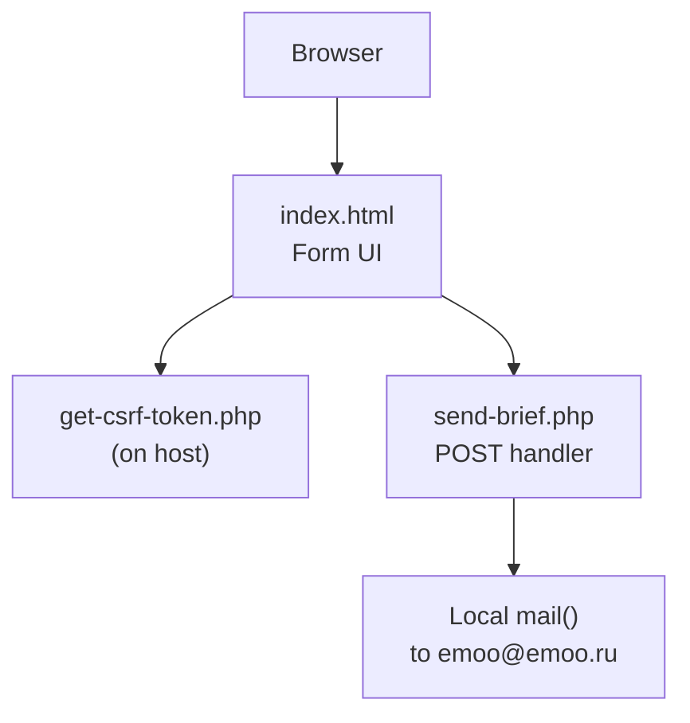
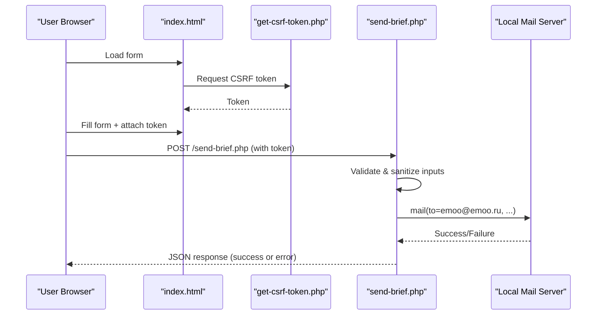
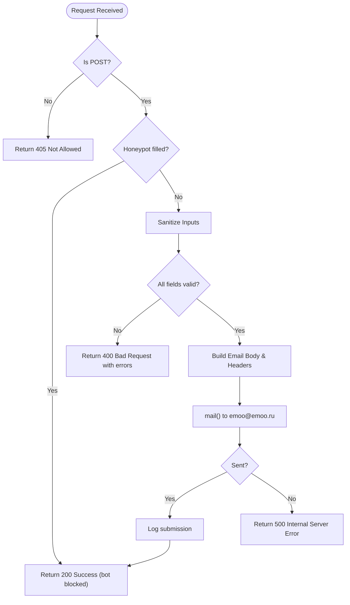
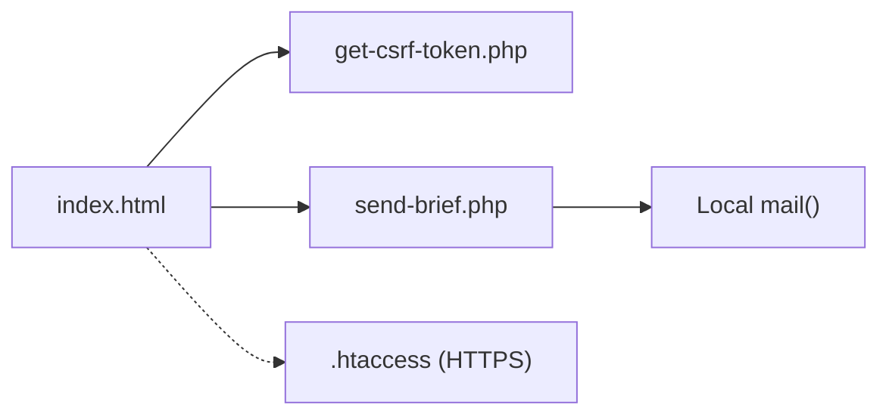

# README.md - Setup and Configuration Guide

<cite>
**Referenced Files in This Document**
- [README.md](file://README.md)
- [index.html](file://index.html)
- [send-brief.php](file://send-brief.php)
</cite>

## Table of Contents
1. [Introduction](#introduction)
2. [Project Structure](#project-structure)
3. [Core Components](#core-components)
4. [Architecture Overview](#architecture-overview)
5. [Detailed Component Analysis](#detailed-component-analysis)
6. [Dependency Analysis](#dependency-analysis)
7. [Performance Considerations](#performance-considerations)
8. [Troubleshooting Guide](#troubleshooting-guide)
9. [Conclusion](#conclusion)

## Introduction
This guide explains how to install, configure, and operate the EMOO project’s secure form submission system for sending briefs to emoo@emoo.ru. It covers server requirements, shared hosting deployment steps, HTTPS enforcement via .htaccess, security measures, testing procedures, and troubleshooting tips. The solution is designed so that both the website and mail account reside on the same hosting environment for maximum delivery reliability.

## Project Structure
The EMOO site includes a front-end form and a PHP handler for processing submissions. According to the documentation, all required files should be placed together in your site directory (for example, /docs). The expected set includes:
- index.html (the form page)
- send-brief.php (the backend processor)
- get-csrf-token.php (CSRF token generator)
- .htaccess (HTTPS redirect and security rules)

In this repository snapshot, you will find:
- index.html (form UI)
- send-brief.php (PHP handler)
- README.md (setup and configuration instructions)

Note: get-csrf-token.php and .htaccess are referenced by the documentation but are not included in this repository snapshot. Ensure these files are present on your hosting as described below.

**Diagram sources**
- [README.md:9-20](file://README.md#L9-L20)
- [send-brief.php:1-116](file://send-brief.php#L1-L116)

**Section sources**
- [README.md:9-20](file://README.md#L9-L20)

## Core Components
- Front-end form: index.html contains the user-facing brief form and integrates with JavaScript to submit data securely.
- Back-end processor: send-brief.php validates input, sanitizes data, constructs an email, and sends it using the local mail() function.
- Security helpers: get-csrf-token.php generates CSRF tokens; .htaccess enforces HTTPS redirects and additional security rules.

Key responsibilities:
- Input validation and sanitization in send-brief.php
- Local email delivery via mail() to emoo@emoo.ru
- HTTPS enforcement through .htaccess
- CSRF protection via token exchange between client and server

**Section sources**
- [README.md:21-37](file://README.md#L21-L37)
- [send-brief.php:1-116](file://send-brief.php#L1-L116)

## Architecture Overview
The form submission flow ensures secure, validated, and reliable delivery of briefs to the internal mail system.

**Diagram sources**
- [README.md:9-20](file://README.md#L9-L20)
- [send-brief.php:1-116](file://send-brief.php#L1-L116)

## Detailed Component Analysis

### Form Handler: send-brief.php
Responsibilities:
- Accept only POST requests
- Honeypot anti-bot check
- Sanitize and validate inputs (name, contact, company, area, message)
- Build email body and headers
- Send email via local mail()
- Return JSON responses with appropriate HTTP status codes

Validation highlights:
- Name length constraints
- Contact must be a valid email or phone pattern
- Company name length limit
- Area selection from allowed values
- Message length limit

Error handling:
- Non-POST returns 405
- Validation errors return 400 with error list
- Successful send returns 200 with success message
- Mail failure returns 500 with error message

Logging:
- Logs successful submissions with timestamp, name, contact, and IP

Security considerations:
- Uses strip_tags and trim for sanitization
- Enforces strict input validation
- Uses Reply-To appropriately based on contact type

**Diagram sources**
- [send-brief.php:1-116](file://send-brief.php#L1-L116)

**Section sources**
- [send-brief.php:1-116](file://send-brief.php#L1-L116)

### Front-end Form: index.html
- Provides the user interface for submitting briefs
- Integrates with JavaScript to handle AJAX submission and feedback
- Includes a honeypot field to deter bots
- Points to send-brief.php for form action

Testing notes:
- Open the form via HTTPS
- Fill required fields
- Submit and verify success message and email receipt

**Section sources**
- [index.html:728-775](file://index.html#L728-L775)

### Security and Deployment: README.md
Requirements:
- PHP version 7.4+
- Active SSL certificate
- mail() function enabled on hosting
- PHP sessions supported

Security measures:
- Local email delivery within the hosting environment
- Forced HTTPS via .htaccess
- CSRF token mechanism
- Rate limiting (documented)
- Input sanitization
- Valid sender address to improve deliverability

Installation steps:
- Upload send-brief.php, get-csrf-token.php, and .htaccess into the docs folder alongside index.html
- Set file permissions: PHP files at 644, directories at 755
- Test by opening https://yourdomain/docs/index.html and submitting the form

.htaccess HTTPS redirect:
- If you already have an .htaccess, prepend the provided rewrite rules to enforce HTTPS

Logging:
- Enable logging in send-brief.php by uncommenting log lines to track attempts and errors

FAQ:
- Purpose of get-csrf-token.php: prevents unauthorized submissions
- Why use emoo@emoo.ru as sender: improves deliverability when domain and mail are on the same host
- 403 Forbidden: usually due to accessing via HTTP instead of HTTPS; ensure .htaccess exists and HTTPS is used

**Section sources**
- [README.md:21-73](file://README.md#L21-L73)

## Dependency Analysis
- index.html depends on:
  - get-csrf-token.php for CSRF token generation
  - send-brief.php for form submission processing
- send-brief.php depends on:
  - PHP runtime (7.4+)
  - mail() function configured on the hosting
  - Optional session support (as per documentation)
- .htaccess depends on Apache-compatible rewrite engine to enforce HTTPS

**Diagram sources**
- [README.md:9-20](file://README.md#L9-L20)
- [send-brief.php:1-116](file://send-brief.php#L1-L116)

**Section sources**
- [README.md:9-20](file://README.md#L9-L20)
- [send-brief.php:1-116](file://send-brief.php#L1-L116)

## Performance Considerations
- Keep form payloads minimal; avoid large attachments in the brief form.
- Ensure mail() is handled locally by the hosting provider to reduce latency.
- Use HTTPS to prevent overhead from mixed content warnings and to leverage browser optimizations.
- Monitor server logs and enable logging in send-brief.php during initial deployment to identify bottlenecks.
- Verify that PHP memory limits and execution time are sufficient for typical form sizes.

[No sources needed since this section provides general guidance]

## Troubleshooting Guide
Common issues and resolutions:
- 403 Forbidden when accessing the site:
  - Ensure you access via https://yourdomain/docs/index.html
  - Confirm .htaccess is present and correctly enforcing HTTPS
- Form does not submit or returns 400:
  - Check that all required fields meet validation rules
  - Verify CSRF token is present and valid
- Email not received:
  - Confirm mail() is enabled on your hosting
  - Check spam/junk folders
  - Review server logs and enable logging in send-brief.php to capture errors
- Rate limiting triggered:
  - Wait before retrying; the script blocks repeated submissions from the same IP
- File permission errors:
  - Ensure PHP files are 644 and directories are 755

Verification steps:
- Open https://yourdomain/docs/index.html
- Fill out the form and submit
- Confirm success message appears
- Check inbox for emoo@emoo.ru

**Section sources**
- [README.md:48-73](file://README.md#L48-L73)
- [send-brief.php:10-116](file://send-brief.php#L10-L116)

## Conclusion
The EMOO form submission system provides a secure, validated, and reliable way to collect briefs and deliver them to emoo@emoo.ru using the hosting’s local mail system. By following the installation steps, ensuring HTTPS enforcement, and applying the documented security practices, you can deploy the solution on shared hosting with confidence. Use the troubleshooting guide to resolve common issues and verify proper operation after deployment.