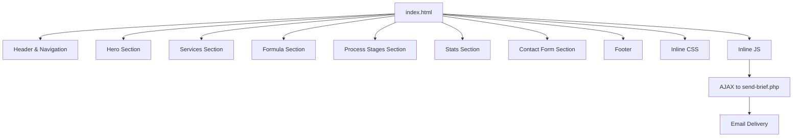
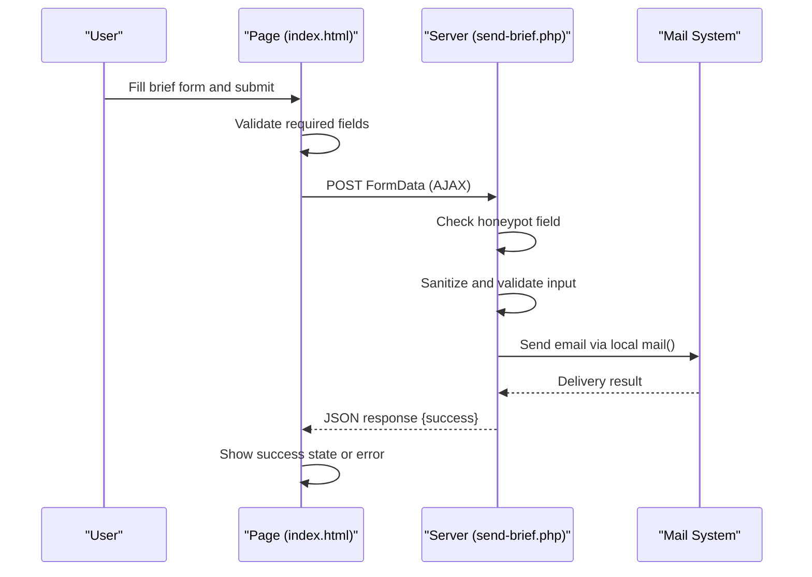
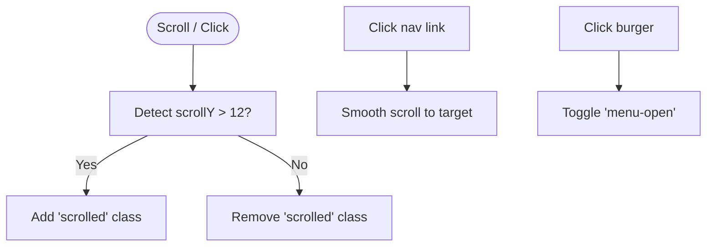
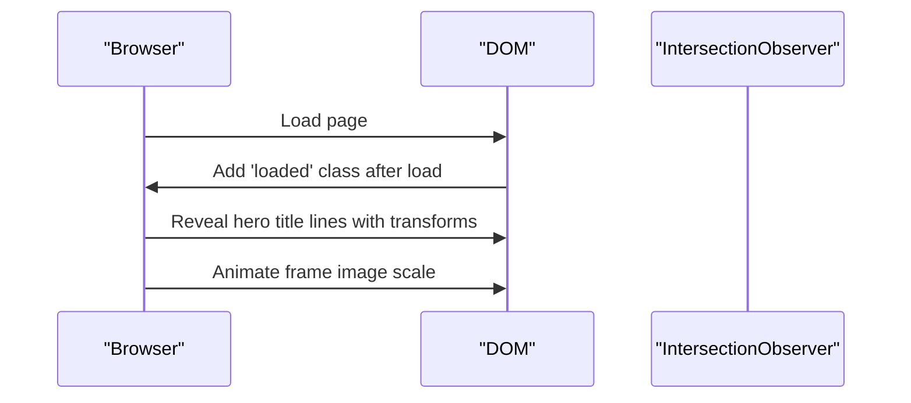
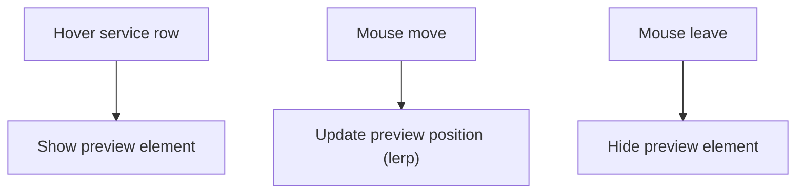
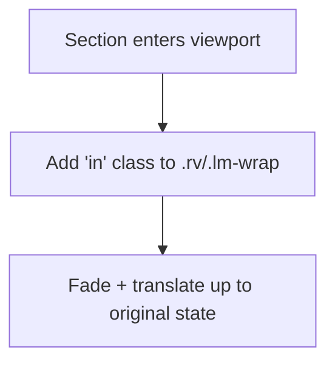
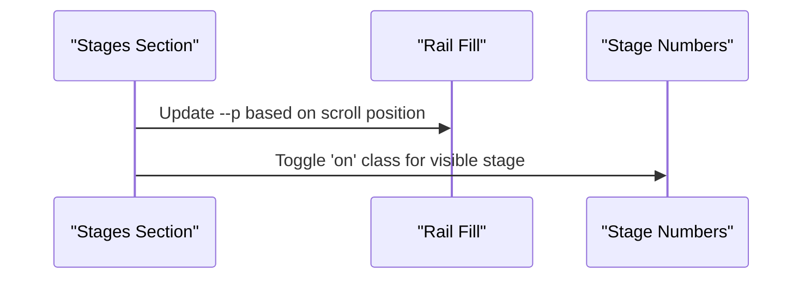
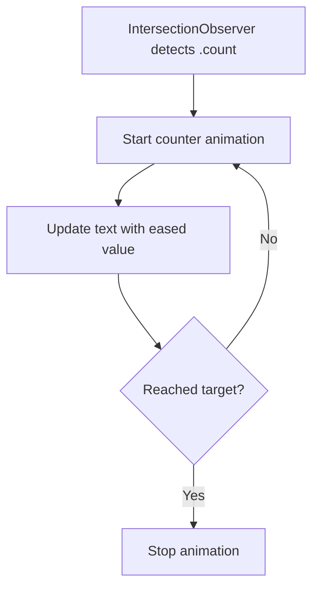
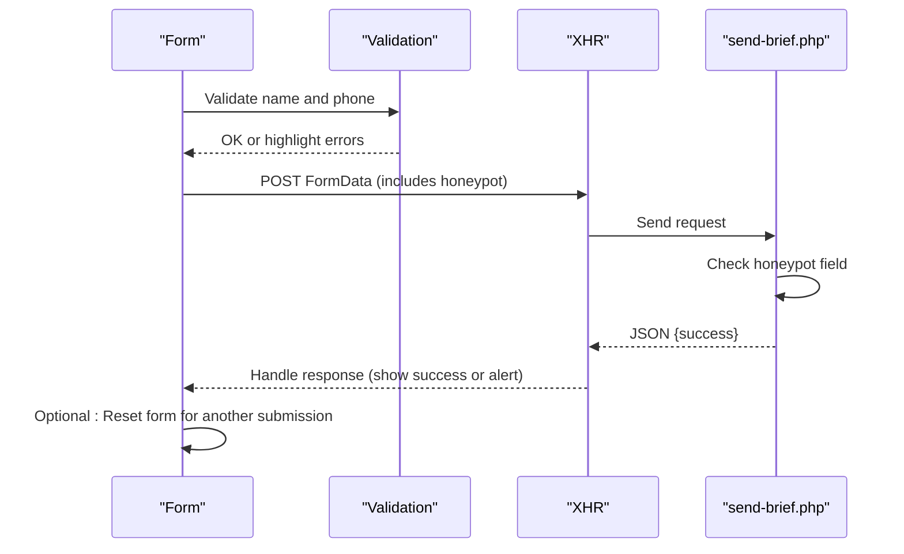
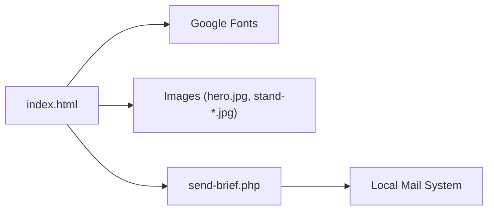

# index.html - Main Website Frontend

<cite>
**Referenced Files in This Document**
- [index.html](file://index.html)
- [send-brief.php](file://send-brief.php)
- [README.md](file://README.md)
</cite>

## Update Summary
**Changes Made**
- Removed CSRF token loading mechanism and related JavaScript functions
- Added honeypot field for enhanced bot protection in contact form
- Enhanced form area selection with proper value attributes for better data handling
- Added 'Send another brief' button for improved user experience after successful submission
- Updated backend validation to work with simplified security approach

## Table of Contents
1. [Introduction](#introduction)
2. [Project Structure](#project-structure)
3. [Core Components](#core-components)
4. [Architecture Overview](#architecture-overview)
5. [Detailed Component Analysis](#detailed-component-analysis)
6. [Dependency Analysis](#dependency-analysis)
7. [Performance Considerations](#performance-considerations)
8. [Troubleshooting Guide](#troubleshooting-guide)
9. [Conclusion](#conclusion)
10. [Appendices](#appendices)

## Introduction
This document provides comprehensive documentation for the main frontend file that powers the EMOO exhibition stand company website. It explains the HTML structure, embedded CSS styling system with custom properties and responsive design, advanced animations (scroll-triggered effects, hover states, transitions), and JavaScript functionality including bilingual content management (Russian/English), form handling via AJAX submission, smooth scrolling navigation, mobile menu interactions, and interactive elements such as service previews and animated counters. Practical guidance is included for customizing content, modifying styling variables, adding new sections, and extending functionality.

## Project Structure
The project is minimal and focused on a single-page site:
- index.html: The complete frontend containing HTML markup, embedded CSS, and inline JavaScript.
- send-brief.php: Backend handler for processing brief submissions from the contact form.
- README.md: Installation and security notes for the form submission flow.

**Diagram sources**
- [index.html:1-1029](file://index.html#L1-L1029)
- [send-brief.php:1-126](file://send-brief.php#L1-L126)

**Section sources**
- [index.html:1-1029](file://index.html#L1-L1029)
- [send-brief.php:1-126](file://send-brief.php#L1-L126)
- [README.md:1-73](file://README.md#L1-L73)

## Core Components
- Header and navigation: Fixed header with logo, desktop nav links, language switcher, brief CTA, and mobile burger menu.
- Hero section: Animated headline, kicker text, lead copy, CTAs, metadata, and visual frame with subtle animation and dimension annotations.
- Services showcase: List of services with hover effects and a floating preview image that follows the cursor on fine-pointer devices.
- Formula explanation: Visual equation and definitions for each letter, with sticky positioning and scroll-based reveals.
- Process stages: Five-step process with a side rail indicator and per-stage details; scroll-driven progress and active state highlighting.
- Portfolio gallery: Grid of works with varied aspect ratios and hover zoom effects (currently commented out in markup but styles present).
- Statistics display: Animated counters triggered by intersection observer.
- Contact form: Floating labels, validation, AJAX submission to send-brief.php with honeypot protection, success state with animated checkmark, and 'Send another brief' functionality.
- Footer: Branding, navigation, contacts, social links, and language switcher.

**Section sources**
- [index.html:333-819](file://index.html#L333-L819)

## Architecture Overview
The page is a single-file application with:
- Embedded CSS using custom properties for theming and consistent typography.
- Inline JavaScript orchestrating UI behaviors without external dependencies.
- A lightweight backend script for secure form delivery with honeypot protection.

**Diagram sources**
- [index.html:956-1025](file://index.html#L956-L1025)
- [send-brief.php:22-28](file://send-brief.php#L22-L28)
- [send-brief.php:29-126](file://send-brief.php#L29-L126)

## Detailed Component Analysis

### Header and Navigation
- Fixed header with background transition on scroll.
- Desktop nav with underline hover effect and active state based on current section.
- Language buttons toggle between Russian and English across the page.
- Mobile menu toggled via burger button with clip-path animation.

**Diagram sources**
- [index.html:874-882](file://index.html#L874-L882)

**Section sources**
- [index.html:45-75](file://index.html#L45-L75)
- [index.html:333-368](file://index.html#L333-L368)
- [index.html:874-882](file://index.html#L874-L882)

### Hero Section
- Animated title lines reveal on load with staggered delays.
- Kicker text scrambles into place during language switching.
- Visual frame includes subtle scale animation and dimension annotations.
- Metadata rows highlight key selling points.

**Diagram sources**
- [index.html:871-872](file://index.html#L871-L872)
- [index.html:77-124](file://index.html#L77-L124)

**Section sources**
- [index.html:77-124](file://index.html#L77-L124)
- [index.html:372-424](file://index.html#L372-L424)
- [index.html:831-866](file://index.html#L831-L866)

### Services Showcase
- Service rows have hover states with background shift, title translation, and arrow rotation.
- Floating preview image appears near cursor on fine-pointer devices, tracking mouse movement smoothly.

**Diagram sources**
- [index.html:941-954](file://index.html#L941-L954)
- [index.html:146-162](file://index.html#L146-L162)

**Section sources**
- [index.html:146-162](file://index.html#L146-L162)
- [index.html:446-488](file://index.html#L446-L488)
- [index.html:941-954](file://index.html#L941-L954)

### Formula Explanation
- Sticky left column with an equation graphic and definitions list.
- Scroll-triggered reveals for intro text and definition items.

**Diagram sources**
- [index.html:490-533](file://index.html#L490-L533)
- [index.html:140-144](file://index.html#L140-L144)

**Section sources**
- [index.html:163-180](file://index.html#L163-L180)
- [index.html:490-533](file://index.html#L490-L533)

### Process Stages
- Side rail shows progress based on scroll within the stages section.
- Active stage number highlighted via IntersectionObserver thresholds.
- Each stage contains detailed descriptions and lists.

**Diagram sources**
- [index.html:903-921](file://index.html#L903-L921)
- [index.html:182-204](file://index.html#L182-L204)

**Section sources**
- [index.html:182-204](file://index.html#L182-L204)
- [index.html:535-640](file://index.html#L535-L640)
- [index.html:903-921](file://index.html#L903-L921)

### Portfolio Gallery
- Grid layout with varied spans and aspect ratios.
- Hover zoom effect on images.
- Currently commented out in markup; styles remain available for activation.

**Section sources**
- [index.html:206-223](file://index.html#L206-L223)
- [index.html:642-672](file://index.html#L642-L672)

### Statistics Display
- Four-column grid with counters that animate when entering viewport.
- Uses easing function for smooth counting animation.

**Diagram sources**
- [index.html:923-939](file://index.html#L923-L939)
- [index.html:232-240](file://index.html#L232-L240)

**Section sources**
- [index.html:232-240](file://index.html#L232-L240)
- [index.html:689-701](file://index.html#L689-L701)
- [index.html:923-939](file://index.html#L923-L939)

### Contact Form
- Floating labels with focus and placeholder-shown behavior.
- Client-side validation highlights invalid fields.
- AJAX submission to send-brief.php with honeypot protection, loading state, and success animation.
- Enhanced area selection with proper value attributes for accurate data processing.
- 'Send another brief' button allows users to submit additional forms without page reload.

**Updated** Enhanced security with honeypot field and improved user experience with resend functionality

**Diagram sources**
- [index.html:956-1025](file://index.html#L956-L1025)
- [send-brief.php:22-28](file://send-brief.php#L22-L28)
- [send-brief.php:29-126](file://send-brief.php#L29-L126)

**Section sources**
- [index.html:241-271](file://index.html#L241-L271)
- [index.html:703-775](file://index.html#L703-L775)
- [index.html:956-1025](file://index.html#L956-L1025)
- [send-brief.php:1-126](file://send-brief.php#L1-L126)

### Footer
- Multi-column grid with brand info, navigation, contacts, and social links.
- Large decorative word with stroke effect and language switcher.

**Section sources**
- [index.html:273-284](file://index.html#L273-L284)
- [index.html:777-819](file://index.html#L777-L819)

## Dependency Analysis
- No external JavaScript libraries are used; all interactivity is implemented inline.
- Fonts are loaded from Google Fonts for Unbounded, Manrope, and JetBrains Mono.
- Images referenced include hero.jpg and various stand images for portfolio and previews.
- Backend dependency: send-brief.php handles form submissions and sends emails via local mail().

**Diagram sources**
- [index.html:7-9](file://index.html#L7-L9)
- [index.html:413-414](file://index.html#L413-L414)
- [index.html:457-487](file://index.html#L457-L487)
- [send-brief.php:113-126](file://send-brief.php#L113-L126)

**Section sources**
- [index.html:7-9](file://index.html#L7-L9)
- [index.html:413-414](file://index.html#L413-L414)
- [index.html:457-487](file://index.html#L457-L487)
- [send-brief.php:113-126](file://send-brief.php#L113-L126)

## Performance Considerations
- Use prefers-reduced-motion media query to disable animations for users who prefer reduced motion.
- Avoid heavy animations on mobile; some features (like service preview) only activate on fine-pointer devices.
- Lazy-load images where possible; ensure images are optimized for web.
- Keep CSS custom properties centralized for easy theming and performance-friendly updates.
- Minimize reflows by batching DOM updates and using transform-based animations.
- Simplified security approach reduces server overhead by removing CSRF token validation.

## Troubleshooting Guide
Common issues and resolutions:
- Form not sending:
  - Ensure send-brief.php is accessible and server supports PHP mail().
  - Verify HTTPS is enforced if required by hosting configuration.
  - Check browser console for network errors and JSON responses.
- Language switching not working:
  - Confirm data-en/data-ru attributes exist on translatable elements.
  - Ensure lang buttons have correct data-lang values.
- Animations not triggering:
  - Check IntersectionObserver thresholds and root margins.
  - Verify .js class added to documentElement and .loaded class on body.
- Mobile menu not closing:
  - Ensure burger click toggles menu-open class and nav links remove it on click.
- Form area selection issues:
  - Verify proper value attributes in select options for accurate backend processing.
- Bot submissions:
  - Honeypot field should remain hidden and empty for legitimate users.

**Section sources**
- [index.html:831-866](file://index.html#L831-L866)
- [index.html:874-882](file://index.html#L874-L882)
- [index.html:956-1025](file://index.html#L956-L1025)
- [send-brief.php:22-28](file://send-brief.php#L22-L28)
- [README.md:48-73](file://README.md#L48-L73)

## Conclusion
The index.html file delivers a polished, responsive single-page experience for EMOO with robust interactivity and clear content structure. The embedded CSS uses custom properties for theming and ensures accessibility through reduced motion support. The inline JavaScript provides bilingual content management, smooth animations, and seamless form submission via AJAX to a secure backend handler with enhanced security through honeypot protection. Recent improvements include simplified security architecture, enhanced form validation, and improved user experience with the 'Send another brief' functionality. Customization is straightforward through CSS variables and well-structured markup, making it easy to extend sections and update branding.

## Appendices

### How to Customize Content
- Change language default:
  - Modify the initial language call in JavaScript to set 'en' instead of 'ru'.
- Update colors and fonts:
  - Edit CSS custom properties in :root for theme colors and font families.
- Add new service:
  - Duplicate a service row block and update data-img, titles, and descriptions.
- Extend process stages:
  - Add a new stage article with appropriate data-stage index and update rail logic if needed.
- Modify form fields:
  - Update select options with proper value attributes for accurate backend processing.

**Section sources**
- [index.html:869-869](file://index.html#L869-L869)
- [index.html:16-23](file://index.html#L16-L23)
- [index.html:456-487](file://index.html#L456-L487)
- [index.html:555-637](file://index.html#L555-L637)
- [index.html:747-753](file://index.html#L747-L753)

### Extending Functionality
- Add analytics:
  - Insert tracking scripts in the head section.
- Enhance form validation:
  - Expand client-side checks and integrate with backend validation messages.
- Improve accessibility:
  - Add aria-labels and roles where missing; ensure keyboard navigation works for all interactive elements.
- Add more form fields:
  - Include proper value attributes for new select options to ensure accurate data processing.

**Section sources**
- [index.html:3-14](file://index.html#L3-L14)
- [index.html:956-1025](file://index.html#L956-L1025)