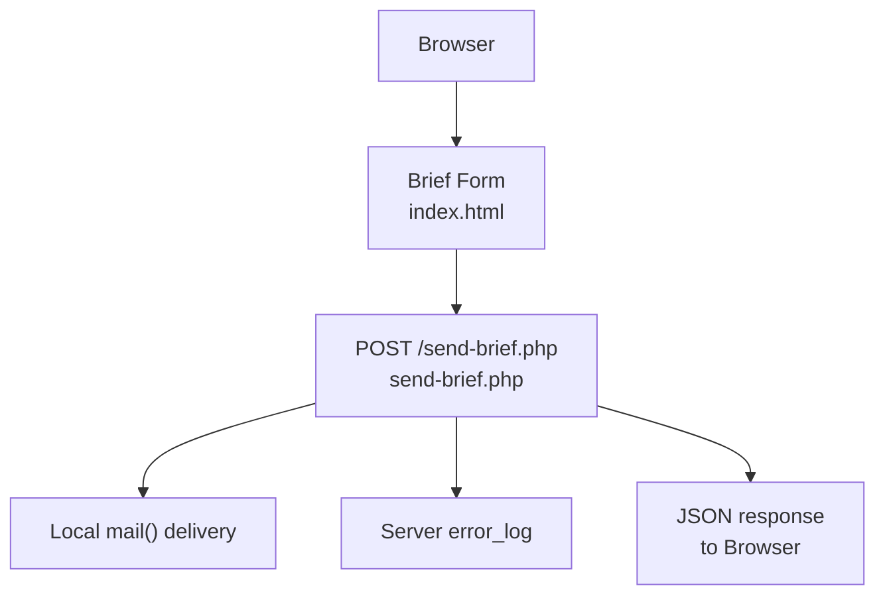
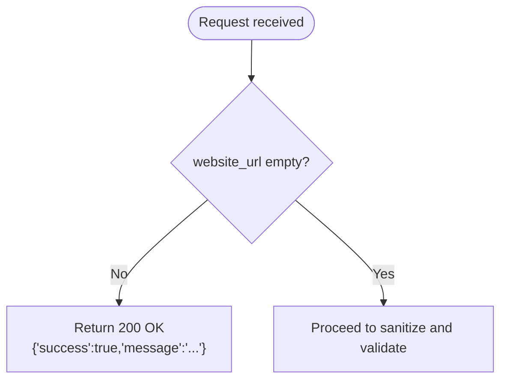
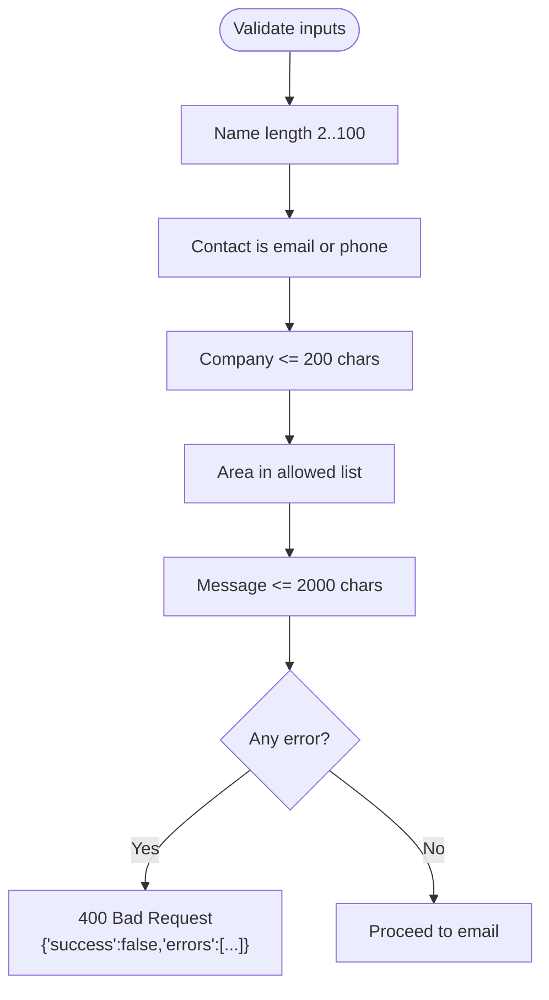
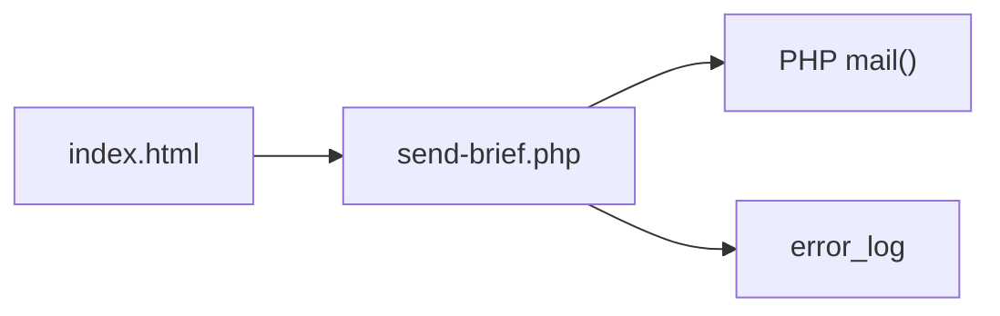

# send-brief.php - Backend Form Processor

<cite>
**Referenced Files in This Document**
- [send-brief.php](file://send-brief.php)
- [index.html](file://index.html)
- [README.md](file://README.md)
</cite>

## Table of Contents
1. [Introduction](#introduction)
2. [Project Structure](#project-structure)
3. [Core Components](#core-components)
4. [Architecture Overview](#architecture-overview)
5. [Detailed Component Analysis](#detailed-component-analysis)
6. [Dependency Analysis](#dependency-analysis)
7. [Performance Considerations](#performance-considerations)
8. [Troubleshooting Guide](#troubleshooting-guide)
9. [Conclusion](#conclusion)
10. [Appendices](#appendices)

## Introduction
This document explains the backend form processor for client brief submissions on the EMOO website. It focuses on how send-brief.php validates and sanitizes input, constructs and sends emails via PHP mail(), returns structured JSON responses for AJAX clients, and logs activity. It also provides practical guidance to modify fields, customize email templates, integrate alternative email services, and extend security measures.

## Project Structure
The project is minimal:
- index.html: The user-facing page containing the brief form and frontend behavior.
- send-brief.php: The server-side endpoint that processes POST submissions and sends emails.
- README.md: Installation notes and security overview.



**Diagram sources**
- [index.html:728-772](file://index.html#L728-L772)
- [send-brief.php:9-115](file://send-brief.php#L9-L115)

**Section sources**
- [index.html:728-772](file://index.html#L728-L772)
- [send-brief.php:1-116](file://send-brief.php#L1-L116)
- [README.md:1-73](file://README.md#L1-L73)

## Core Components
- Input handling and sanitization: Extracts and cleans form fields (name, contact, company, area, message).
- Validation rules: Enforces required fields, length limits, allowed values, and contact format checks.
- Honeypot bot detection: Silently accepts requests if a hidden field is filled.
- Email composition: Builds subject, body, and headers; sets Reply-To based on contact type.
- Delivery and logging: Uses PHP mail() with a sender envelope; logs successful submissions.
- JSON API: Returns consistent success/error payloads with appropriate HTTP status codes.

**Section sources**
- [send-brief.php:21-71](file://send-brief.php#L21-L71)
- [send-brief.php:73-115](file://send-brief.php#L73-L115)

## Architecture Overview
The flow from submission to delivery:

```mermaid
sequenceDiagram
participant B as "Browser"
participant F as "Form (index.html)"
participant S as "send-brief.php"
participant M as "mail()"
participant L as "error_log"
B->>F : Fill brief form
F->>S : POST {name, phone, company, area, message}
S->>S : Check method and honeypot
S->>S : Sanitize + Validate
alt Valid
S->>M : Send email with headers
M-->>S : true/false
opt Success
S->>L : Log submission details
S-->>B : 200 OK {"success" : true,"message" : "..."}
else Failure
S-->>B : 500 Internal Server Error {"success" : false,"message" : "..."}
end
else Invalid or Bot
S-->>B : 200/400 {"success" : false,"errors" : [...]}
end
```

**Diagram sources**
- [send-brief.php:9-115](file://send-brief.php#L9-L115)
- [index.html:728-772](file://index.html#L728-L772)

## Detailed Component Analysis

### Request Handling and Method Enforcement
- Only POST requests are accepted; other methods receive a 405 response with a JSON message.

**Section sources**
- [send-brief.php:9-15](file://send-brief.php#L9-L15)

### Honeypot Bot Detection
- A hidden field named website_url is present in the form. If it contains any value, the request is treated as a bot and silently accepted with a success JSON payload.



**Diagram sources**
- [send-brief.php:21-27](file://send-brief.php#L21-L27)
- [index.html:730-731](file://index.html#L730-L731)

**Section sources**
- [send-brief.php:21-27](file://send-brief.php#L21-L27)
- [index.html:730-731](file://index.html#L730-L731)

### Input Sanitization and Field Extraction
- Fields extracted: name, phone, company, area, message.
- Each field is trimmed and stripped of HTML tags before validation.

**Section sources**
- [send-brief.php:29-34](file://send-brief.php#L29-L34)

### Validation Rules
- Name: required, between 2 and 100 characters.
- Contact: required; must be a valid email or match a phone pattern after normalization.
- Company: optional; if provided, must not exceed 200 characters.
- Area: optional; if provided, must be one of the predefined options.
- Message: optional; if provided, must not exceed 2000 characters.
- On validation failure, returns 400 with an array of errors.



**Diagram sources**
- [send-brief.php:36-71](file://send-brief.php#L36-L71)

**Section sources**
- [send-brief.php:36-71](file://send-brief.php#L36-L71)

### Email Composition and Headers
- Subject and body are constructed with submitted data and metadata (date, IP).
- Headers include From and Reply-To:
  - If contact is an email, Reply-To uses the client’s name and email.
  - Otherwise, Reply-To falls back to the configured sender address.
- Content-Type is set to text/plain UTF-8.

**Section sources**
- [send-brief.php:73-100](file://send-brief.php#L73-L100)

### Email Delivery and Logging
- Uses PHP mail() with a sender envelope parameter.
- On success:
  - Logs submission details (timestamp, name, contact, IP) to the server error log.
  - Returns 200 OK with a success JSON payload.
- On failure:
  - Returns 500 Internal Server Error with an error JSON payload.

```mermaid
sequenceDiagram
participant S as "send-brief.php"
participant M as "mail()"
participant L as "error_log"
S->>M : mail(to, subject, body, headers, "-f from")
alt Sent
S->>L : Log timestamp, name, contact, IP
S-->>Client : 200 OK {"success" : true,"message" : "..."}
else Not sent
S-->>Client : 500 Internal Server Error {"success" : false,"message" : "..."}
end
```



**Diagram sources**
- [send-brief.php:102-115](file://send-brief.php#L102-L115)

**Section sources**
- [send-brief.php:102-115](file://send-brief.php#L102-L115)

### JSON Response Format
- Success: 200 OK with {"success": true, "message": "..."}
- Validation errors: 400 Bad Request with {"success": false, "errors": ["...", ...]}
- Non-POST: 405 Method Not Allowed with {"success": false, "message": "..."}
- Mail delivery failure: 500 Internal Server Error with {"success": false, "message": "..."}

**Section sources**
- [send-brief.php:9-15](file://send-brief.php#L9-L15)
- [send-brief.php:66-71](file://send-brief.php#L66-L71)
- [send-brief.php:105-115](file://send-brief.php#L105-L115)

### Frontend Integration Notes
- The form posts to send-brief.php using standard POST.
- Includes a hidden honeypot field to deter bots.
- The form UI shows success feedback upon successful submission.

**Section sources**
- [index.html:728-772](file://index.html#L728-L772)

## Dependency Analysis
- Frontend dependency: index.html defines the form fields and submits to send-brief.php.
- Backend dependencies:
  - PHP runtime with mail() enabled.
  - Server error_log for audit trail.
  - No external libraries or databases.



**Diagram sources**
- [index.html:728-772](file://index.html#L728-L772)
- [send-brief.php:102-115](file://send-brief.php#L102-L115)

**Section sources**
- [index.html:728-772](file://index.html#L728-L772)
- [send-brief.php:102-115](file://send-brief.php#L102-L115)

## Performance Considerations
- Lightweight processing: Minimal logic, no heavy computations.
- I/O bound: Email delivery depends on local MTA performance.
- Logging: error_log writes are low overhead but can be tuned per environment.

[No sources needed since this section provides general guidance]

## Troubleshooting Guide

Common issues and resolutions:
- Email not delivered:
  - Verify mail() is enabled and local MTA is configured.
  - Check server error_log for delivery failures.
  - Ensure From and Reply-To addresses are valid and permitted by the host.
- Validation errors:
  - Confirm all required fields are present and within allowed lengths.
  - For contact, ensure it matches either a valid email or a recognized phone pattern.
  - For area, ensure the selected option matches the allowed list exactly.
- Security concerns:
  - Honeypot helps reduce spam; ensure the hidden field remains hidden and disabled for normal users.
  - Enforce HTTPS at the web server level to protect data in transit.
  - Consider adding CSRF tokens and rate limiting for stronger protection.

Operational tips:
- Inspect HTTP status codes returned by the endpoint to diagnose issues quickly.
- Use browser developer tools to inspect JSON responses and network requests.
- Review server logs for timestamps and IPs associated with submissions.

**Section sources**
- [send-brief.php:9-15](file://send-brief.php#L9-L15)
- [send-brief.php:36-71](file://send-brief.php#L36-L71)
- [send-brief.php:102-115](file://send-brief.php#L102-L115)
- [README.md:28-37](file://README.md#L28-L37)

## Conclusion
send-brief.php provides a concise, secure-enough solution for collecting brief submissions and delivering them via email. It enforces method restrictions, applies basic sanitization and validation, includes a honeypot mechanism, and returns consistent JSON responses. For production environments, consider augmenting security with CSRF tokens, rate limiting, and robust email service integration.

[No sources needed since this section summarizes without analyzing specific files]

## Appendices

### How to Modify Form Fields
- Add a new field in index.html inside the form and ensure it has a unique name attribute.
- In send-brief.php:
  - Extract the new field from $_POST and apply trim(strip_tags(...)).
  - Add validation rules as needed (length, allowed values, format).
  - Include the field in the email body if desired.
  - Update any frontend validation or UX accordingly.

**Section sources**
- [index.html:728-772](file://index.html#L728-L772)
- [send-brief.php:29-34](file://send-brief.php#L29-L34)
- [send-brief.php:36-71](file://send-brief.php#L36-L71)
- [send-brief.php:73-88](file://send-brief.php#L73-L88)

### Customize Email Templates
- Adjust subject and body construction in send-brief.php to include additional fields or reformat content.
- Maintain UTF-8 encoding and keep headers minimal to improve deliverability.

**Section sources**
- [send-brief.php:73-100](file://send-brief.php#L73-L100)

### Integrate With Different Email Services
- Replace mail() with a library or API call (e.g., SMTP via PHPMailer, SwiftMailer, or a cloud email API).
- Map existing variables (subject, body, headers) to the chosen service’s parameters.
- Preserve logging and error handling patterns to maintain observability.

[No sources needed since this section provides general guidance]

### Extend Security Measures
- CSRF Protection:
  - Generate a token on page load and store it in the session.
  - Validate the token on each submission; reject mismatches.
- Rate Limiting:
  - Track submissions per IP within a time window; block excess attempts.
- Additional Hardening:
  - Enforce HTTPS at the web server level.
  - Restrict access to sensitive endpoints via server configuration.
  - Consider CAPTCHA for high-risk scenarios.

**Section sources**
- [README.md:28-37](file://README.md#L28-L37)