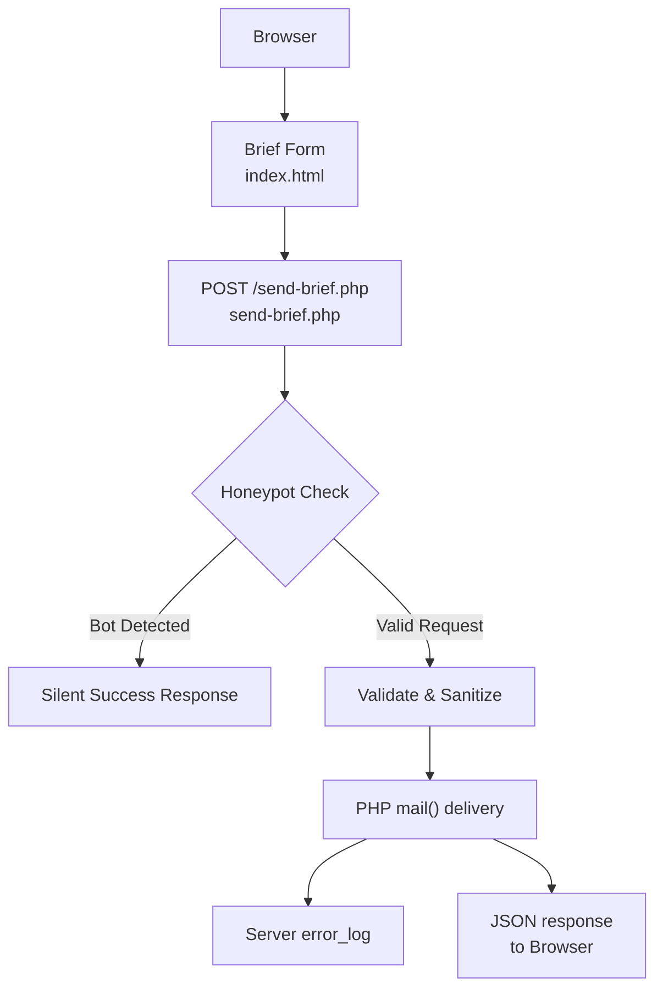
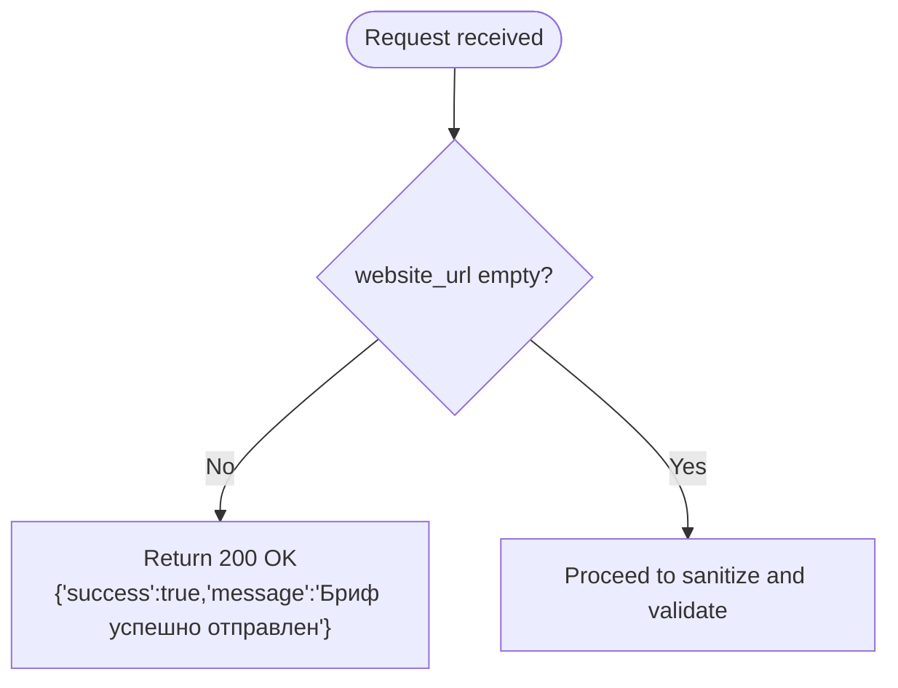
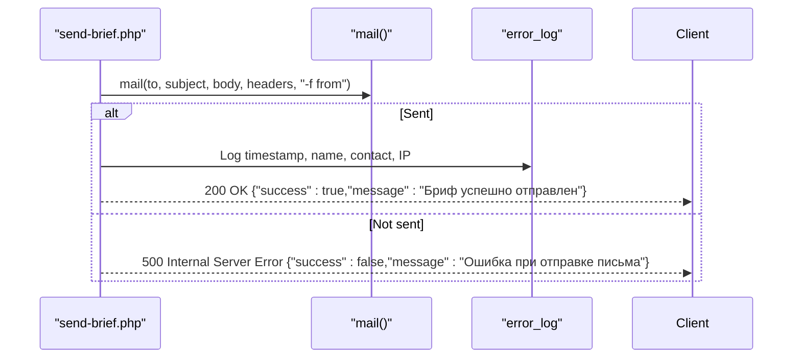
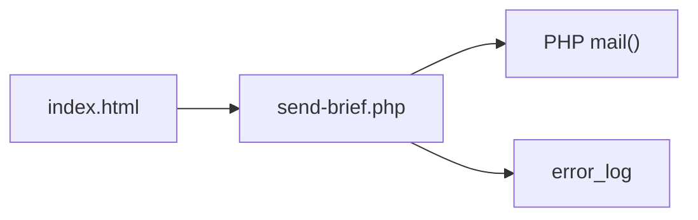

# send-brief.php - Backend Form Processor

<cite>
**Referenced Files in This Document**
- [send-brief.php](file://send-brief.php)
- [index.html](file://index.html)
- [README.md](file://README.md)
</cite>

## Update Summary
**Changes Made**
- Updated security architecture section to reflect simplified honeypot-only protection
- Removed references to complex CSRF validation and HTTPS enforcement
- Updated error handling and user feedback mechanisms
- Simplified security measures documentation to focus on honeypot protection
- Updated troubleshooting guide to reflect current implementation

## Table of Contents
1. [Introduction](#introduction)
2. [Project Structure](#project-structure)
3. [Core Components](#core-components)
4. [Architecture Overview](#architecture-overview)
5. [Detailed Component Analysis](#detailed-component-analysis)
6. [Dependency Analysis](#dependency-analysis)
7. [Performance Considerations](#performance-considerations)
8. [Troubleshooting Guide](#troubleshooting-guide)
9. [Conclusion](#conclusion)
10. [Appendices](#appendices)

## Introduction
This document explains the backend form processor for client brief submissions on the EMOO website. The system has been updated with a simplified security architecture that focuses on honeypot protection instead of complex CSRF validation. It handles input validation and sanitization, constructs and sends emails via PHP mail(), returns structured JSON responses for AJAX clients, and logs activity. The implementation provides enhanced error handling and user feedback while maintaining simplicity and effectiveness.

## Project Structure
The project is minimal and streamlined:
- index.html: The user-facing page containing the brief form and frontend behavior with AJAX submission
- send-brief.php: The server-side endpoint that processes POST submissions and sends emails using simplified security
- README.md: Installation notes and security overview reflecting the current simplified approach



**Diagram sources**
- [index.html:728-772](file://index.html#L728-L772)
- [send-brief.php:21-27](file://send-brief.php#L21-L27)
- [send-brief.php:102-115](file://send-brief.php#L102-L115)

**Section sources**
- [index.html:728-772](file://index.html#L728-L772)
- [send-brief.php:1-126](file://send-brief.php#L1-L126)
- [README.md:1-73](file://README.md#L1-L73)

## Core Components
- **Simplified Security**: Honeypot bot detection replaces complex CSRF validation
- **Input handling and sanitization**: Extracts and cleans form fields (name, contact, company, area, message)
- **Validation rules**: Enforces required fields, length limits, allowed values, and contact format checks
- **Enhanced error handling**: Improved user feedback and consistent error responses
- **Email composition**: Builds subject, body, and headers; sets Reply-To based on contact type
- **Delivery and logging**: Uses PHP mail() with a sender envelope; logs successful submissions
- **JSON API**: Returns consistent success/error payloads with appropriate HTTP status codes

**Section sources**
- [send-brief.php:21-71](file://send-brief.php#L21-L71)
- [send-brief.php:73-126](file://send-brief.php#L73-L126)

## Architecture Overview
The flow from submission to delivery with simplified security:

```mermaid
sequenceDiagram
participant B as "Browser"
participant F as "Form (index.html)"
participant S as "send-brief.php"
participant M as "mail()"
participant L as "error_log"
B->>F : Fill brief form
F->>S : POST {name, phone, company, area, message}
S->>S : Check honeypot field
alt Bot detected
S-->>B : 200 OK {"success" : true,"message" : "..."}
else Valid request
S->>S : Sanitize + Validate
alt Valid
S->>M : Send email with headers
M-->>S : true/false
opt Success
S->>L : Log submission details
S-->>B : 200 OK {"success" : true,"message" : "..."}
else Failure
S-->>B : 500 Internal Server Error {"success" : false,"message" : "..."}
end
else Invalid
S-->>B : 400 Bad Request {"success" : false,"errors" : [...]}
end
end
```

**Diagram sources**
- [send-brief.php:21-126](file://send-brief.php#L21-L126)
- [index.html:956-1014](file://index.html#L956-L1014)

## Detailed Component Analysis

### Request Handling and Method Enforcement
- Only POST requests are accepted; other methods receive a 405 response with a JSON message
- Enhanced error handling provides clear feedback for invalid request methods

**Section sources**
- [send-brief.php:9-15](file://send-brief.php#L9-L15)

### Simplified Security: Honeypot Protection
- A hidden field named `website_url` is present in the form with display:none styling
- If any value is detected in this field, the request is treated as a bot and silently accepted with a success JSON payload
- This approach eliminates the need for complex CSRF token validation while effectively deterring automated spam



**Diagram sources**
- [send-brief.php:21-27](file://send-brief.php#L21-L27)
- [index.html:730-731](file://index.html#L730-L731)

**Section sources**
- [send-brief.php:21-27](file://send-brief.php#L21-L27)
- [index.html:730-731](file://index.html#L730-L731)

### Input Sanitization and Field Extraction
- Fields extracted: name, phone, company, area, message
- Each field is trimmed and stripped of HTML tags before validation using `trim(strip_tags(...))`
- Consistent sanitization approach ensures data safety across all input fields

**Section sources**
- [send-brief.php:30-35](file://send-brief.php#L30-L35)

### Validation Rules
- Name: required, between 2 and 100 characters using `mb_strlen()` for proper UTF-8 support
- Contact: required; must be a valid email or match a phone pattern after normalization
- Company: optional; if provided, must not exceed 200 characters
- Area: optional; if provided, must be one of the predefined options with character normalization
- Message: optional; if provided, must not exceed 2000 characters
- On validation failure, returns 400 with an array of descriptive errors


**Diagram sources**
- [send-brief.php:37-81](file://send-brief.php#L37-L81)

**Section sources**
- [send-brief.php:37-81](file://send-brief.php#L37-L81)

### Email Composition and Headers
- Subject and body are constructed with submitted data and metadata (date, IP)
- Headers include From and Reply-To:
  - If contact is an email, Reply-To uses the client's name and email
  - Otherwise, Reply-To falls back to the configured sender address
- Content-Type is set to text/plain UTF-8 with proper encoding
- Enhanced header construction includes X-Mailer information for better deliverability

**Section sources**
- [send-brief.php:83-110](file://send-brief.php#L83-L110)

### Email Delivery and Logging
- Uses PHP mail() with a sender envelope parameter `-f{$from_email}`
- On success:
  - Logs submission details (timestamp, name, contact, IP) to the server error_log
  - Returns 200 OK with a success JSON payload
- On failure:
  - Returns 500 Internal Server Error with an error JSON payload
- Enhanced logging provides detailed audit trail for debugging and monitoring



**Diagram sources**
- [send-brief.php:112-126](file://send-brief.php#L112-L126)

**Section sources**
- [send-brief.php:112-126](file://send-brief.php#L112-L126)

### JSON Response Format
- Success: 200 OK with `{"success": true, "message": "Бриф успешно отправлен"}`
- Validation errors: 400 Bad Request with `{"success": false, "errors": ["...", ...]}`
- Non-POST: 405 Method Not Allowed with `{"success": false, "message": "Метод не разрешён"}`
- Mail delivery failure: 500 Internal Server Error with `{"success": false, "message": "Ошибка при отправке письма"}`
- Bot detection: 200 OK with success message (silent acceptance)

**Section sources**
- [send-brief.php:9-15](file://send-brief.php#L9-L15)
- [send-brief.php:21-27](file://send-brief.php#L21-L27)
- [send-brief.php:76-81](file://send-brief.php#L76-L81)
- [send-brief.php:119-125](file://send-brief.php#L119-L125)

### Frontend Integration Notes
- The form posts to send-brief.php using AJAX with FormData
- Includes a hidden honeypot field with `display:none !important` styling to deter bots
- Enhanced user feedback shows success state with animated confirmation
- Loading states provide visual feedback during submission
- Error handling displays appropriate messages to users

**Section sources**
- [index.html:728-772](file://index.html#L728-L772)
- [index.html:956-1014](file://index.html#L956-L1014)

## Dependency Analysis
- Frontend dependency: index.html defines the form fields and submits via AJAX to send-brief.php
- Backend dependencies:
  - PHP runtime with mail() enabled
  - Server error_log for audit trail
  - No external libraries or databases required
  - Simplified security model reduces complexity



**Diagram sources**
- [index.html:956-1014](file://index.html#L956-L1014)
- [send-brief.php:112-126](file://send-brief.php#L112-L126)

**Section sources**
- [index.html:956-1014](file://index.html#L956-L1014)
- [send-brief.php:112-126](file://send-brief.php#L112-L126)

## Performance Considerations
- Lightweight processing: Minimal logic with no heavy computations
- I/O bound: Email delivery depends on local MTA performance
- Logging: error_log writes are low overhead but can be tuned per environment
- Simplified security: Honeypot check is computationally inexpensive compared to CSRF validation
- AJAX submission: Improves user experience without full page reloads

## Troubleshooting Guide

Common issues and resolutions:
- **Email not delivered**:
  - Verify mail() is enabled and local MTA is configured
  - Check server error_log for delivery failures
  - Ensure From and Reply-To addresses are valid and permitted by the host
- **Validation errors**:
  - Confirm all required fields are present and within allowed lengths
  - For contact, ensure it matches either a valid email or a recognized phone pattern
  - For area, ensure the selected option matches the allowed list exactly
- **Security concerns**:
  - Honeypot helps reduce spam; ensure the hidden field remains hidden and disabled for normal users
  - The simplified security model relies on honeypot protection only
  - Consider additional server-level protections like rate limiting if needed

Operational tips:
- Inspect HTTP status codes returned by the endpoint to diagnose issues quickly
- Use browser developer tools to inspect JSON responses and network requests
- Review server logs for timestamps and IPs associated with submissions
- Monitor error_log entries for detailed submission information

**Section sources**
- [send-brief.php:9-15](file://send-brief.php#L9-L15)
- [send-brief.php:37-81](file://send-brief.php#L37-L81)
- [send-brief.php:112-126](file://send-brief.php#L112-L126)
- [README.md:28-37](file://README.md#L28-L37)

## Conclusion
send-brief.php provides a streamlined, effective solution for collecting brief submissions and delivering them via email. The updated implementation focuses on simplified security with honeypot protection, replacing complex CSRF validation while maintaining effectiveness against automated spam. It enforces method restrictions, applies robust sanitization and validation, includes enhanced error handling, and returns consistent JSON responses. The system prioritizes simplicity and maintainability while providing reliable form processing functionality.

## Appendices

### How to Modify Form Fields
- Add a new field in index.html inside the form and ensure it has a unique name attribute
- In send-brief.php:
  - Extract the new field from $_POST and apply `trim(strip_tags(...))`
  - Add validation rules as needed (length, allowed values, format)
  - Include the field in the email body if desired
  - Update any frontend validation or UX accordingly

**Section sources**
- [index.html:728-772](file://index.html#L728-L772)
- [send-brief.php:30-35](file://send-brief.php#L30-L35)
- [send-brief.php:37-81](file://send-brief.php#L37-L81)
- [send-brief.php:83-93](file://send-brief.php#L83-L93)

### Customize Email Templates
- Adjust subject and body construction in send-brief.php to include additional fields or reformat content
- Maintain UTF-8 encoding and keep headers minimal to improve deliverability
- Consider adding more detailed metadata like user agent or referrer for better tracking

**Section sources**
- [send-brief.php:83-110](file://send-brief.php#L83-L110)

### Integrate With Different Email Services
- Replace mail() with a library or API call (e.g., SMTP via PHPMailer, SwiftMailer, or a cloud email API)
- Map existing variables (subject, body, headers) to the chosen service's parameters
- Preserve logging and error handling patterns to maintain observability
- Consider implementing retry logic for failed deliveries

### Extend Security Measures
- **Additional Honeypot Fields**: Add multiple hidden fields with different names for enhanced bot detection
- **Rate Limiting**: Implement IP-based rate limiting at the application level if needed
- **Input Hardening**: Enhance validation rules for specific use cases
- **Monitoring**: Add comprehensive logging for security events and suspicious activity

**Section sources**
- [send-brief.php:21-27](file://send-brief.php#L21-L27)
- [README.md:28-37](file://README.md#L28-L37)