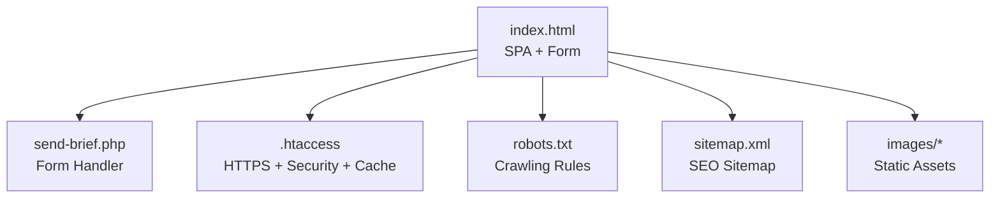
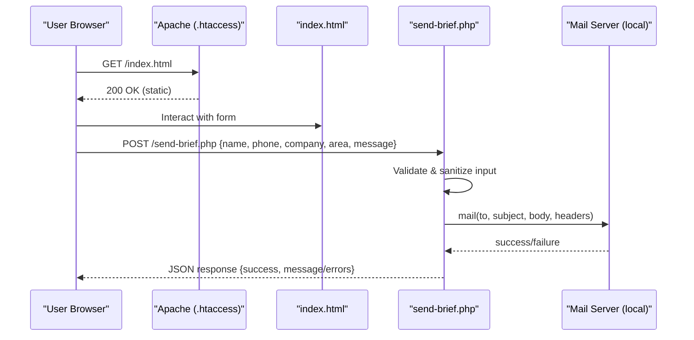
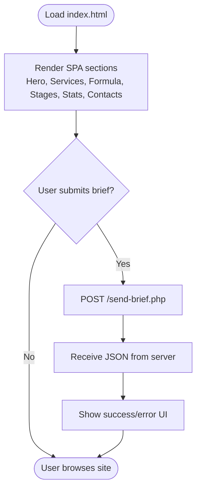
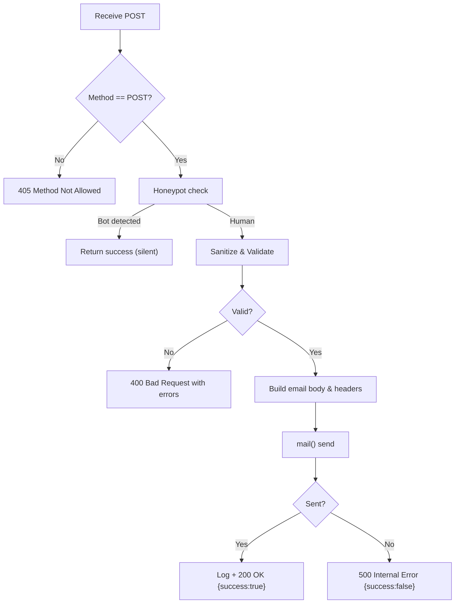
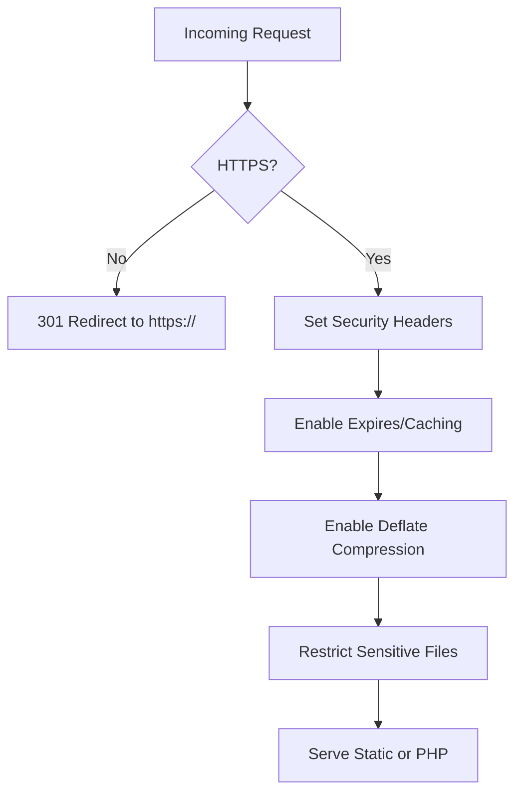
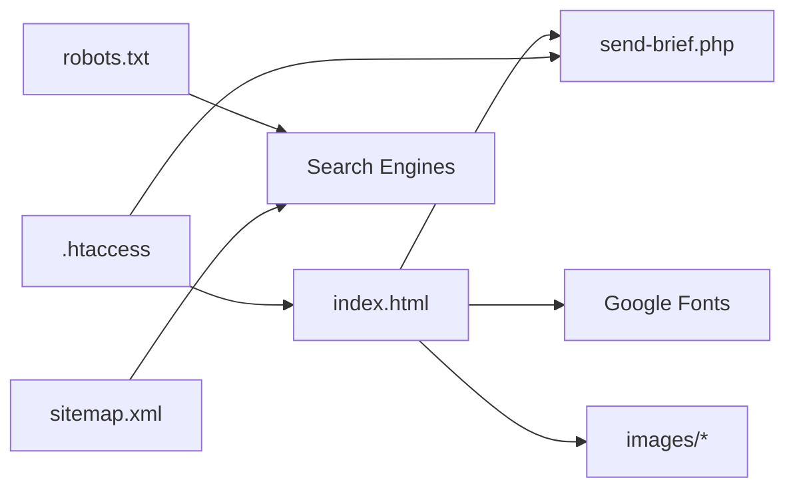

# File Structure Reference

<cite>
**Referenced Files in This Document**
- [index.html](file://index.html)
- [send-brief.php](file://send-brief.php)
- [.htaccess](file://.htaccess)
- [robots.txt](file://robots.txt)
- [sitemap.xml](file://sitemap.xml)
- [README.md](file://README.md)
</cite>

## Table of Contents
1. [Introduction](#introduction)
2. [Project Structure](#project-structure)
3. [Core Components](#core-components)
4. [Architecture Overview](#architecture-overview)
5. [Detailed Component Analysis](#detailed-component-analysis)
6. [Dependency Analysis](#dependency-analysis)
7. [Performance Considerations](#performance-considerations)
8. [Troubleshooting Guide](#troubleshooting-guide)
9. [Conclusion](#conclusion)
10. [Appendices](#appendices)

## Introduction
This document provides a comprehensive reference for the EMOO project’s file structure and organization. It explains each file’s purpose, how they interact, data flow patterns, external dependencies (such as Google Fonts), deployment considerations, and required file permissions. The site is a single-page application with an embedded form that submits to a PHP backend for email delivery, supported by Apache configuration, SEO files, and documentation.

## Project Structure
The repository root contains the core assets for a single-page marketing site:
- index.html: Main single-page application containing HTML structure, CSS styling, and JavaScript functionality.
- send-brief.php: Server-side handler for processing the brief form and sending emails via PHP mail().
- .htaccess: Apache configuration for HTTPS enforcement, security headers, caching, compression, and access control.
- robots.txt: Search engine crawling directives and sitemap reference.
- sitemap.xml: Site map for SEO with hreflang alternates.
- README.md: Installation and operational notes for the form submission system.
- images/: Directory for static assets referenced by the site (e.g., hero image).

**Diagram sources**
- [index.html:782-784](file://index.html#L782-L784)
- [send-brief.php:1-126](file://send-brief.php#L1-L126)
- [.htaccess:1-53](file://.htaccess#L1-L53)
- [robots.txt:1-11](file://robots.txt#L1-L11)
- [sitemap.xml:1-14](file://sitemap.xml#L1-L14)

**Section sources**
- [index.html:1-800](file://index.html#L1-L800)
- [send-brief.php:1-126](file://send-brief.php#L1-L126)
- [.htaccess:1-53](file://.htaccess#L1-L53)
- [robots.txt:1-11](file://robots.txt#L1-L11)
- [sitemap.xml:1-14](file://sitemap.xml#L1-L14)
- [README.md:1-73](file://README.md#L1-L73)

## Core Components
- index.html: Single-page application with bilingual content, responsive design, animations, and a contact/brief form that posts to send-brief.php. Includes Open Graph/Twitter meta, structured data, and preconnect to Google Fonts.
- send-brief.php: Validates and sanitizes form input, applies honeypot anti-bot logic, constructs an email body, sets headers, sends via PHP mail(), logs activity, and returns JSON responses.
- .htaccess: Enforces HTTPS, sets security headers, enables caching for static assets, compresses text-based responses, and restricts direct browsing of sensitive files.
- robots.txt: Allows crawling of public pages while disallowing sensitive endpoints and referencing the sitemap.
- sitemap.xml: Declares the homepage with last modification date, change frequency, priority, and hreflang alternates for language versions.
- README.md: Documents requirements, security measures, installation steps, and troubleshooting guidance for the form submission pipeline.

**Section sources**
- [index.html:1-800](file://index.html#L1-L800)
- [send-brief.php:1-126](file://send-brief.php#L1-L126)
- [.htaccess:1-53](file://.htaccess#L1-L53)
- [robots.txt:1-11](file://robots.txt#L1-L11)
- [sitemap.xml:1-14](file://sitemap.xml#L1-L14)
- [README.md:1-73](file://README.md#L1-L73)

## Architecture Overview
The application follows a simple client-server pattern:
- Client: index.html serves the SPA, including form UI and inline styles/scripts.
- Server: Apache serves static assets and routes POST requests to send-brief.php for processing.
- Email: send-brief.php uses PHP mail() to deliver messages locally on the same host.
- SEO: robots.txt and sitemap.xml guide search engines; .htaccess ensures secure and optimized delivery.

**Diagram sources**
- [index.html:782-784](file://index.html#L782-L784)
- [send-brief.php:10-15](file://send-brief.php#L10-L15)
- [send-brief.php:30-81](file://send-brief.php#L30-L81)
- [send-brief.php:83-125](file://send-brief.php#L83-L125)
- [.htaccess:4-8](file://.htaccess#L4-L8)

## Detailed Component Analysis

### index.html: Single-Page Application
- Purpose: Presents the EMOO brand, services, process, projects, stats, and a brief request form. Contains all CSS and minimal JS for interactions, animations, and language toggling.
- Key features:
  - SEO: Meta tags, Open Graph, Twitter Card, canonical URL, hreflang alternates, structured data (Organization, WebSite).
  - External dependencies: Preconnect and stylesheet links to Google Fonts (Unbounded, Manrope, JetBrains Mono).
  - Form: Posts to send-brief.php via standard POST; includes a hidden honeypot field to deter bots.
  - Accessibility and performance: Reduced motion support, semantic markup, lazy loading where applicable.

**Diagram sources**
- [index.html:782-784](file://index.html#L782-L784)
- [index.html:33-35](file://index.html#L33-L35)

**Section sources**
- [index.html:1-800](file://index.html#L1-L800)

### send-brief.php: Form Processing and Email Delivery
- Purpose: Securely processes brief submissions, validates inputs, builds an email, and sends it using PHP mail().
- Data flow:
  - Reject non-POST requests with 405.
  - Apply honeypot check to silently accept bot submissions.
  - Sanitize and validate fields (name, contact, company, area, message).
  - Build email subject/body/headers and send via mail().
  - Log successful submissions and return JSON responses indicating success or errors.

**Diagram sources**
- [send-brief.php:10-15](file://send-brief.php#L10-L15)
- [send-brief.php:22-28](file://send-brief.php#L22-L28)
- [send-brief.php:30-81](file://send-brief.php#L30-L81)
- [send-brief.php:83-125](file://send-brief.php#L83-L125)

**Section sources**
- [send-brief.php:1-126](file://send-brief.php#L1-L126)

### .htaccess: Apache Configuration
- Purpose: Enforces HTTPS, adds security headers, enables caching and compression, and prevents direct browsing of sensitive files.
- Highlights:
  - Force HTTPS redirect.
  - Security headers: X-Content-Type-Options, X-Frame-Options, X-XSS-Protection, Referrer-Policy, Permissions-Policy.
  - Expires caching for images, CSS, JS, fonts.
  - Deflate compression for text-based types.
  - Access restrictions for sensitive extensions.

**Diagram sources**
- [.htaccess:4-8](file://.htaccess#L4-L8)
- [.htaccess:14-21](file://.htaccess#L14-L21)
- [.htaccess:23-34](file://.htaccess#L23-L34)
- [.htaccess:36-43](file://.htaccess#L36-L43)
- [.htaccess:45-49](file://.htaccess#L45-L49)

**Section sources**
- [.htaccess:1-53](file://.htaccess#L1-L53)

### robots.txt: Crawling Control
- Purpose: Directs search engine crawlers to allow indexing of public pages while disallowing sensitive endpoints and referencing the sitemap.
- Behavior:
  - Allow all paths except specific sensitive files.
  - Point to sitemap.xml for discovery.

**Section sources**
- [robots.txt:1-11](file://robots.txt#L1-L11)

### sitemap.xml: SEO Sitemap
- Purpose: Declares the homepage URL, last modification date, change frequency, priority, and hreflang alternates for language variants.
- Benefits: Helps search engines understand site structure and multilingual content.

**Section sources**
- [sitemap.xml:1-14](file://sitemap.xml#L1-L14)

### README.md: Deployment and Operations Notes
- Purpose: Provides installation instructions, environment requirements, security measures, and troubleshooting tips for the form submission system.
- Key points:
  - Requires PHP 7.4+, SSL, mail() enabled, sessions.
  - Multi-layered security: local mail delivery, HTTPS enforcement, CSRF protection (documented), rate limiting (documented), sanitization, valid sender address.
  - File placement and permissions guidance.

**Section sources**
- [README.md:1-73](file://README.md#L1-L73)

## Dependency Analysis
- index.html depends on:
  - send-brief.php for form submission.
  - Google Fonts for typography (preconnected and loaded via stylesheet).
  - Local images directory for visual assets.
- send-brief.php depends on:
  - PHP runtime with mail() function enabled.
  - Apache serving PHP scripts.
- .htaccess affects all requests for security and performance.
- robots.txt and sitemap.xml influence search engine behavior but do not affect runtime.

**Diagram sources**
- [index.html:33-35](file://index.html#L33-L35)
- [index.html:782-784](file://index.html#L782-L784)
- [.htaccess:1-53](file://.htaccess#L1-L53)
- [robots.txt:1-11](file://robots.txt#L1-L11)
- [sitemap.xml:1-14](file://sitemap.xml#L1-L14)

**Section sources**
- [index.html:1-800](file://index.html#L1-L800)
- [send-brief.php:1-126](file://send-brief.php#L1-L126)
- [.htaccess:1-53](file://.htaccess#L1-L53)
- [robots.txt:1-11](file://robots.txt#L1-L11)
- [sitemap.xml:1-14](file://sitemap.xml#L1-L14)

## Performance Considerations
- Use preconnect to Google Fonts to reduce font load latency.
- Leverage browser caching via .htaccess expires rules for static assets.
- Enable compression for text-based resources to reduce transfer size.
- Keep images optimized; ensure proper sizing and formats.
- Minimize unnecessary DOM manipulations and heavy animations on low-end devices; reduced motion media query is already present.

[No sources needed since this section provides general guidance]

## Troubleshooting Guide
- Form does not submit:
  - Ensure POST method is used; server returns 405 for non-POST requests.
  - Check honeypot field presence in the form; bots may be silently accepted.
  - Validate input fields; server returns 400 with error details if validation fails.
- Emails not received:
  - Verify PHP mail() is enabled on the hosting environment.
  - Confirm recipient addresses are correctly configured in send-brief.php.
  - Check server logs and error_log entries for failures.
- HTTPS issues:
  - Ensure SSL certificate is active; .htaccess enforces HTTPS redirect.
  - If accessing via HTTP, expect a 301 redirect to HTTPS.
- Permission errors:
  - Set file permissions per README guidance (files 644, directories 755).
  - Ensure Apache can read and execute PHP scripts.

**Section sources**
- [send-brief.php:10-15](file://send-brief.php#L10-L15)
- [send-brief.php:22-28](file://send-brief.php#L22-L28)
- [send-brief.php:30-81](file://send-brief.php#L30-L81)
- [send-brief.php:112-125](file://send-brief.php#L112-L125)
- [.htaccess:4-8](file://.htaccess#L4-L8)
- [README.md:21-27](file://README.md#L21-L27)
- [README.md:39-46](file://README.md#L39-L46)

## Conclusion
The EMOO project is a well-structured single-page application with a clear separation between frontend presentation and backend form processing. The integration of .htaccess ensures secure and performant delivery, while robots.txt and sitemap.xml optimize discoverability. The form submission pipeline is robust, with validation, sanitization, and logging. Proper deployment and permissions are essential for reliable operation.

[No sources needed since this section summarizes without analyzing specific files]

## Appendices

### Deployment Checklist
- Place all files in the website root directory as indicated by the project structure.
- Ensure PHP 7.4+ is available and mail() is enabled.
- Activate SSL and confirm HTTPS enforcement via .htaccess.
- Set correct file permissions: files 644, directories 755.
- Test form submission end-to-end and verify email receipt.
- Validate SEO elements: robots.txt allows crawling, sitemap.xml is accessible.

**Section sources**
- [README.md:21-27](file://README.md#L21-L27)
- [README.md:39-46](file://README.md#L39-L46)
- [.htaccess:4-8](file://.htaccess#L4-L8)
- [robots.txt:1-11](file://robots.txt#L1-L11)
- [sitemap.xml:1-14](file://sitemap.xml#L1-L14)