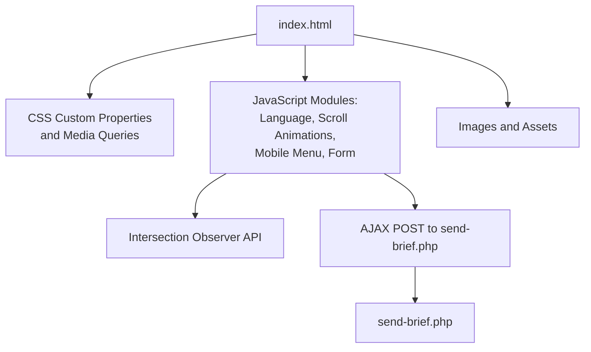
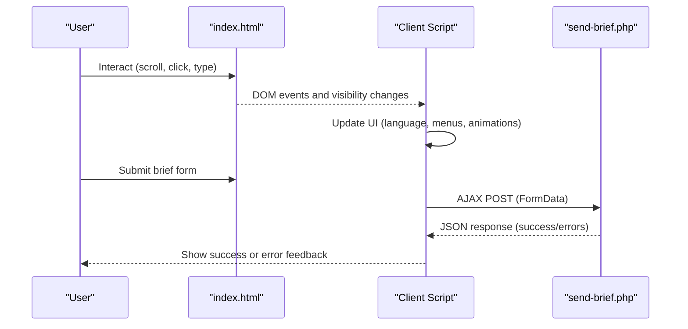
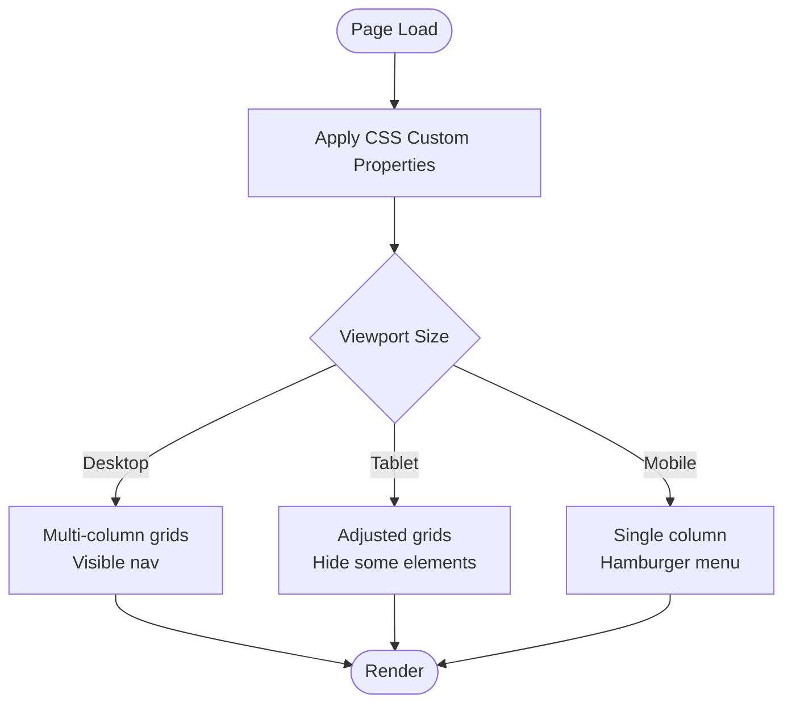
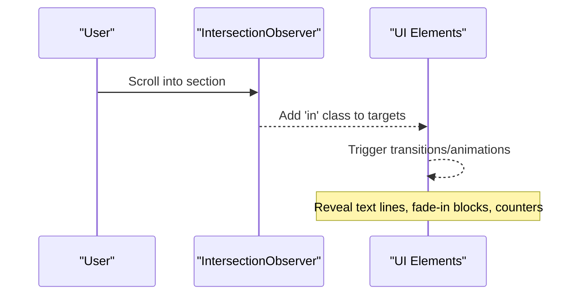
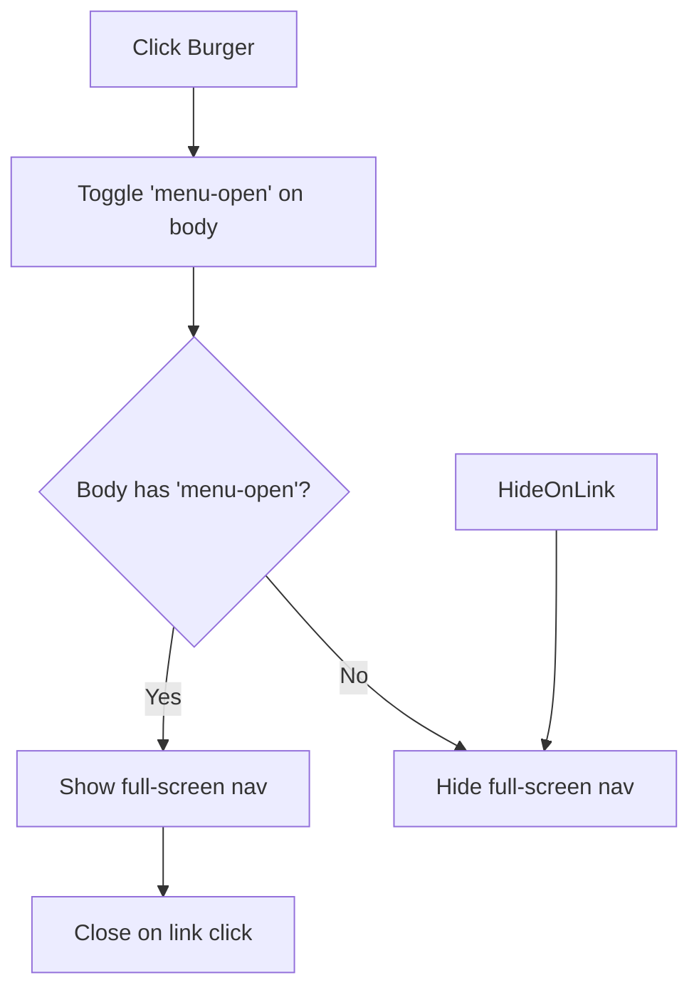
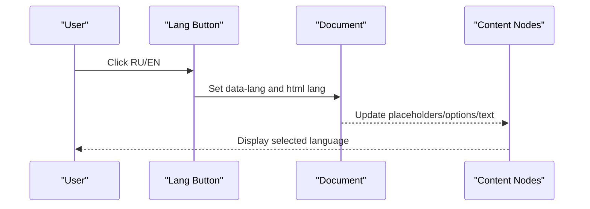
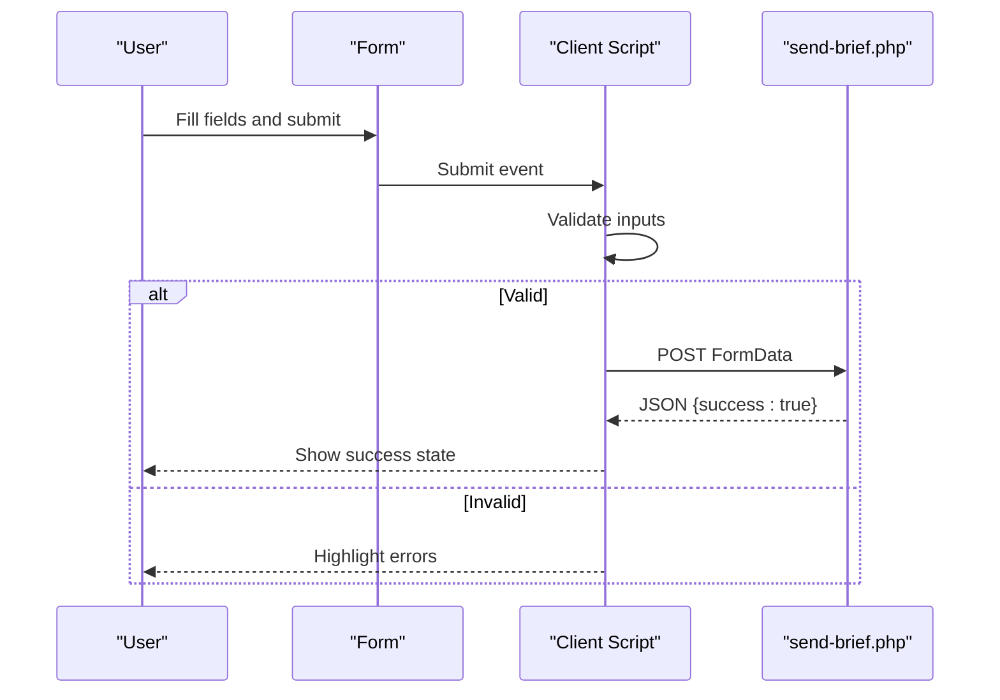
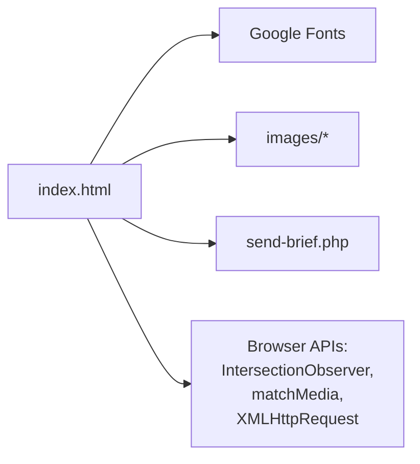

# Frontend Implementation

<cite>
**Referenced Files in This Document**
- [index.html](file://index.html)
- [send-brief.php](file://send-brief.php)
- [README.md](file://README.md)
</cite>

## Table of Contents
1. [Introduction](#introduction)
2. [Project Structure](#project-structure)
3. [Core Components](#core-components)
4. [Architecture Overview](#architecture-overview)
5. [Detailed Component Analysis](#detailed-component-analysis)
6. [Dependency Analysis](#dependency-analysis)
7. [Performance Considerations](#performance-considerations)
8. [Troubleshooting Guide](#troubleshooting-guide)
9. [Conclusion](#conclusion)
10. [Appendices](#appendices)

## Introduction
This document explains the frontend implementation of the EMOO exhibition company website. It is a single-page application built with vanilla HTML5, CSS3, and JavaScript. The site uses a responsive design approach based on CSS custom properties and media queries, scroll-triggered animations via the Intersection Observer API, a mobile hamburger navigation, and a bilingual interface (Russian and English). It also includes a form validation system with real-time feedback and AJAX submission handling to a PHP backend. Accessibility considerations are integrated throughout the UI.

## Project Structure
The project is a minimal static site with a single page:
- index.html: Contains all markup, styles, and client-side logic for the SPA.
- send-brief.php: Server-side handler for form submissions.
- README.md: Installation and security notes for the form handler.
- images/: Directory for assets referenced by the page.

**Diagram sources**
- [index.html:68-381](file://index.html#L68-L381)
- [index.html:879-1080](file://index.html#L879-L1080)
- [send-brief.php:1-126](file://send-brief.php#L1-L126)

**Section sources**
- [index.html:1-1082](file://index.html#L1-L1082)
- [send-brief.php:1-126](file://send-brief.php#L1-L126)
- [README.md:1-73](file://README.md#L1-L73)

## Core Components
- Responsive layout and theming: CSS custom properties define colors, typography, and spacing; media queries adapt layouts across breakpoints.
- Navigation: Desktop nav links with active state tracking; mobile hamburger menu with full-screen overlay.
- Language switching: RU/EN toggle updates content placeholders, titles, and dynamic text with a scramble effect.
- Scroll animations: Elements reveal on scroll using Intersection Observer; counters animate when visible.
- Services hover preview: Cursor-following image preview for service rows on fine-pointer devices.
- Form validation and submission: Client-side validation with visual feedback; AJAX POST to send-brief.php; success/error handling.

**Section sources**
- [index.html:68-381](file://index.html#L68-L381)
- [index.html:879-1080](file://index.html#L879-L1080)

## Architecture Overview
The SPA architecture is centered around a single HTML file that embeds:
- Semantic sections for hero, services, formula, stages, works, stats, contacts, and footer.
- Inline CSS for styling, including responsive rules and reduced-motion support.
- Inline JavaScript for interactivity and data flow.

**Diagram sources**
- [index.html:879-1080](file://index.html#L879-L1080)
- [send-brief.php:1-126](file://send-brief.php#L1-L126)

## Detailed Component Analysis

### Responsive Design with CSS Custom Properties and Media Queries
- Custom properties define brand palette, typography, and line colors, enabling consistent theming and easy customization.
- Media queries adjust grid layouts, hide/show elements, and optimize spacing for tablets and phones.
- Reduced motion preferences disable animations and transitions for accessibility.

**Diagram sources**
- [index.html:68-381](file://index.html#L68-L381)

**Section sources**
- [index.html:68-381](file://index.html#L68-L381)

### Interactive Features
- Scroll-triggered animations: Elements with reveal classes fade and translate into view using Intersection Observer.
- Active navigation tracking: Sections in viewport update active link states.
- Stages rail progress: Visual rail fills proportionally as the user scrolls through process steps.
- Counters animation: Numbers count up when entering the viewport.
- Services cursor preview: On fine-pointer devices, hovering over service rows shows a floating preview image following the cursor.

**Diagram sources**
- [index.html:937-992](file://index.html#L937-L992)

**Section sources**
- [index.html:937-992](file://index.html#L937-L992)
- [index.html:994-1007](file://index.html#L994-L1007)

### Mobile Navigation with Hamburger Menu
- Desktop hides the burger; mobile reveals it at smaller breakpoints.
- Toggling adds/removes a body class to open/close the full-screen menu.
- Links close the menu upon selection.

**Diagram sources**
- [index.html:117-128](file://index.html#L117-L128)
- [index.html:932-935](file://index.html#L932-L935)

**Section sources**
- [index.html:117-128](file://index.html#L117-L128)
- [index.html:932-935](file://index.html#L932-L935)

### Language Switching (Russian and English)
- Buttons toggle the language attribute on the document root and body.
- Content elements with data attributes switch placeholders, options, and dynamic text.
- Title updates per language; optional scramble effect animates text transitions.

**Diagram sources**
- [index.html:904-922](file://index.html#L904-L922)

**Section sources**
- [index.html:904-922](file://index.html#L904-L922)

### Form Validation and AJAX Submission
- Client-side validation highlights required fields and prevents submission if invalid.
- On submit, the form data is sent via XMLHttpRequest to send-brief.php.
- Success displays an animated confirmation; errors show messages and reset the button state.

**Diagram sources**
- [index.html:1009-1078](file://index.html#L1009-L1078)
- [send-brief.php:1-126](file://send-brief.php#L1-L126)

**Section sources**
- [index.html:1009-1078](file://index.html#L1009-L1078)
- [send-brief.php:1-126](file://send-brief.php#L1-L126)

### CSS Architecture Patterns
- CSS custom properties centralize theme values for colors, fonts, and lines.
- Utility classes for reveal animations and responsive behavior reduce duplication.
- Section scaffolding standardizes spacing and typography across pages.

**Section sources**
- [index.html:68-381](file://index.html#L68-L381)

### Animation Implementations
- Entrance animations use transform and opacity transitions triggered by adding classes.
- Hero title lines animate on load; service list items stagger their reveal.
- Counters animate with easing functions when visible.
- Marquee and subtle background grain add motion without impacting performance.

**Section sources**
- [index.html:130-198](file://index.html#L130-L198)
- [index.html:937-992](file://index.html#L937-L992)

### Accessibility Considerations
- prefers-reduced-motion disables animations and transitions for users who prefer reduced motion.
- Semantic HTML structure with landmarks and headings improves screen reader navigation.
- Aria labels on interactive controls like the burger menu and decorative elements.
- Focus states for form inputs ensure keyboard usability.

**Section sources**
- [index.html:372-380](file://index.html#L372-L380)
- [index.html:387-407](file://index.html#L387-L407)

## Dependency Analysis
- index.html depends on:
  - Google Fonts for typography.
  - Images under images/.
  - send-brief.php for form processing.
- JavaScript modules within index.html depend on:
  - Intersection Observer API for scroll-based interactions.
  - matchMedia for feature detection (reduced motion, pointer type).
  - XMLHttpRequest for AJAX form submission.

**Diagram sources**
- [index.html:33-38](file://index.html#L33-L38)
- [index.html:879-1080](file://index.html#L879-L1080)
- [send-brief.php:1-126](file://send-brief.php#L1-L126)

**Section sources**
- [index.html:33-38](file://index.html#L33-L38)
- [index.html:879-1080](file://index.html#L879-L1080)
- [send-brief.php:1-126](file://send-brief.php#L1-L126)

## Performance Considerations
- Use passive scroll listeners to avoid blocking main thread during scrolling.
- Limit heavy animations on low-power devices; respect prefers-reduced-motion.
- Lazy-load images where appropriate to improve initial load time.
- Keep CSS and JS inline in a single file for simplicity; consider splitting for large projects to enable caching.

[No sources needed since this section provides general guidance]

## Troubleshooting Guide
- Form not sending:
  - Ensure send-brief.php is accessible and server supports mail().
  - Check network tab for AJAX errors and verify CORS or same-origin policy.
- 403 Forbidden:
  - Confirm HTTPS is enforced and .htaccess is present as documented.
- Language not switching:
  - Verify buttons have correct data-lang attributes and that content nodes include data-en/data-ru.
- Animations not triggering:
  - Check that elements have reveal classes and that IntersectionObserver is supported.
  - Respect prefers-reduced-motion settings.

**Section sources**
- [send-brief.php:1-126](file://send-brief.php#L1-L126)
- [README.md:28-73](file://README.md#L28-L73)
- [index.html:937-992](file://index.html#L937-L992)

## Conclusion
The EMOO website demonstrates a clean, maintainable SPA built with vanilla technologies. Its responsive design, accessible patterns, and modular JavaScript provide a solid foundation. The bilingual support and robust form handling integrate seamlessly with a simple PHP backend. Extending the site involves adding new sections, updating language content, and enhancing interactions while preserving the established patterns.

[No sources needed since this section summarizes without analyzing specific files]

## Appendices

### Extending UI Components
- Add a new section:
  - Insert semantic markup with standard section classes and reveal wrappers.
  - Define any additional CSS variables or utilities if needed.
  - Wire up Intersection Observer if you need scroll-triggered animations.
- Customize visuals:
  - Modify CSS custom properties to change colors, fonts, and spacing globally.
  - Adjust media queries to refine responsive behavior for new components.
- Maintain responsiveness:
  - Test across breakpoints and ensure new elements stack gracefully on small screens.
  - Respect reduced motion preferences for new animations.

[No sources needed since this section provides general guidance]