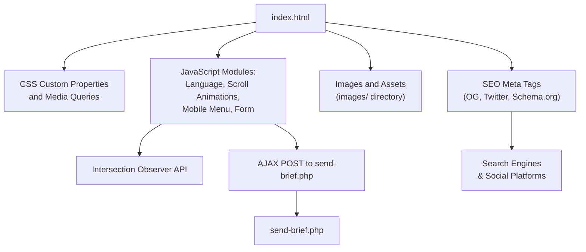
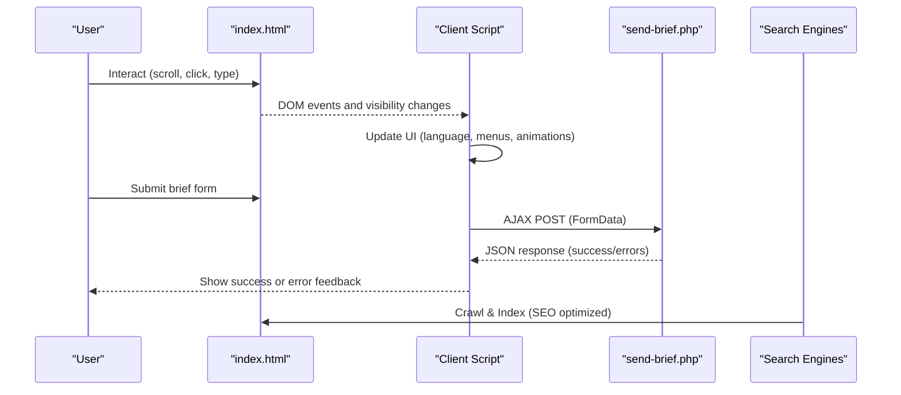
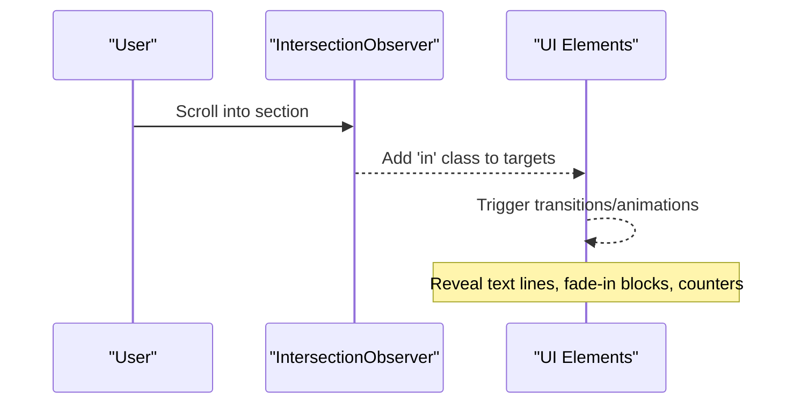
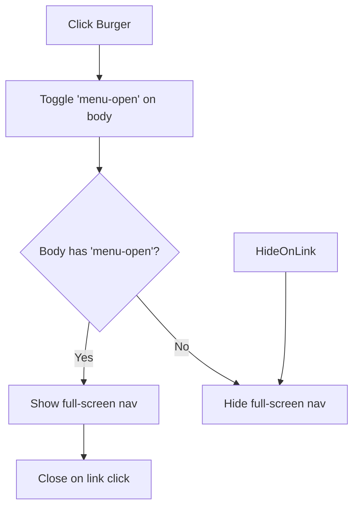
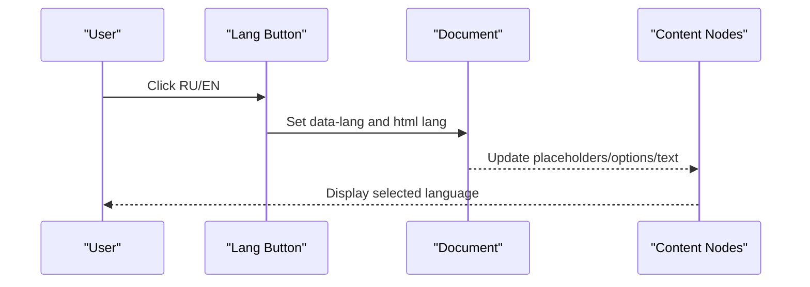
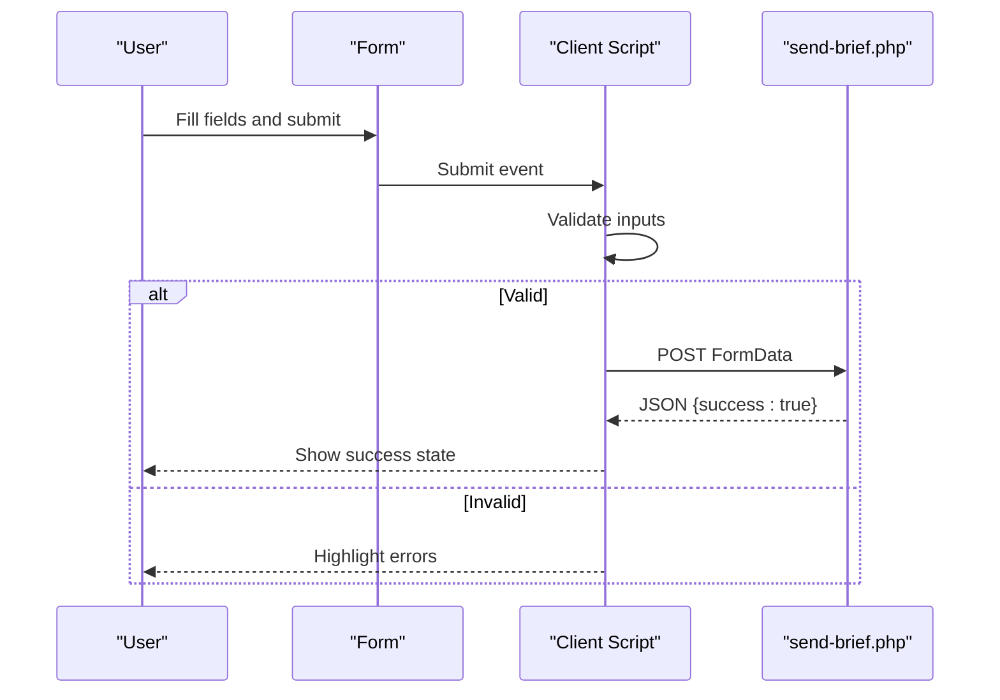
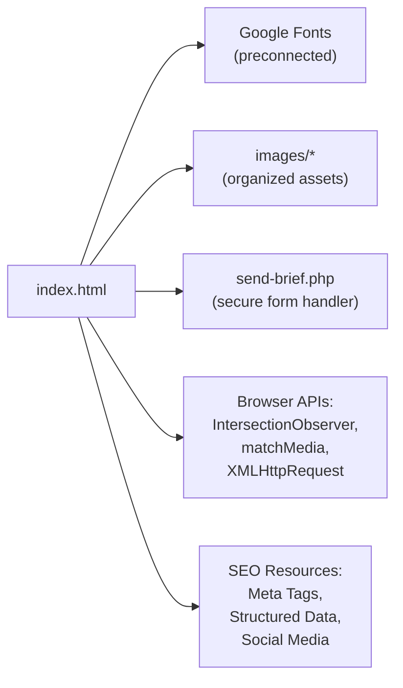

# Frontend Implementation

<cite>
**Referenced Files in This Document**
- [index.html](file://index.html)
- [send-brief.php](file://send-brief.php)
- [README.md](file://README.md)
- [robots.txt](file://robots.txt)
- [sitemap.xml](file://sitemap.xml)
</cite>

## Update Summary
**Changes Made**
- Added comprehensive SEO enhancement section covering meta tags, Open Graph protocol, Twitter Cards, and hreflang attributes
- Updated project structure documentation to reflect images/ subdirectory organization
- Enhanced search engine optimization section with structured data markup details
- Updated asset management section to document proper image organization
- Added SEO performance considerations and best practices

## Table of Contents
1. [Introduction](#introduction)
2. [Project Structure](#project-structure)
3. [Core Components](#core-components)
4. [Architecture Overview](#architecture-overview)
5. [Detailed Component Analysis](#detailed-component-analysis)
6. [SEO and Search Engine Optimization](#seo-and-search-engine-optimization)
7. [Dependency Analysis](#dependency-analysis)
8. [Performance Considerations](#performance-considerations)
9. [Troubleshooting Guide](#troubleshooting-guide)
10. [Conclusion](#conclusion)
11. [Appendices](#appendices)

## Introduction
This document explains the frontend implementation of the EMOO exhibition company website. It is a single-page application built with vanilla HTML5, CSS3, and JavaScript. The site uses a responsive design approach based on CSS custom properties and media queries, scroll-triggered animations via the Intersection Observer API, a mobile hamburger navigation, and a bilingual interface (Russian and English). It includes comprehensive SEO optimization with extensive meta tags, Open Graph protocol implementation, Twitter Card integration, hreflang attributes for multilingual support, and JSON-LD structured data markup. The site also features a form validation system with real-time feedback and AJAX submission handling to a PHP backend. Accessibility considerations are integrated throughout the UI.

## Project Structure
The project is a minimal static site with a single page:
- index.html: Contains all markup, styles, and client-side logic for the SPA with comprehensive SEO implementation.
- send-brief.php: Server-side handler for form submissions with security measures.
- README.md: Installation and security notes for the form handler.
- robots.txt: Search engine crawling directives.
- sitemap.xml: XML sitemap with hreflang annotations for multilingual support.
- images/: Directory for assets including hero images, service previews, and favicon files.

**Diagram sources**
- [index.html:1-67](file://index.html#L1-L67)
- [index.html:68-381](file://index.html#L68-L381)
- [index.html:879-1080](file://index.html#L879-L1080)
- [send-brief.php:1-126](file://send-brief.php#L1-L126)

**Section sources**
- [index.html:1-1082](file://index.html#L1-L1082)
- [send-brief.php:1-126](file://send-brief.php#L1-L126)
- [README.md:1-73](file://README.md#L1-L73)
- [robots.txt:1-11](file://robots.txt#L1-L11)
- [sitemap.xml:1-14](file://sitemap.xml#L1-L14)

## Core Components
- Responsive layout and theming: CSS custom properties define colors, typography, and spacing; media queries adapt layouts across breakpoints.
- Navigation: Desktop nav links with active state tracking; mobile hamburger menu with full-screen overlay.
- Language switching: RU/EN toggle updates content placeholders, titles, and dynamic text with a scramble effect.
- Scroll animations: Elements reveal on scroll using Intersection Observer; counters animate when visible.
- Services hover preview: Cursor-following image preview for service rows on fine-pointer devices.
- Form validation and submission: Client-side validation with visual feedback; AJAX POST to send-brief.php; success/error handling.
- Comprehensive SEO implementation: Meta tags, Open Graph protocol, Twitter Cards, hreflang attributes, and JSON-LD structured data.

**Section sources**
- [index.html:68-381](file://index.html#L68-L381)
- [index.html:879-1080](file://index.html#L879-L1080)
- [index.html:1-67](file://index.html#L1-L67)

## Architecture Overview
The SPA architecture is centered around a single HTML file that embeds:
- Semantic sections for hero, services, formula, stages, works, stats, contacts, and footer.
- Inline CSS for styling, including responsive rules and reduced-motion support.
- Inline JavaScript for interactivity and data flow.
- Comprehensive SEO metadata for search engines and social media platforms.

**Diagram sources**
- [index.html:879-1080](file://index.html#L879-L1080)
- [send-brief.php:1-126](file://send-brief.php#L1-L126)
- [index.html:1-67](file://index.html#L1-L67)

## Detailed Component Analysis

### Responsive Design with CSS Custom Properties and Media Queries
- Custom properties define brand palette, typography, and line colors, enabling consistent theming and easy customization.
- Media queries adjust grid layouts, hide/show elements, and optimize spacing for tablets and phones.
- Reduced motion preferences disable animations and transitions for accessibility.

**Diagram sources**
- [index.html:68-381](file://index.html#L68-L381)

**Section sources**
- [index.html:68-381](file://index.html#L68-L381)

### Interactive Features
- Scroll-triggered animations: Elements with reveal classes fade and translate into view using Intersection Observer.
- Active navigation tracking: Sections in viewport update active link states.
- Stages rail progress: Visual rail fills proportionally as the user scrolls through process steps.
- Counters animation: Numbers count up when entering the viewport.
- Services cursor preview: On fine-pointer devices, hovering over service rows shows a floating preview image following the cursor.

**Diagram sources**
- [index.html:937-992](file://index.html#L937-L992)

**Section sources**
- [index.html:937-992](file://index.html#L937-L992)
- [index.html:994-1007](file://index.html#L994-L1007)

### Mobile Navigation with Hamburger Menu
- Desktop hides the burger; mobile reveals it at smaller breakpoints.
- Toggling adds/removes a body class to open/close the full-screen menu.
- Links close the menu upon selection.

**Diagram sources**
- [index.html:117-128](file://index.html#L117-L128)
- [index.html:932-935](file://index.html#L932-L935)

**Section sources**
- [index.html:117-128](file://index.html#L117-L128)
- [index.html:932-935](file://index.html#L932-L935)

### Language Switching (Russian and English)
- Buttons toggle the language attribute on the document root and body.
- Content elements with data attributes switch placeholders, options, and dynamic text.
- Title updates per language; optional scramble effect animates text transitions.

**Diagram sources**
- [index.html:904-922](file://index.html#L904-L922)

**Section sources**
- [index.html:904-922](file://index.html#L904-L922)

### Form Validation and AJAX Submission
- Client-side validation highlights required fields and prevents submission if invalid.
- On submit, the form data is sent via XMLHttpRequest to send-brief.php.
- Success displays an animated confirmation; errors show messages and reset the button state.

**Diagram sources**
- [index.html:1009-1078](file://index.html#L1009-L1078)
- [send-brief.php:1-126](file://send-brief.php#L1-L126)

**Section sources**
- [index.html:1009-1078](file://index.html#L1009-L1078)
- [send-brief.php:1-126](file://send-brief.php#L1-L126)

### CSS Architecture Patterns
- CSS custom properties centralize theme values for colors, fonts, and lines.
- Utility classes for reveal animations and responsive behavior reduce duplication.
- Section scaffolding standardizes spacing and typography across pages.

**Section sources**
- [index.html:68-381](file://index.html#L68-L381)

### Animation Implementations
- Entrance animations use transform and opacity transitions triggered by adding classes.
- Hero title lines animate on load; service list items stagger their reveal.
- Counters animate with easing functions when visible.
- Marquee and subtle background grain add motion without impacting performance.

**Section sources**
- [index.html:130-198](file://index.html#L130-L198)
- [index.html:937-992](file://index.html#L937-L992)

### Accessibility Considerations
- prefers-reduced-motion disables animations and transitions for users who prefer reduced motion.
- Semantic HTML structure with landmarks and headings improves screen reader navigation.
- Aria labels on interactive controls like the burger menu and decorative elements.
- Focus states for form inputs ensure keyboard usability.

**Section sources**
- [index.html:372-380](file://index.html#L372-L380)
- [index.html:387-407](file://index.html#L387-L407)

## SEO and Search Engine Optimization

### Comprehensive Meta Tag Implementation
The website implements extensive SEO optimization through comprehensive meta tags in the document head:

- **Basic SEO**: Character encoding, viewport configuration, title, description, keywords, author, and robots directives
- **Canonical URL**: Prevents duplicate content issues with proper canonical linking
- **Theme Color**: Mobile browser chrome color customization
- **Preconnect**: Optimized font loading performance with Google Fonts preconnection

### Open Graph Protocol Implementation
Full Open Graph protocol support ensures optimal social media sharing:

- **og:type**: Website type specification
- **og:title**: Optimized title for social sharing
- **og:description**: Compelling description for social previews
- **og:url**: Canonical URL for social platforms
- **og:image**: High-quality hero image for social sharing
- **og:locale**: Primary locale (ru_RU) with alternate locale (en_US)
- **og:site_name**: Brand name consistency across platforms

### Twitter Card Integration
Twitter-specific meta tags provide enhanced Twitter sharing experience:

- **twitter:card**: Large image card format for rich previews
- **twitter:title**: Optimized title for Twitter display
- **twitter:description**: Concise description for Twitter cards
- **twitter:image**: Optimized image for Twitter sharing

### Multilingual Support with hreflang
Proper multilingual SEO implementation with hreflang attributes:

- **hreflang="ru"**: Russian version at primary URL
- **hreflang="en"**: English version with query parameter
- **hreflang="x-default"**: Default language fallback
- **XML Sitemap Integration**: Complementary hreflang annotations in sitemap.xml

### Structured Data Markup
JSON-LD structured data provides rich search result information:

#### Organization Schema
- **Business Information**: Name, URL, logo, description
- **Contact Details**: Email and telephone number
- **Brand Slogan**: "Every Moment Of Opportunity"
- **Multi-location Support**: Addresses for Moscow, Dubai, and Belgrade

#### WebSite Schema
- **Site Information**: Name and URL
- **Multilingual Support**: Language array supporting Russian and English
- **Search Engine Recognition**: Enhanced site understanding by search engines

### Asset Organization
- **Image Directory Structure**: All images organized under `images/` subdirectory
- **Optimized Image Paths**: Consistent relative paths for better maintainability
- **Favicon Implementation**: SVG and PNG favicons for optimal browser compatibility

### Search Engine Configuration
- **robots.txt**: Proper crawling directives excluding sensitive files
- **sitemap.xml**: XML sitemap with hreflang annotations for multilingual SEO
- **Security Headers**: HTTPS enforcement and access control

**Section sources**
- [index.html:1-67](file://index.html#L1-L67)
- [robots.txt:1-11](file://robots.txt#L1-L11)
- [sitemap.xml:1-14](file://sitemap.xml#L1-L14)

## Dependency Analysis
- index.html depends on:
  - Google Fonts for typography with preconnect optimization.
  - Images under images/ directory for visual content.
  - send-brief.php for form processing with security measures.
  - External SEO resources (meta tags, structured data).
- JavaScript modules within index.html depend on:
  - Intersection Observer API for scroll-based interactions.
  - matchMedia for feature detection (reduced motion, pointer type).
  - XMLHttpRequest for AJAX form submission.

**Diagram sources**
- [index.html:33-38](file://index.html#L33-L38)
- [index.html:879-1080](file://index.html#L879-L1080)
- [send-brief.php:1-126](file://send-brief.php#L1-L126)
- [index.html:1-67](file://index.html#L1-L67)

**Section sources**
- [index.html:33-38](file://index.html#L33-L38)
- [index.html:879-1080](file://index.html#L879-L1080)
- [send-brief.php:1-126](file://send-brief.php#L1-L126)
- [index.html:1-67](file://index.html#L1-L67)

## Performance Considerations
- Use passive scroll listeners to avoid blocking main thread during scrolling.
- Limit heavy animations on low-power devices; respect prefers-reduced-motion.
- Lazy-load images where appropriate to improve initial load time.
- Keep CSS and JS inline in a single file for simplicity; consider splitting for large projects to enable caching.
- **SEO Performance**: Preconnect to external domains for faster resource loading.
- **Asset Optimization**: Organized image structure improves caching and CDN deployment.
- **Mobile Performance**: Responsive design ensures optimal performance across devices.

[No sources needed since this section provides general guidance]

## Troubleshooting Guide
- Form not sending:
  - Ensure send-brief.php is accessible and server supports mail().
  - Check network tab for AJAX errors and verify CORS or same-origin policy.
- 403 Forbidden:
  - Confirm HTTPS is enforced and .htaccess is present as documented.
- Language not switching:
  - Verify buttons have correct data-lang attributes and that content nodes include data-en/data-ru.
- Animations not triggering:
  - Check that elements have reveal classes and that IntersectionObserver is supported.
  - Respect prefers-reduced-motion settings.
- **SEO Issues**:
  - Verify meta tags are properly formatted and indexed by search engines.
  - Check Open Graph tags render correctly on social media platforms.
  - Ensure hreflang attributes point to valid URLs.
  - Validate JSON-LD structured data using Google's Rich Results Test.
- **Image Loading Problems**:
  - Confirm images exist in the images/ directory with correct paths.
  - Check file permissions and MIME types for proper serving.

**Section sources**
- [send-brief.php:1-126](file://send-brief.php#L1-L126)
- [README.md:28-73](file://README.md#L28-L73)
- [index.html:937-992](file://index.html#L937-L992)
- [index.html:1-67](file://index.html#L1-L67)

## Conclusion
The EMOO website demonstrates a clean, maintainable SPA built with vanilla technologies, enhanced with comprehensive SEO optimization. Its responsive design, accessible patterns, modular JavaScript, and extensive search engine optimization provide a solid foundation for both user experience and discoverability. The bilingual support, robust form handling, and structured data integration seamlessly work with a simple PHP backend while maintaining excellent SEO performance. Extending the site involves adding new sections, updating language content, enhancing interactions, and maintaining the established SEO patterns for continued search engine visibility.

[No sources needed since this section summarizes without analyzing specific files]

## Appendices

### Extending UI Components
- Add a new section:
  - Insert semantic markup with standard section classes and reveal wrappers.
  - Define any additional CSS variables or utilities if needed.
  - Wire up Intersection Observer if you need scroll-triggered animations.
  - Include appropriate SEO meta descriptions and structured data if applicable.
- Customize visuals:
  - Modify CSS custom properties to change colors, fonts, and spacing globally.
  - Adjust media queries to refine responsive behavior for new components.
  - Maintain accessibility standards and reduced motion support.
- Maintain responsiveness:
  - Test across breakpoints and ensure new elements stack gracefully on small screens.
  - Respect reduced motion preferences for new animations.
  - Optimize images and assets for different screen sizes.

### SEO Enhancement Guidelines
- **Meta Tags**: Always include descriptive title, meta description, and relevant keywords.
- **Open Graph**: Implement complete OG tags for optimal social media sharing.
- **Twitter Cards**: Configure Twitter-specific meta tags for enhanced Twitter presence.
- **Structured Data**: Use JSON-LD for Organization and WebSite schemas.
- **Multilingual Support**: Implement hreflang attributes for all language versions.
- **Asset Management**: Organize images in dedicated directories with proper naming conventions.

[No sources needed since this section provides general guidance]