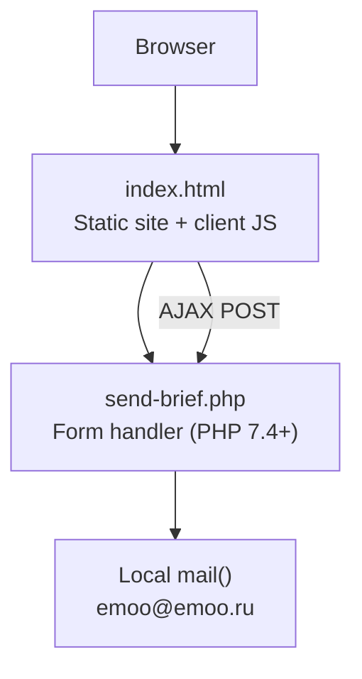
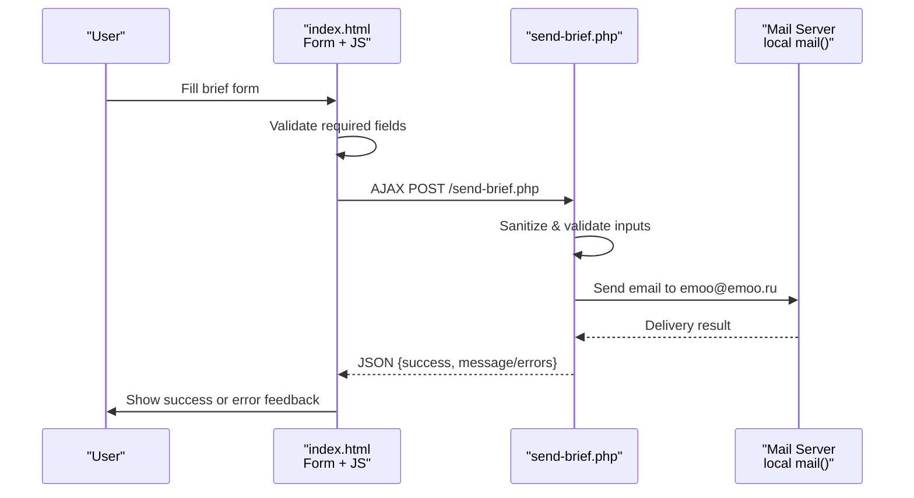
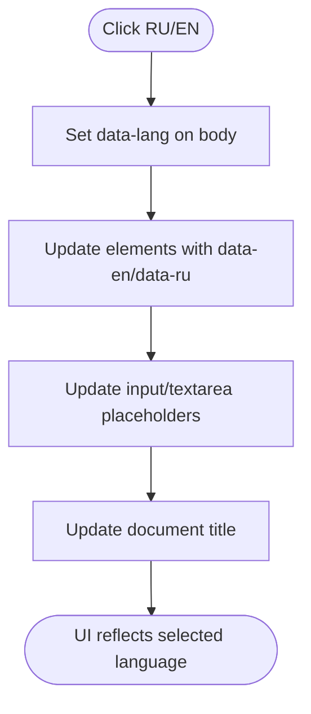
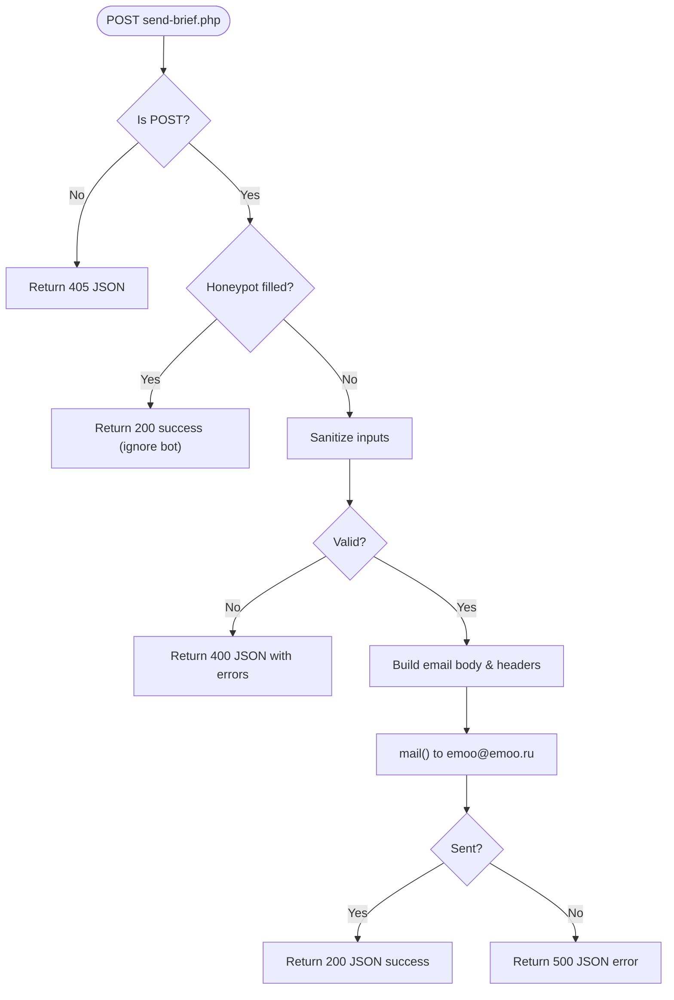
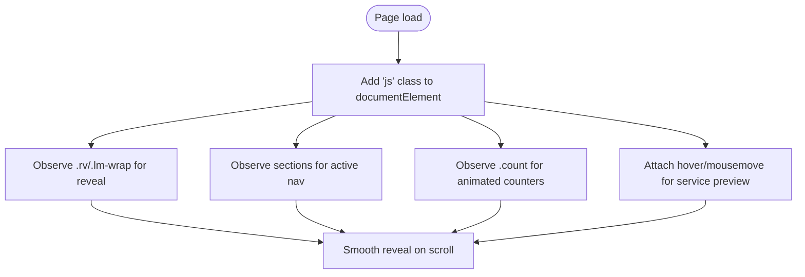
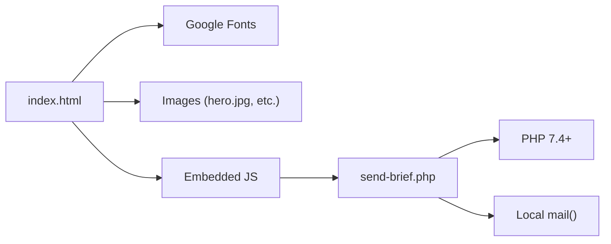

# Project Overview

<cite>
**Referenced Files in This Document**
- [README.md](file://README.md)
- [index.html](file://index.html)
- [send-brief.php](file://send-brief.php)
</cite>

## Table of Contents
1. [Introduction](#introduction)
2. [Project Structure](#project-structure)
3. [Core Components](#core-components)
4. [Architecture Overview](#architecture-overview)
5. [Detailed Component Analysis](#detailed-component-analysis)
6. [Dependency Analysis](#dependency-analysis)
7. [Performance Considerations](#performance-considerations)
8. [Troubleshooting Guide](#troubleshooting-guide)
9. [Conclusion](#conclusion)

## Introduction
EMOO is a professional business website for an exhibition stand company that designs, builds, and supports exhibition stands across 17 countries. The site targets potential clients and partners who need turnkey exhibition solutions, from concept to on-site support. It showcases services, process stages, portfolio highlights, and provides a secure form to request a free concept within 24 hours.

Key features:
- Bilingual support (Russian/English) with client-side language switching
- Secure form processing via PHP with validation, sanitization, and honeypot anti-bot protection
- Responsive design optimized for desktop, tablet, and mobile
- Interactive sections including animated counters, scroll reveals, and a cursor-following service preview
- Simple static frontend with a lightweight backend for form handling, suitable for shared hosting environments

[No sources needed since this section summarizes without analyzing specific files]

## Project Structure
The project follows a minimal, monolithic structure optimized for simple deployment on shared hosting:
- index.html: Single-page site containing all content, styles, and client-side logic
- send-brief.php: Backend script that processes the brief form and sends email notifications
- README.md: Installation and security notes for deploying the form handler

**Diagram sources**
- [index.html:728-772](file://index.html#L728-L772)
- [index.html:953-1009](file://index.html#L953-L1009)
- [send-brief.php:1-116](file://send-brief.php#L1-L116)

**Section sources**
- [README.md:9-27](file://README.md#L9-L27)
- [index.html:1-30](file://index.html#L1-L30)
- [send-brief.php:1-15](file://send-brief.php#L1-L15)

## Core Components
- Frontend (index.html):
  - Sections: Hero, Services, Formula, Process Stages, Portfolio (placeholder), Stats, Contact Form, Footer
  - Bilingual UI using data attributes and CSS visibility toggles
  - Animations: entrance reveals, counters, marquee ticker, header shrink on scroll
  - Mobile navigation with burger menu
  - Interactive service preview that follows cursor on fine-pointer devices
- Backend (send-brief.php):
  - Accepts POST only, validates inputs, sanitizes data
  - Honeypot field to block bots
  - Sends email via local mail() with proper headers and reply-to handling
  - Returns JSON responses for success or errors

**Section sources**
- [index.html:333-819](file://index.html#L333-L819)
- [index.html:823-1010](file://index.html#L823-L1010)
- [send-brief.php:9-116](file://send-brief.php#L9-L116)

## Architecture Overview
The site is a static single-page application with a small PHP endpoint for form submission. The flow is:
- User fills out the brief form
- Client JavaScript validates required fields and submits via AJAX to send-brief.php
- PHP validates and sanitizes input, constructs email body, and sends via mail()
- Response is returned as JSON; client shows success state or error message

**Diagram sources**
- [index.html:728-772](file://index.html#L728-L772)
- [index.html:953-1009](file://index.html#L953-L1009)
- [send-brief.php:9-116](file://send-brief.php#L9-L116)

## Detailed Component Analysis

### Bilingual Support (Russian/English)
- Language toggle buttons set a data attribute on the body and update document language
- Elements with both data-en and data-ru attributes switch text or placeholders based on active language
- Title updates dynamically per language

**Diagram sources**
- [index.html:831-866](file://index.html#L831-L866)

**Section sources**
- [index.html:333-368](file://index.html#L333-L368)
- [index.html:831-866](file://index.html#L831-L866)

### Secure Form Processing
- Honeypot field blocks automated submissions
- Strict server-side validation for name, contact (email or phone pattern), optional company length, allowed area values, and message length
- Data sanitized before use
- Email constructed with proper headers and reply-to logic
- JSON responses enable smooth UX without page reload

**Diagram sources**
- [send-brief.php:9-116](file://send-brief.php#L9-L116)

**Section sources**
- [send-brief.php:9-116](file://send-brief.php#L9-L116)
- [index.html:728-772](file://index.html#L728-L772)
- [index.html:953-1009](file://index.html#L953-L1009)

### Responsive Design and Interactions
- CSS Grid and media queries adapt layout for various screen sizes
- Header shrinks on scroll; mobile menu toggles via class changes
- Scroll-triggered reveal animations using IntersectionObserver
- Animated counters for statistics
- Cursor-following service preview on devices with fine pointer

**Diagram sources**
- [index.html:823-951](file://index.html#L823-L951)

**Section sources**
- [index.html:24-328](file://index.html#L24-L328)
- [index.html:823-951](file://index.html#L823-L951)

### Content Sections Overview
- Hero: Brand messaging, key stats (including “17 countries”), and CTAs
- Services: Four core offerings with hover previews
- Formula: Conceptual breakdown of EMOO methodology
- Process: Five-stage workflow with visual rail indicator
- Stats: Animated counters highlighting experience and reach
- Contact: Brief form with step-by-step instructions and contact details
- Footer: Navigation, contacts, social links, and branding

**Section sources**
- [index.html:372-819](file://index.html#L372-L819)

## Dependency Analysis
- index.html depends on:
  - Google Fonts (loaded via link tags)
  - Local images referenced by paths (e.g., hero.jpg, stand images)
  - Client-side JavaScript embedded in the same file
- send-brief.php depends on:
  - PHP 7.4+ runtime
  - Local mail() function enabled on the host
  - Valid SMTP configuration on the hosting environment

**Diagram sources**
- [index.html:7-14](file://index.html#L7-L14)
- [index.html:728-772](file://index.html#L728-L772)
- [send-brief.php:1-15](file://send-brief.php#L1-L15)

**Section sources**
- [index.html:7-14](file://index.html#L7-L14)
- [send-brief.php:1-15](file://send-brief.php#L1-L15)

## Performance Considerations
- Single-file architecture reduces HTTP requests and simplifies caching
- CSS animations are GPU-friendly where possible; reduced motion respected via prefers-reduced-motion
- Images should be optimized and lazy-loaded where appropriate
- Avoid heavy libraries; current implementation uses vanilla JS for performance
- Ensure fonts are preconnected to reduce render blocking

[No sources needed since this section provides general guidance]

## Troubleshooting Guide
Common issues and resolutions:
- Form not sending emails:
  - Verify PHP version is 7.4+ and mail() is enabled on the host
  - Confirm SSL is active if HTTPS is enforced by server rules
  - Check server logs for mail delivery errors
- 405 Method Not Allowed:
  - Ensure form submission uses POST method
- 400 Bad Request:
  - Review validation errors returned by the backend (name, contact format, area selection, message length)
- 500 Internal Server Error:
  - Indicates failure to send email; check mail configuration and server permissions
- Honeypot bypass:
  - If bots fill hidden field, submissions are silently ignored; ensure honeypot remains hidden

**Section sources**
- [README.md:21-37](file://README.md#L21-L37)
- [send-brief.php:9-71](file://send-brief.php#L9-L71)
- [send-brief.php:102-116](file://send-brief.php#L102-L116)

## Conclusion
EMOO’s website delivers a polished, bilingual, and responsive presentation of exhibition stand services across 17 countries, backed by a secure and straightforward form pipeline. The monolithic static structure paired with a minimal PHP handler makes it easy to deploy and maintain on shared hosting while providing a professional user experience for potential clients and partners.

[No sources needed since this section summarizes without analyzing specific files]