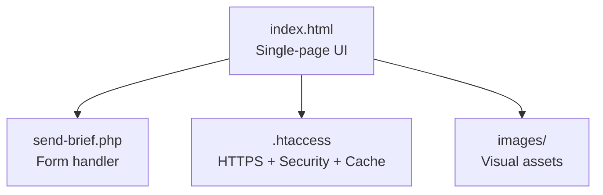
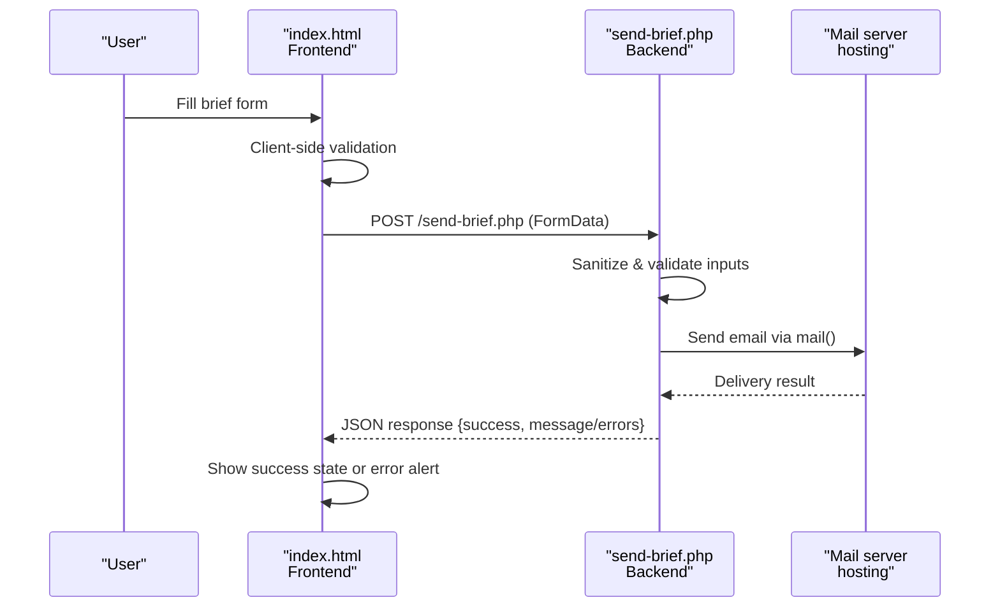
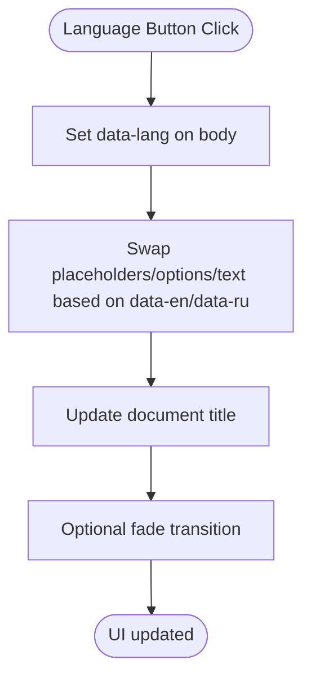
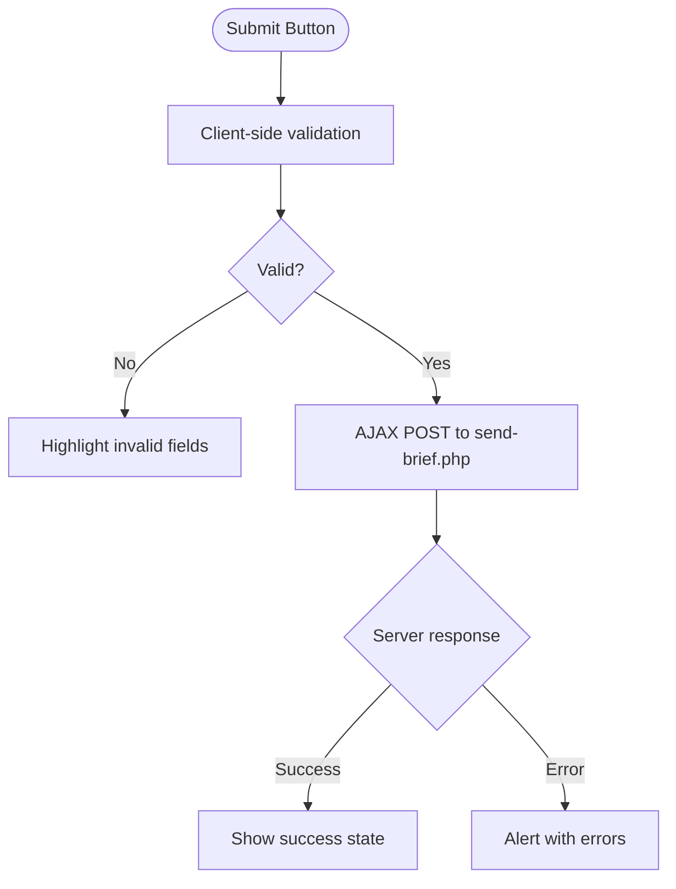
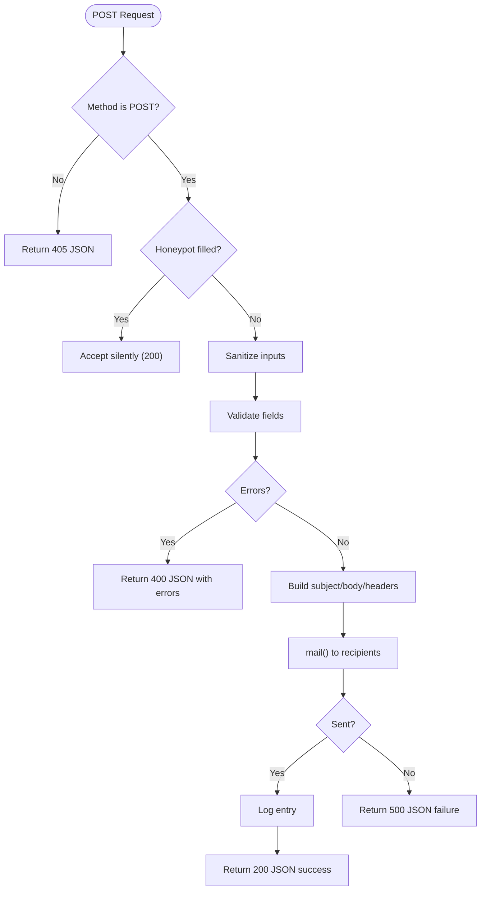
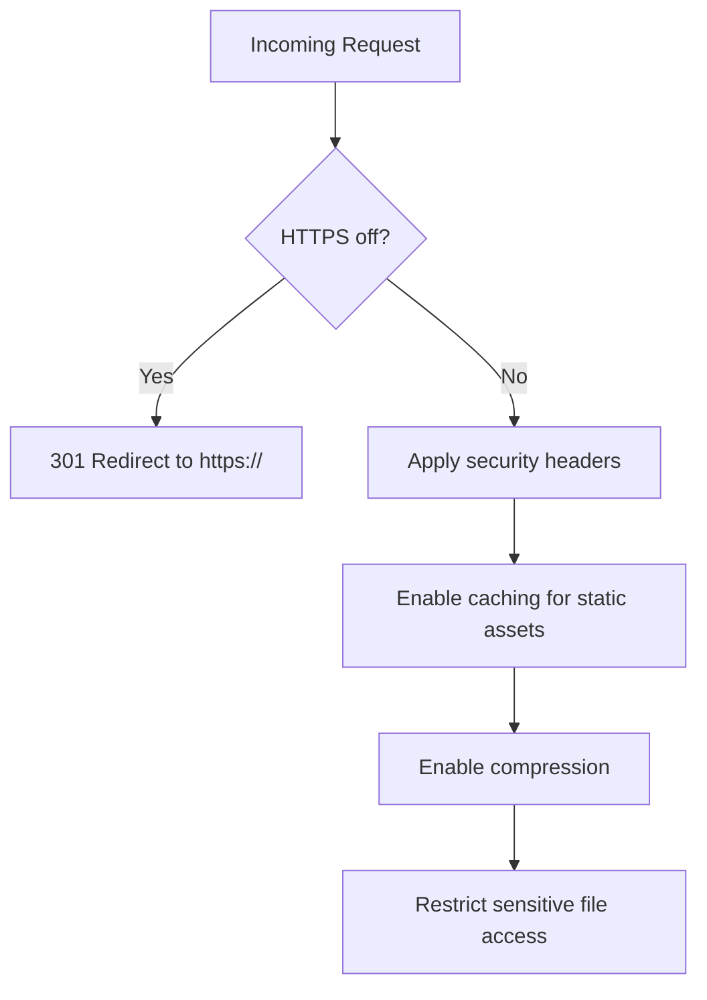

# Project Overview

<cite>
**Referenced Files in This Document**
- [index.html](file://index.html)
- [send-brief.php](file://send-brief.php)
- [.htaccess](file://.htaccess)
- [README.md](file://README.md)
</cite>

## Table of Contents
1. [Introduction](#introduction)
2. [Project Structure](#project-structure)
3. [Core Components](#core-components)
4. [Architecture Overview](#architecture-overview)
5. [Detailed Component Analysis](#detailed-component-analysis)
6. [Dependency Analysis](#dependency-analysis)
7. [Performance Considerations](#performance-considerations)
8. [Troubleshooting Guide](#troubleshooting-guide)
9. [Conclusion](#conclusion)

## Introduction
EMOO is a professional exhibition stand construction company landing page with bilingual support (Russian/English). The site showcases services, process, portfolio, and statistics, and captures leads via a contact form that sends briefs to the company email. It is designed as a single-page application built with HTML5, CSS3, and vanilla JavaScript on the frontend, and PHP for backend processing. The goal is to provide a simple yet effective marketing solution tailored to exhibition companies’ needs: fast concept delivery, clear process transparency, and reliable lead capture.

Target audience includes B2B clients planning exhibitions who need turnkey stand design, build, event programming, visualization, logistics, and 24/7 support across multiple countries. Business goals are brand positioning, lead generation, and conversion through a frictionless user experience and secure form submission.

**Section sources**
- [index.html:1-100](file://index.html#L1-L100)
- [index.html:425-477](file://index.html#L425-L477)
- [index.html:757-831](file://index.html#L757-L831)
- [send-brief.php:1-126](file://send-brief.php#L1-L126)
- [README.md:1-73](file://README.md#L1-L73)

## Project Structure
The project is intentionally minimal:
- index.html: Single-page layout with embedded styles and scripts, bilingual content, sections for hero, services, formula, process stages, stats, and contact form.
- send-brief.php: Backend handler for form submissions, validation, sanitization, and email dispatch.
- .htaccess: Server configuration enforcing HTTPS, security headers, caching, compression, and file access rules.
- README.md: Installation and security notes for the form handler.



**Diagram sources**
- [index.html:1-100](file://index.html#L1-L100)
- [send-brief.php:1-126](file://send-brief.php#L1-L126)
- [.htaccess:1-53](file://.htaccess#L1-L53)

**Section sources**
- [index.html:1-100](file://index.html#L1-L100)
- [send-brief.php:1-126](file://send-brief.php#L1-L126)
- [.htaccess:1-53](file://.htaccess#L1-L53)
- [README.md:1-73](file://README.md#L1-L73)

## Core Components
- Hero section with headline, value proposition, and CTAs driving users to the brief form.
- Services list with hover preview images to enhance interactivity.
- Formula section explaining EMOO methodology with definitions.
- Process stages with scroll-linked rail animation and step details.
- Stats counters with animated numbers.
- Contact form with client-side validation and AJAX submission to the PHP handler.
- Footer with navigation, contacts, and social links.

Key features:
- Bilingual toggle between Russian and English without page reload.
- Smooth animations and reveal-on-scroll effects using IntersectionObserver.
- Mobile-friendly responsive layout with hamburger menu.
- SEO metadata, Open Graph, Twitter Cards, and structured data for Organization and Website.

**Section sources**
- [index.html:425-477](file://index.html#L425-L477)
- [index.html:499-541](file://index.html#L499-L541)
- [index.html:543-586](file://index.html#L543-L586)
- [index.html:588-693](file://index.html#L588-L693)
- [index.html:742-754](file://index.html#L742-L754)
- [index.html:757-831](file://index.html#L757-L831)
- [index.html:833-875](file://index.html#L833-L875)
- [index.html:879-1082](file://index.html#L879-L1082)

## Architecture Overview
EMOO uses a single-page architecture with no frameworks or libraries. The frontend handles all UI logic, language switching, animations, and form interactions. The backend is a lightweight PHP script that validates input, sanitizes data, and sends emails via the hosting’s mail() function. Server-level protections are enforced by .htaccess for HTTPS, security headers, caching, and compression.



**Diagram sources**
- [index.html:1009-1079](file://index.html#L1009-L1079)
- [send-brief.php:9-126](file://send-brief.php#L9-L126)

**Section sources**
- [index.html:879-1082](file://index.html#L879-L1082)
- [send-brief.php:9-126](file://send-brief.php#L9-L126)
- [.htaccess:1-53](file://.htaccess#L1-L53)

## Detailed Component Analysis

### Bilingual Support (RU/EN)
- Language toggle updates document attributes and dynamically swaps placeholders, options, and dynamic text.
- Uses data attributes for localized strings and a scramble effect for the kicker text.
- Default language can be configured in the script.



**Diagram sources**
- [index.html:887-923](file://index.html#L887-L923)

**Section sources**
- [index.html:887-923](file://index.html#L887-L923)

### Lead Generation Form
- Fields: name, phone/email, company, area (select), message.
- Honeypot field to deter bots.
- Client-side validation highlights required fields; server-side validation enforces format and length constraints.
- AJAX submission returns JSON responses for success or errors.
- Success state shows confirmation and allows resubmission.



**Diagram sources**
- [index.html:1009-1079](file://index.html#L1009-L1079)
- [send-brief.php:22-81](file://send-brief.php#L22-L81)

**Section sources**
- [index.html:781-831](file://index.html#L781-L831)
- [index.html:1009-1079](file://index.html#L1009-L1079)
- [send-brief.php:22-81](file://send-brief.php#L22-L81)

### Backend Processing (send-brief.php)
- Enforces POST-only requests.
- Honeypot check to silently accept bot submissions.
- Sanitizes and validates inputs (name, contact, company, area, message).
- Normalizes area values to predefined options.
- Builds email subject/body and sets headers including Reply-To.
- Sends email via mail() and logs successful submissions.
- Returns JSON responses indicating success or errors.



**Diagram sources**
- [send-brief.php:9-126](file://send-brief.php#L9-L126)

**Section sources**
- [send-brief.php:9-126](file://send-brief.php#L9-L126)

### Server Configuration (.htaccess)
- Forces HTTPS redirect for secure communication.
- Sets security headers (X-Content-Type-Options, X-Frame-Options, X-XSS-Protection, Referrer-Policy, Permissions-Policy).
- Enables caching for static assets and compression for text-based resources.
- Restricts direct browsing to sensitive files while allowing PHP execution for handlers.



**Diagram sources**
- [.htaccess:1-53](file://.htaccess#L1-L53)

**Section sources**
- [.htaccess:1-53](file://.htaccess#L1-L53)

### Interactive UX Enhancements
- Scroll-triggered reveals using IntersectionObserver for sections and line animations.
- Active navigation highlighting based on current section visibility.
- Animated counters for statistics.
- Service row hover previews with cursor-following image.
- Responsive mobile menu with burger toggle.

**Section sources**
- [index.html:924-1007](file://index.html#L924-L1007)

## Dependency Analysis
The project has minimal dependencies:
- Frontend: Pure HTML/CSS/vanilla JS with no external libraries except Google Fonts.
- Backend: PHP mail() function integrated with hosting environment.
- Server: Apache .htaccess for redirects, headers, caching, and compression.

```mermaid
graph LR
UI["index.html"] --> |AJAX| PHPScript["send-brief.php"]
PHPScript --> |mail()| Mail["Hosting Mail Server"]
UI --> |Styles/Scripts| Browser["Browser"]
Browser --> |Requests| Server["Apache/.htaccess"]
```

**Diagram sources**
- [index.html:879-1082](file://index.html#L879-L1082)
- [send-brief.php:9-126](file://send-brief.php#L9-L126)
- [.htaccess:1-53](file://.htaccess#L1-L53)

**Section sources**
- [index.html:879-1082](file://index.html#L879-L1082)
- [send-brief.php:9-126](file://send-brief.php#L9-L126)
- [.htaccess:1-53](file://.htaccess#L1-L53)

## Performance Considerations
- Single-page design reduces network overhead and improves perceived performance.
- Embedded CSS and JS avoid additional HTTP requests.
- IntersectionObserver enables efficient scroll-based animations without heavy listeners.
- .htaccess caching and compression reduce load times for repeat visits.
- Reduced motion media query respects user preferences for accessibility.

[No sources needed since this section provides general guidance]

## Troubleshooting Guide
Common issues and resolutions:
- 403 Forbidden when accessing the site: Ensure HTTPS is used and .htaccess is present.
- Form not sending: Verify PHP mail() is enabled on the hosting and that send-brief.php is accessible.
- Email not received: Check spam filters and ensure sender address matches domain hosting.
- Validation errors: Confirm required fields are filled and formats are correct.
- Network errors: Check internet connectivity and server availability.

**Section sources**
- [README.md:63-73](file://README.md#L63-L73)
- [send-brief.php:9-126](file://send-brief.php#L9-L126)
- [.htaccess:1-53](file://.htaccess#L1-L53)

## Conclusion
EMOO’s website delivers a streamlined, high-performance landing page optimized for exhibition companies seeking turnkey solutions. With bilingual support, interactive UX, and a secure lead capture mechanism, it effectively bridges marketing goals and technical simplicity. The architecture leverages modern web standards and minimal dependencies to ensure reliability, speed, and maintainability.

[No sources needed since this section summarizes without analyzing specific files]