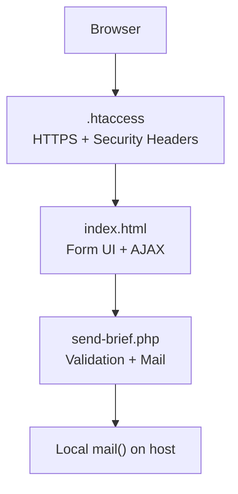
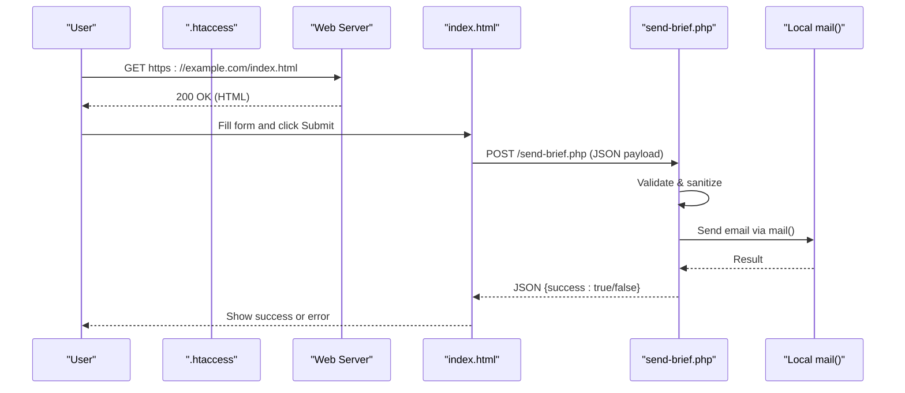
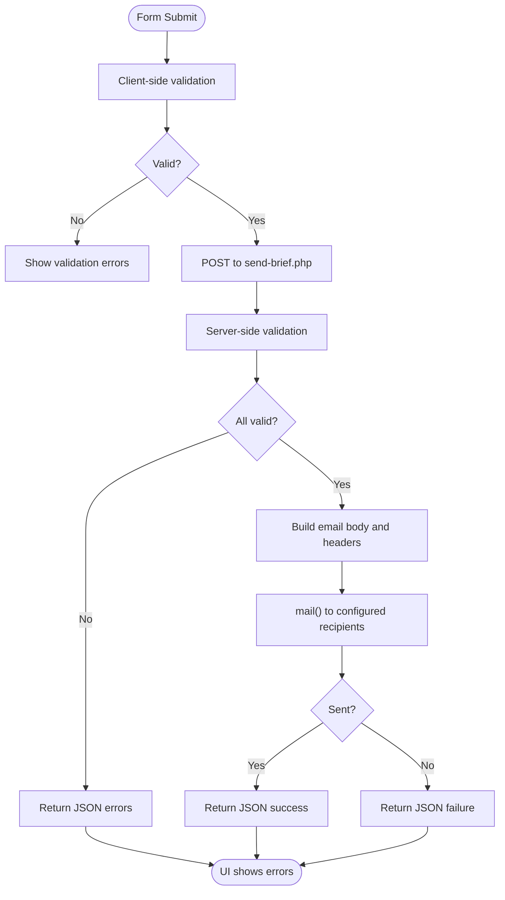
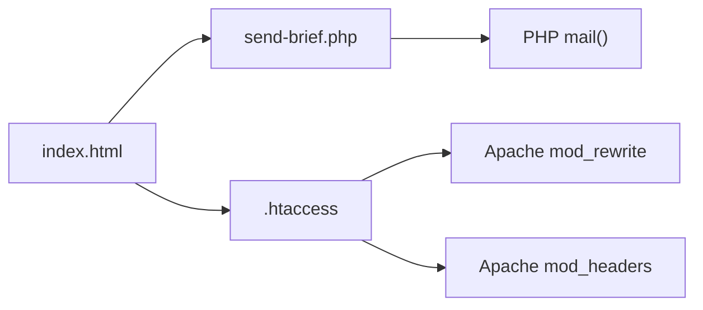

# Quick Start Guide

<cite>
**Referenced Files in This Document**
- [README.md](file://README.md)
- [.htaccess](file://.htaccess)
- [send-brief.php](file://send-brief.php)
- [index.html](file://index.html)
</cite>

## Table of Contents
1. [Introduction](#introduction)
2. [Project Structure](#project-structure)
3. [Core Components](#core-components)
4. [Architecture Overview](#architecture-overview)
5. [Detailed Component Analysis](#detailed-component-analysis)
6. [Dependency Analysis](#dependency-analysis)
7. [Performance Considerations](#performance-considerations)
8. [Troubleshooting Guide](#troubleshooting-guide)
9. [Conclusion](#conclusion)

## Introduction
This guide helps you deploy the EMOO exhibition company website quickly and securely on a standard web hosting environment. It covers server requirements, file placement, HTTPS setup with automatic redirect, permissions, verification steps for form submission, and common troubleshooting tips. The site uses a static front-end (HTML/CSS/JS) and a lightweight PHP handler to send brief submissions via local mail delivery.

## Project Structure
Place all required files in your website’s public directory (for example, the root or a subfolder like /docs). The minimal set includes:
- index.html — the main page and contact form
- send-brief.php — server-side handler that validates and sends emails
- .htaccess — enforces HTTPS and sets security headers, caching, and compression

**Diagram sources**
- [.htaccess:1-53](file://.htaccess#L1-L53)
- [index.html:782-1067](file://index.html#L782-L1067)
- [send-brief.php:1-126](file://send-brief.php#L1-L126)

**Section sources**
- [README.md:9-27](file://README.md#L9-L27)
- [.htaccess:1-53](file://.htaccess#L1-L53)
- [index.html:782-1067](file://index.html#L782-L1067)
- [send-brief.php:1-126](file://send-brief.php#L1-L126)

## Core Components
- index.html: Presents the site content and the “Brief” form. On submit, it sends data via AJAX to send-brief.php and shows success or error feedback.
- send-brief.php: Accepts POST requests, sanitizes and validates input, constructs an email, and sends it using the host’s local mail() function. Returns JSON responses for success or errors.
- .htaccess: Forces HTTPS, adds security headers, enables caching and compression, and restricts direct access to sensitive file types.

Key behaviors:
- Form validation occurs both client-side (in HTML/JS) and server-side (in PHP).
- Email is sent locally to configured recipients; sender is set to a domain-matched address to improve deliverability.
- All HTTP traffic is redirected to HTTPS automatically.

**Section sources**
- [index.html:782-1067](file://index.html#L782-L1067)
- [send-brief.php:1-126](file://send-brief.php#L1-L126)
- [.htaccess:1-53](file://.htaccess#L1-L53)

## Architecture Overview
The deployment relies on a simple request flow:
1. User visits the site over HTTP; .htaccess redirects to HTTPS.
2. Browser loads index.html and renders the form.
3. On form submit, JavaScript posts data to send-brief.php via AJAX.
4. send-brief.php validates input, builds an email, and calls the local mail() function.
5. Response is returned as JSON; the UI updates accordingly.

**Diagram sources**
- [.htaccess:1-53](file://.htaccess#L1-L53)
- [index.html:1009-1067](file://index.html#L1009-L1067)
- [send-brief.php:1-126](file://send-brief.php#L1-L126)

## Detailed Component Analysis

### HTTPS and Redirect Configuration (.htaccess)
- Enforces HTTPS by redirecting all HTTP requests to HTTPS with a 301 status.
- Adds security headers (e.g., X-Content-Type-Options, X-Frame-Options, Referrer-Policy, Permissions-Policy).
- Enables browser caching for static assets and optional compression.
- Restricts direct browsing of sensitive file extensions while allowing PHP execution for handlers.

Operational notes:
- Ensure mod_rewrite and mod_headers are enabled on Apache.
- If you already have a .htaccess, prepend the HTTPS redirect rules at the top.

**Section sources**
- [.htaccess:1-53](file://.htaccess#L1-L53)

### Form Submission Flow (index.html + send-brief.php)
- The form posts to send-brief.php via AJAX.
- Client-side validation ensures required fields are present before sending.
- Server-side validation checks field lengths, formats (email/phone), allowed values, and applies sanitization.
- On success, send-brief.php returns a JSON success message; otherwise, it returns errors or a failure message.
- The UI displays a success state or alerts based on the response.

**Diagram sources**
- [index.html:1009-1067](file://index.html#L1009-L1067)
- [send-brief.php:1-126](file://send-brief.php#L1-L126)

**Section sources**
- [index.html:782-1067](file://index.html#L782-L1067)
- [send-brief.php:1-126](file://send-brief.php#L1-L126)

### File Placement and Directory Structure
- Place index.html, send-brief.php, and .htaccess in the same directory where your site is served (for example, the document root or a subfolder such as /docs).
- Keep images under an images folder relative to the site root so links resolve correctly.

Verification checklist:
- Confirm index.html is accessible at your domain URL.
- Confirm send-brief.php is reachable at the same path.
- Confirm .htaccess is active (HTTP requests should redirect to HTTPS).

**Section sources**
- [README.md:9-27](file://README.md#L9-L27)
- [.htaccess:1-53](file://.htaccess#L1-L53)

## Dependency Analysis
- index.html depends on:
  - send-brief.php for form processing
  - .htaccess for HTTPS enforcement and security headers
- send-brief.php depends on:
  - PHP runtime (version 7.4+)
  - Local mail() function enabled on the host
  - PHP sessions if CSRF protection is used elsewhere (not required for current handler)
- .htaccess depends on Apache modules:
  - mod_rewrite for redirects
  - mod_headers for security headers
  - mod_expires/mod_deflate for caching/compression (optional but recommended)

**Diagram sources**
- [index.html:1009-1067](file://index.html#L1009-L1067)
- [send-brief.php:1-126](file://send-brief.php#L1-L126)
- [.htaccess:1-53](file://.htaccess#L1-L53)

**Section sources**
- [README.md:21-27](file://README.md#L21-L27)
- [.htaccess:1-53](file://.htaccess#L1-L53)
- [send-brief.php:1-126](file://send-brief.php#L1-L126)

## Performance Considerations
- Enable caching for static assets via .htaccess to reduce load times.
- Use compression for text-based resources to minimize bandwidth.
- Keep images optimized and use appropriate dimensions to avoid unnecessary transfers.
- Ensure your hosting provider has sufficient resources for PHP execution and mail delivery.

[No sources needed since this section provides general guidance]

## Troubleshooting Guide

Common issues and resolutions:
- HTTP to HTTPS redirect not working:
  - Verify .htaccess is present and mod_rewrite is enabled on Apache.
  - Ensure your SSL certificate is installed and active for the domain.
- 403 Forbidden when accessing the site:
  - Access the site via HTTPS only; HTTP is blocked by redirect rules.
  - Confirm .htaccess exists in the correct directory.
- Form submission fails:
  - Check that send-brief.php is reachable and executable.
  - Ensure PHP version is 7.4+ and the mail() function is enabled on your host.
  - Verify that the recipient addresses in send-brief.php are correct for your environment.
  - Review server logs for PHP errors or mail delivery failures.
- Emails not received:
  - Confirm local mail delivery works on your hosting account.
  - Check spam/junk folders and any server-side mail filtering.
- Incorrect permissions:
  - Set PHP files to 644 and directories to 755.
  - Ensure the web server can read these files and execute PHP.

Verification steps:
- Open your site via HTTPS and confirm the redirect from HTTP.
- Fill out the form and submit; expect a success message and an email to the configured recipients.
- Inspect network tab in developer tools to verify the POST request to send-brief.php returns a JSON response.

**Section sources**
- [README.md:39-73](file://README.md#L39-L73)
- [.htaccess:1-53](file://.htaccess#L1-L53)
- [send-brief.php:1-126](file://send-brief.php#L1-L126)
- [index.html:1009-1067](file://index.html#L1009-L1067)

## Conclusion
You now have a secure, fast-deploying EMOO website with HTTPS enforcement, robust form handling, and clear verification steps. Follow the installation instructions, ensure proper permissions, and validate the form submission workflow. For ongoing maintenance, keep your hosting environment updated and monitor server logs for any issues.

[No sources needed since this section summarizes without analyzing specific files]