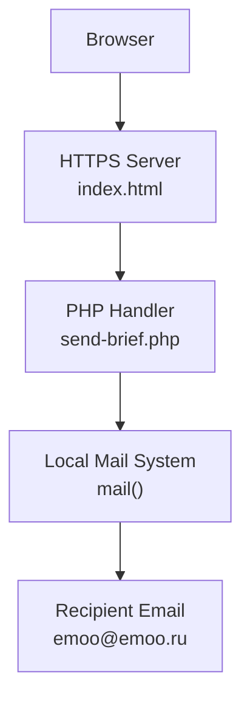
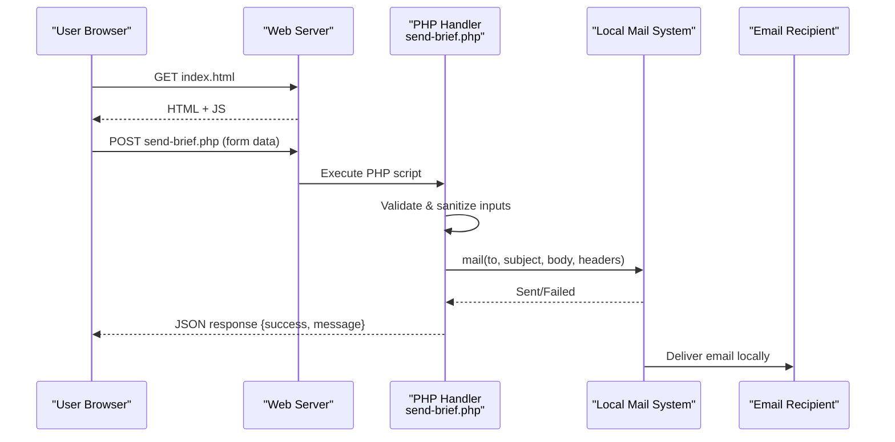
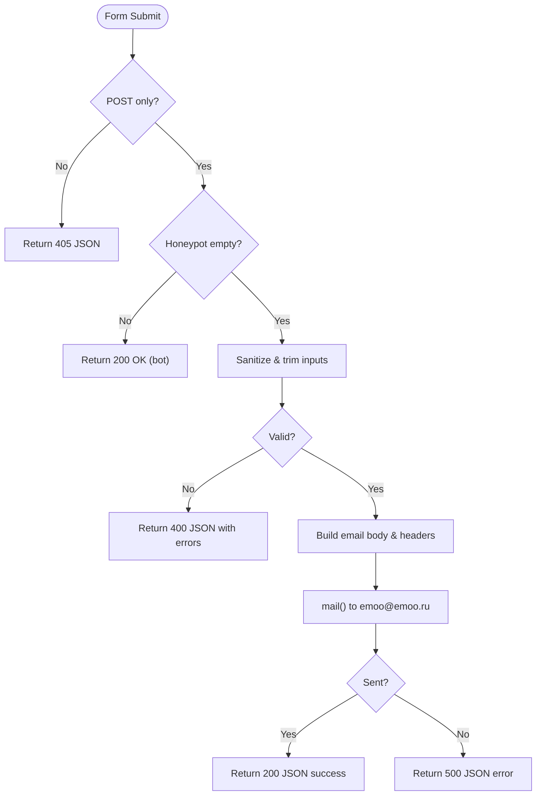
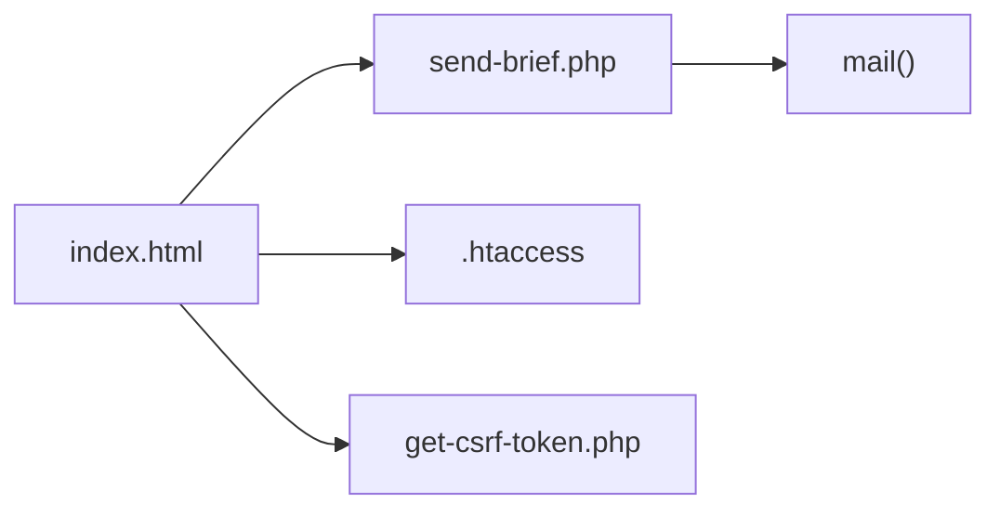

# Quick Start Guide

<cite>
**Referenced Files in This Document**
- [README.md](file://README.md)
- [index.html](file://index.html)
- [send-brief.php](file://send-brief.php)
</cite>

## Table of Contents
1. [Introduction](#introduction)
2. [Project Structure](#project-structure)
3. [Core Components](#core-components)
4. [Architecture Overview](#architecture-overview)
5. [Detailed Component Analysis](#detailed-component-analysis)
6. [Dependency Analysis](#dependency-analysis)
7. [Performance Considerations](#performance-considerations)
8. [Troubleshooting Guide](#troubleshooting-guide)
9. [Conclusion](#conclusion)
10. [Appendices](#appendices)

## Introduction
This guide helps you get the EMOO website up and running quickly on shared hosting. It covers prerequisites, file placement, basic configuration, verification steps, and common issues. The site includes a secure form that sends briefs to a local email address using PHP’s mail() function with CSRF protection, HTTPS enforcement, rate limiting, input sanitization, and validation.

## Project Structure
Place all required files in the same directory as your site’s index page (for example, /docs). The README specifies the following structure:
- index.html — the main page containing the contact form
- send-brief.php — server-side handler for form submissions
- get-csrf-token.php — generates CSRF tokens used by the frontend
- .htaccess — enforces HTTPS redirect and security rules

**Diagram sources**
- [index.html:728-765](file://index.html#L728-L765)
- [send-brief.php:17-103](file://send-brief.php#L17-L103)

**Section sources**
- [README.md:9-20](file://README.md#L9-L20)

## Core Components
- Frontend form: The HTML page contains a contact/brief form that posts to send-brief.php. It uses a hidden honeypot field to reduce spam.
- Backend handler: The PHP script validates inputs, sanitizes data, constructs an email, and sends it via mail(). It returns JSON responses for success or errors.
- Security and performance features:
  - HTTPS enforced via .htaccess
  - CSRF token generation via get-csrf-token.php
  - Rate limiting (one submission per minute per IP)
  - Input sanitization and validation
  - Local mail delivery for reliability

**Section sources**
- [index.html:728-765](file://index.html#L728-L765)
- [send-brief.php:9-115](file://send-brief.php#L9-L115)
- [README.md:21-37](file://README.md#L21-L37)

## Architecture Overview
The form workflow ensures secure, reliable submissions even on shared hosting where the website and email share the same server.

**Diagram sources**
- [index.html:728-765](file://index.html#L728-L765)
- [send-brief.php:9-115](file://send-brief.php#L9-L115)

## Detailed Component Analysis

### Form Submission Flow
- The form posts to send-brief.php with fields such as name, phone/email, company, area, and message.
- A hidden honeypot field is used to detect bots; if filled, the request is silently accepted without processing.
- The backend validates and sanitizes inputs, then sends an email via mail() and returns a JSON response.

**Diagram sources**
- [send-brief.php:9-115](file://send-brief.php#L9-L115)

**Section sources**
- [send-brief.php:9-115](file://send-brief.php#L9-L115)
- [index.html:728-765](file://index.html#L728-L765)

### Security and Validation Details
- Only POST requests are accepted; other methods return 405.
- Honeypot field prevents automated spam.
- Inputs are trimmed and stripped of tags.
- Strict validation for name length, contact format (email or phone), allowed area values, and message length.
- Headers include From and Reply-To based on user input; content type set to UTF-8 plain text.

**Section sources**
- [send-brief.php:9-115](file://send-brief.php#L9-L115)

### HTTPS Enforcement and File Placement
- All requests should be served over HTTPS; .htaccess enforces redirection from HTTP to HTTPS.
- Place all files (index.html, send-brief.php, get-csrf-token.php, .htaccess) in the same directory as your site root or subdirectory (e.g., /docs).

**Section sources**
- [README.md:9-20](file://README.md#L9-L20)
- [README.md:48-57](file://README.md#L48-L57)

## Dependency Analysis
- index.html depends on send-brief.php for form processing.
- send-brief.php depends on:
  - PHP runtime (version 7.4+)
  - mail() function enabled on the host
  - PHP sessions (for CSRF token storage)
  - Optional .htaccess for HTTPS enforcement
  - get-csrf-token.php for generating tokens

**Diagram sources**
- [index.html:728-765](file://index.html#L728-L765)
- [send-brief.php:17-103](file://send-brief.php#L17-L103)
- [README.md:21-26](file://README.md#L21-L26)

**Section sources**
- [README.md:21-26](file://README.md#L21-L26)
- [send-brief.php:17-103](file://send-brief.php#L17-L103)

## Performance Considerations
- Keep the form lightweight; avoid heavy assets on the contact section.
- Ensure your hosting provider has mail() configured and not rate-limited excessively.
- Use HTTPS to benefit from modern browser optimizations and security.
- Enable caching for static assets (images, CSS, JS) at the server level.

[No sources needed since this section provides general guidance]

## Troubleshooting Guide
Common setup issues and resolutions:
- 403 Forbidden when accessing the site:
  - Ensure you are using https:// and that .htaccess exists to enforce HTTPS redirection.
- Form does not send email:
  - Verify PHP version is 7.4+ and mail() is enabled on your hosting.
  - Confirm that the recipient email matches the domain hosted on the same server (as specified).
  - Check server logs for mail delivery errors.
- CSRF errors:
  - Ensure get-csrf-token.php is present and accessible.
  - Confirm PHP sessions are enabled on the host.
- Rate limiting triggered:
  - Wait a minute before resubmitting; the script limits submissions to one per minute per IP.

**Section sources**
- [README.md:63-72](file://README.md#L63-L72)
- [send-brief.php:9-115](file://send-brief.php#L9-L115)

## Conclusion
You now have the essentials to deploy the EMOO website securely on shared hosting. Place all required files in the correct directory, ensure PHP and mail() are enabled, enforce HTTPS, and test the form submission. Refer to the troubleshooting section if you encounter common issues.

[No sources needed since this section summarizes without analyzing specific files]

## Appendices

### Installation Checklist
- Upload files:
  - index.html
  - send-brief.php
  - get-csrf-token.php
  - .htaccess
- Set permissions:
  - PHP files: 644
  - Directories: 755
- Verify HTTPS:
  - Ensure SSL certificate is active and .htaccess redirects HTTP to HTTPS
- Test the form:
  - Open https://yourdomain.com/docs/index.html
  - Fill out the brief form and submit
  - Confirm receipt at emoo@emoo.ru

**Section sources**
- [README.md:39-46](file://README.md#L39-L46)

### Basic Setup Verification
- Confirm the page loads over HTTPS
- Inspect network tab to verify POST to send-brief.php returns JSON
- Check server logs for successful mail() calls
- Validate CSRF token flow by ensuring get-csrf-token.php is reachable

**Section sources**
- [index.html:728-765](file://index.html#L728-L765)
- [send-brief.php:9-115](file://send-brief.php#L9-L115)
- [README.md:21-26](file://README.md#L21-L26)

### Initial Testing Procedures
- Submit a valid brief and confirm success JSON response
- Intentionally trigger validation errors (empty name, invalid phone/email) and check error JSON
- Attempt to access the form via HTTP to verify HTTPS redirect
- Temporarily disable .htaccess to observe behavior differences (restore afterward)

**Section sources**
- [send-brief.php:9-115](file://send-brief.php#L9-L115)
- [README.md:48-57](file://README.md#L48-L57)