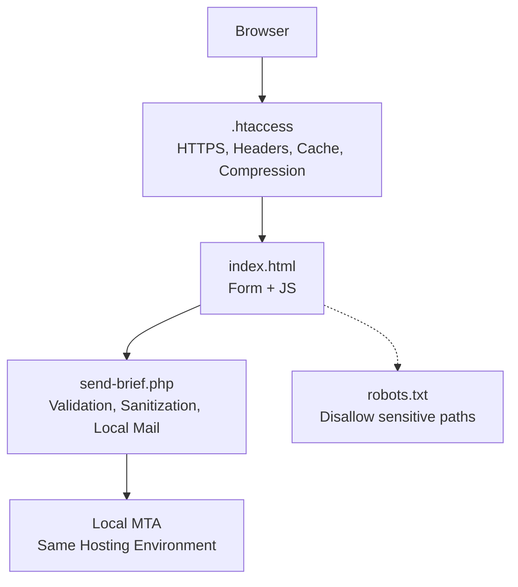
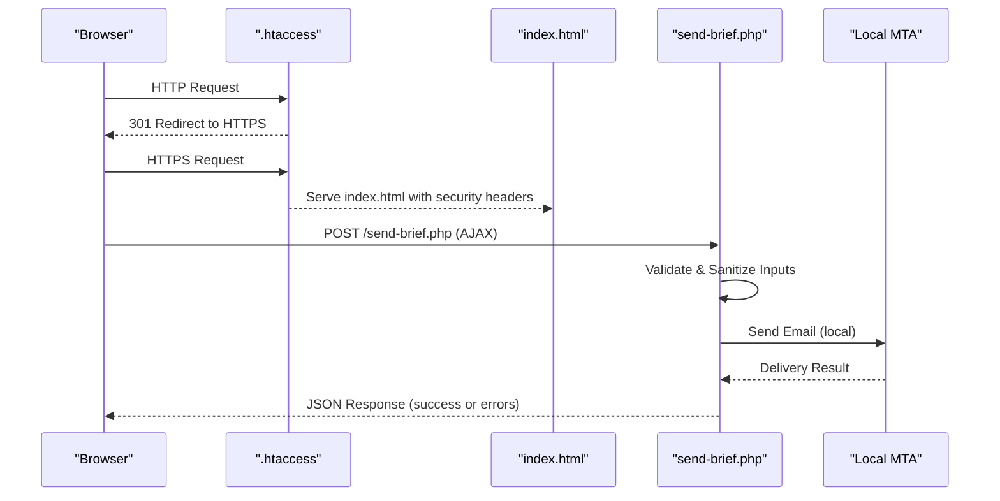
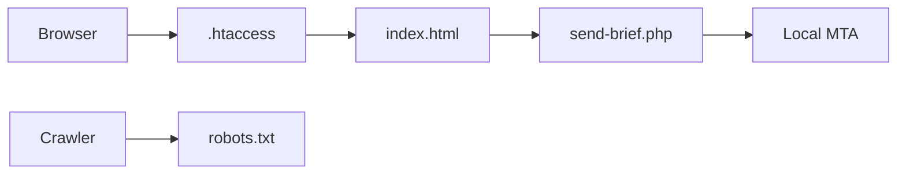

# Security Configuration

<cite>
**Referenced Files in This Document**
- [.htaccess](file://.htaccess)
- [send-brief.php](file://send-brief.php)
- [index.html](file://index.html)
- [README.md](file://README.md)
- [robots.txt](file://robots.txt)
</cite>

## Table of Contents
1. [Introduction](#introduction)
2. [Project Structure](#project-structure)
3. [Core Components](#core-components)
4. [Architecture Overview](#architecture-overview)
5. [Detailed Component Analysis](#detailed-component-analysis)
6. [Dependency Analysis](#dependency-analysis)
7. [Performance Considerations](#performance-considerations)
8. [Troubleshooting Guide](#troubleshooting-guide)
9. [Conclusion](#conclusion)
10. [Appendices](#appendices)

## Introduction
This document provides a comprehensive security overview for the EMOO website’s multi-layered protection strategy. It covers server-level hardening via .htaccess (HTTPS enforcement, security headers, caching, compression), backend input validation and sanitization in PHP, bot mitigation using honeypot fields, and guidance on monitoring, incident response, and best practices. It also clarifies how local email delivery within the same hosting environment improves reliability and reduces exposure.

## Project Structure
The site is minimal and focused:
- A static landing page with an embedded form that submits to a PHP endpoint.
- A PHP handler that validates, sanitizes, and sends emails locally.
- Server configuration (.htaccess) enforcing HTTPS, setting security headers, enabling compression, and controlling caching.
- robots.txt to prevent indexing of sensitive endpoints.

**Diagram sources**
- [.htaccess:1-53](file://.htaccess#L1-L53)
- [index.html:782-1067](file://index.html#L782-L1067)
- [send-brief.php:1-126](file://send-brief.php#L1-L126)
- [robots.txt:1-11](file://robots.txt#L1-L11)

**Section sources**
- [.htaccess:1-53](file://.htaccess#L1-L53)
- [index.html:782-1067](file://index.html#L782-L1067)
- [send-brief.php:1-126](file://send-brief.php#L1-L126)
- [robots.txt:1-11](file://robots.txt#L1-L11)

## Core Components
- HTTPS enforcement and security headers at the web server level.
- Input validation and sanitization in the PHP handler.
- Honeypot field to deter automated submissions.
- Local mail delivery to reduce interception risk and improve deliverability.
- robots.txt to hide sensitive endpoints from crawlers.

Key responsibilities:
- .htaccess: Enforce HTTPS, set security headers, enable compression, cache static assets, and restrict direct access patterns for sensitive file types.
- send-brief.php: Accept POST only, sanitize inputs, validate formats and lengths, build email content safely, log attempts, and return JSON responses.
- index.html: Provide a user-friendly form, client-side validation, and AJAX submission to the PHP handler.
- robots.txt: Disallow crawling of PHP endpoints and configuration files.

**Section sources**
- [.htaccess:1-53](file://.htaccess#L1-L53)
- [send-brief.php:1-126](file://send-brief.php#L1-L126)
- [index.html:782-1067](file://index.html#L782-L1067)
- [robots.txt:1-11](file://robots.txt#L1-L11)

## Architecture Overview
The request flow emphasizes secure transport, strict server policies, and safe processing on the backend.

**Diagram sources**
- [.htaccess:6-21](file://.htaccess#L6-L21)
- [index.html:1009-1067](file://index.html#L1009-L1067)
- [send-brief.php:9-126](file://send-brief.php#L9-L126)

## Detailed Component Analysis

### .htaccess: HTTPS, Security Headers, Caching, Compression, Access Control
- HTTPS Enforcement: Forces all traffic to HTTPS with a 301 redirect when not already secure.
- Security Headers:
  - X-Content-Type-Options: Prevents MIME-type sniffing.
  - X-Frame-Options: Restricts framing to same origin.
  - X-XSS-Protection: Enables legacy XSS filtering mode.
  - Referrer-Policy: Limits referrer information leakage.
  - Permissions-Policy: Disables sensitive browser features (geolocation, microphone, camera).
- Caching: Long-lived expires headers for images, CSS, JS, and fonts to improve performance while keeping dynamic content fresh.
- Compression: Enables DEFLATE for HTML, CSS, JS, SVG, and JSON to reduce bandwidth.
- Sensitive File Handling: Uses a FilesMatch pattern to control access to PHP, logs, ini, and backup files; comments indicate intended behavior for AJAX-accessible scripts.

Security benefits:
- Ensures encrypted transport for all requests.
- Mitigates common client-side attacks through restrictive headers.
- Reduces attack surface by limiting exposure of sensitive file types.

**Section sources**
- [.htaccess:6-21](file://.htaccess#L6-L21)
- [.htaccess:23-43](file://.htaccess#L23-L43)
- [.htaccess:45-49](file://.htaccess#L45-L49)

### send-brief.php: Input Validation, Sanitization, Logging, Local Mail
- Method Restriction: Only accepts POST; returns 405 for other methods.
- Honeypot Field: Silently accepts submissions if a hidden field is filled, effectively blocking bots without friction for real users.
- Sanitization: Trims whitespace and strips tags from all inputs before use.
- Validation:
  - Name length constraints.
  - Contact must be a valid email or phone number format.
  - Company name length limit.
  - Area selection validated against a whitelist with normalization for Unicode variants.
  - Message length limit.
- Email Construction:
  - Subject and body built from sanitized inputs.
  - Reply-To header set based on whether contact is an email.
  - Content-Type set to plain text UTF-8.
  - Sender address explicitly set to a domain-matching email to improve trust and deliverability.
- Local Mail Delivery: Uses the host’s local mail() function to send internally, reducing external exposure and leveraging trusted internal routing.
- Logging: Records successful submissions with timestamp, name, contact, and IP to aid monitoring and forensics.
- Responses: Returns JSON with success or error messages and appropriate HTTP status codes.

Security benefits:
- Strong input validation and sanitization reduce injection and XSS risks.
- Honeypot mitigates automated spam.
- Local mail delivery minimizes interception risk and improves deliverability within the same hosting environment.
- Structured logging supports monitoring and incident response.

**Section sources**
- [send-brief.php:9-28](file://send-brief.php#L9-L28)
- [send-brief.php:30-81](file://send-brief.php#L30-L81)
- [send-brief.php:83-113](file://send-brief.php#L83-L113)
- [send-brief.php:115-125](file://send-brief.php#L115-L125)

### index.html: Form UX, Client-Side Validation, AJAX Submission
- Form Fields: Includes a hidden honeypot field to detect bots.
- Client-Side Validation: Checks required fields and prevents submission if invalid.
- AJAX Submission: Sends form data to send-brief.php and handles success/error states, showing feedback to the user.
- No CSRF token implementation visible in this file; the README references a token-based mechanism, but it is not present in the current codebase.

Security considerations:
- Client-side validation improves usability but must not be relied upon for security; server-side checks are essential and implemented in the PHP handler.
- The absence of CSRF tokens in the frontend means additional protections should be considered if cross-site request forgery is a concern.

**Section sources**
- [index.html:782-818](file://index.html#L782-L818)
- [index.html:1009-1067](file://index.html#L1009-L1067)

### robots.txt: Crawling Restrictions
- Disallows crawling of send-brief.php, get-csrf-token.php, and .htaccess to prevent search engines from indexing sensitive endpoints.

Security benefit:
- Reduces exposure of administrative or functional endpoints to automated discovery by crawlers.

**Section sources**
- [robots.txt:4-8](file://robots.txt#L4-L8)

## Dependency Analysis
- Browser depends on .htaccess for HTTPS redirection and security headers.
- index.html depends on send-brief.php for processing form submissions.
- send-brief.php depends on the hosting environment’s local mail system.
- robots.txt influences crawler behavior but does not enforce access control.

**Diagram sources**
- [.htaccess:6-21](file://.htaccess#L6-L21)
- [index.html:1009-1067](file://index.html#L1009-L1067)
- [send-brief.php:113-125](file://send-brief.php#L113-L125)
- [robots.txt:4-8](file://robots.txt#L4-L8)

**Section sources**
- [.htaccess:6-21](file://.htaccess#L6-L21)
- [index.html:1009-1067](file://index.html#L1009-L1067)
- [send-brief.php:113-125](file://send-brief.php#L113-L125)
- [robots.txt:4-8](file://robots.txt#L4-L8)

## Performance Considerations
- Caching: Long expiration times for static assets reduce repeated downloads and improve load times.
- Compression: DEFLATE reduces payload sizes for text-based resources, improving transfer speed.
- Local Mail: Sending email via the local MTA avoids network overhead and leverages optimized local routing.

[No sources needed since this section provides general guidance]

## Troubleshooting Guide
Common issues and resolutions:
- 405 Method Not Allowed: Ensure the form uses POST; GET requests are rejected by the handler.
- 400 Bad Request: Indicates validation errors; check input formats and lengths.
- 500 Internal Server Error: Likely a mail delivery failure; verify local MTA configuration and permissions.
- 403 Forbidden: Often caused by accessing the site over HTTP instead of HTTPS; ensure the redirect is active and SSL is configured.
- Spam or Bot Submissions: If honeypot is bypassed, consider adding rate limiting at the application or server level.

Monitoring and diagnostics:
- Review application logs written by the handler to track successful submissions and IPs.
- Inspect server error logs for PHP or mail-related failures.
- Use browser developer tools to inspect AJAX requests and responses during testing.

Recommended enhancements:
- Implement CSRF tokens on both frontend and backend to protect against cross-site request forgery.
- Add rate limiting per IP to prevent abuse and spam bursts.
- Enable Content-Security-Policy to further constrain resource loading and execution contexts.
- Rotate and securely store any secrets or credentials if added later.

**Section sources**
- [send-brief.php:9-15](file://send-brief.php#L9-L15)
- [send-brief.php:76-81](file://send-brief.php#L76-L81)
- [send-brief.php:115-125](file://send-brief.php#L115-L125)
- [README.md:65-72](file://README.md#L65-L72)

## Conclusion
The EMOO website employs a practical, layered security approach:
- Server-level enforcement of HTTPS and restrictive security headers.
- Robust backend validation and sanitization to mitigate injection and XSS risks.
- Honeypot-based bot mitigation and structured logging for observability.
- Local email delivery to reduce exposure and improve reliability.
To further strengthen security, consider implementing CSRF tokens, rate limiting, and a comprehensive Content-Security-Policy, along with ongoing log monitoring and incident response procedures.

[No sources needed since this section summarizes without analyzing specific files]

## Appendices

### Security Log Monitoring Checklist
- Verify that successful submissions are logged with timestamps, names, contacts, and IPs.
- Set up alerts for spikes in failed submissions or unusual IP activity.
- Regularly review server error logs for PHP or mail subsystem issues.

**Section sources**
- [send-brief.php:115-117](file://send-brief.php#L115-L117)

### Best Practices for Secure Web Applications
- Always enforce HTTPS and set strong security headers.
- Validate and sanitize all user inputs on the server side.
- Use anti-bot techniques such as honeypots and CAPTCHA where appropriate.
- Implement CSRF protection for state-changing operations.
- Apply rate limiting to sensitive endpoints.
- Monitor logs and set up alerting for anomalies.
- Keep dependencies and server software updated.

[No sources needed since this section provides general guidance]