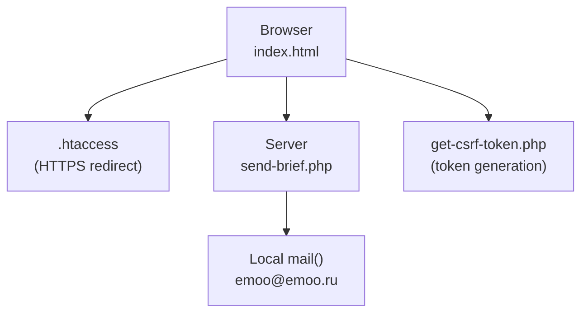
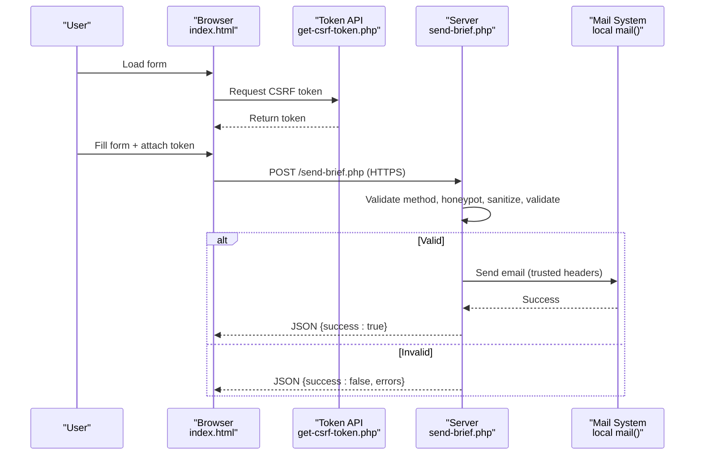
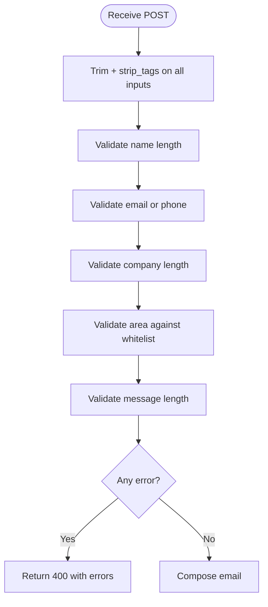
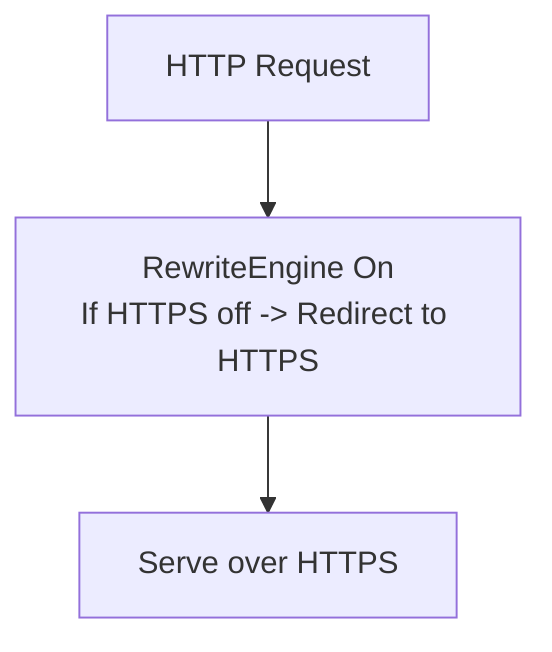
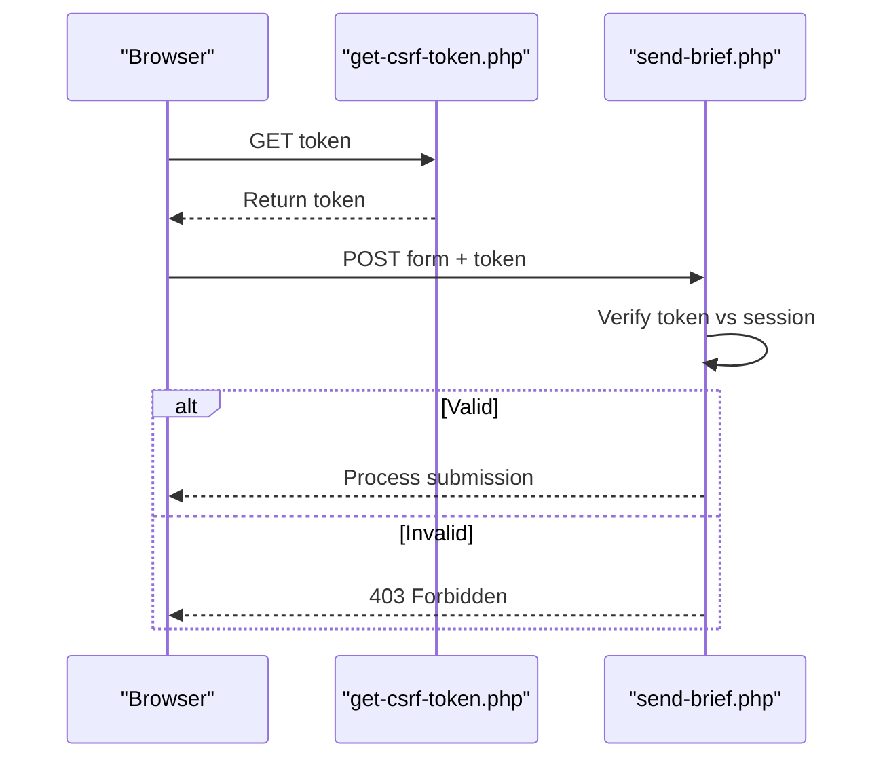
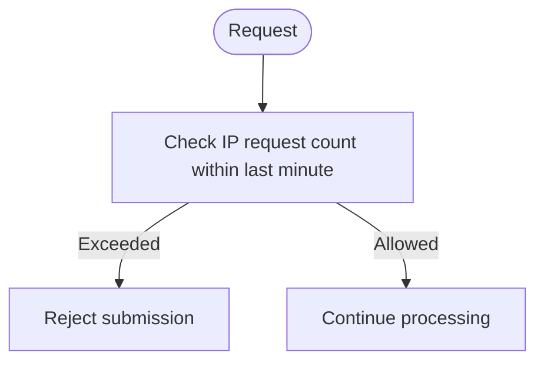
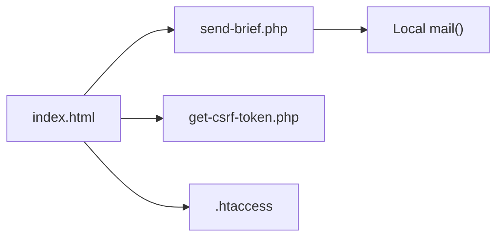

# Security Implementation

<cite>
**Referenced Files in This Document**
- [README.md](file://README.md)
- [index.html](file://index.html)
- [send-brief.php](file://send-brief.php)
</cite>

## Table of Contents
1. [Introduction](#introduction)
2. [Project Structure](#project-structure)
3. [Core Components](#core-components)
4. [Architecture Overview](#architecture-overview)
5. [Detailed Component Analysis](#detailed-component-analysis)
6. [Dependency Analysis](#dependency-analysis)
7. [Performance Considerations](#performance-considerations)
8. [Troubleshooting Guide](#troubleshooting-guide)
9. [Conclusion](#conclusion)
10. [Appendices](#appendices)

## Introduction
This document explains the multi-layered security approach implemented for the EMOO website’s brief form submission. It covers CSRF token usage, input validation and sanitization, bot protection via honeypot fields, rate limiting strategy, HTTPS enforcement through .htaccess, and secure email delivery practices. The goal is to protect against common web vulnerabilities such as XSS, SQL injection (via safe handling), spam submissions, and unauthorized access, while maintaining a smooth user experience.

## Project Structure
The project includes:
- A client-side form page that integrates security measures like a hidden honeypot field and references to CSRF token handling.
- A server-side PHP handler that validates, sanitizes, and sends emails securely.
- Documentation describing required files including get-csrf-token.php and .htaccess for full deployment.

**Diagram sources**
- [index.html:729-731](file://index.html#L729-L731)
- [send-brief.php:1-116](file://send-brief.php#L1-L116)
- [README.md:18-26](file://README.md#L18-L26)

**Section sources**
- [README.md:9-26](file://README.md#L9-L26)
- [index.html:729-731](file://index.html#L729-L731)
- [send-brief.php:1-116](file://send-brief.php#L1-L116)

## Core Components
- Honeypot field: A hidden input prevents automated bots from submitting forms by checking if this field is filled.
- Input validation and sanitization: Server-side checks ensure data integrity and remove potentially harmful content before processing or sending.
- Email security: Local delivery via mail() with proper headers and sender configuration improves deliverability and reduces interception risk.
- HTTPS enforcement: .htaccess redirects HTTP to HTTPS to encrypt traffic in transit.
- CSRF protection: Token-based validation ensures requests originate from the legitimate form session.
- Rate limiting: Limits submissions per IP to mitigate abuse and spam.

**Section sources**
- [index.html:729-731](file://index.html#L729-L731)
- [send-brief.php:21-71](file://send-brief.php#L21-L71)
- [send-brief.php:73-115](file://send-brief.php#L73-L115)
- [README.md:28-38](file://README.md#L28-L38)
- [README.md:48-57](file://README.md#L48-L57)

## Architecture Overview
The submission flow enforces multiple security layers:
1. Client loads the form and optionally fetches a CSRF token.
2. Browser submits the form over HTTPS enforced by .htaccess.
3. Server validates method, applies honeypot check, sanitizes inputs, validates constraints, and enforces rate limits.
4. If valid, the server composes and sends an email using local mail() with trusted headers.
5. Response is returned as JSON indicating success or errors.

**Diagram sources**
- [index.html:729-731](file://index.html#L729-L731)
- [send-brief.php:9-27](file://send-brief.php#L9-L27)
- [send-brief.php:29-71](file://send-brief.php#L29-L71)
- [send-brief.php:73-115](file://send-brief.php#L73-L115)
- [README.md:28-38](file://README.md#L28-L38)

## Detailed Component Analysis

### Honeypot Bot Protection
- A hidden input named website_url is included in the form and styled to be invisible.
- The server rejects submissions where this field is populated, treating them as bot activity.
- This technique is lightweight and effective against simple bots without impacting human users.

**Diagram sources**
- [index.html:729-731](file://index.html#L729-L731)
- [send-brief.php:21-27](file://send-brief.php#L21-L27)

**Section sources**
- [index.html:729-731](file://index.html#L729-L731)
- [send-brief.php:21-27](file://send-brief.php#L21-L27)

### Input Validation and Sanitization
- All inputs are trimmed and stripped of HTML tags to prevent XSS.
- Required fields are validated: name length, contact format (email or phone regex), optional company length, allowed area values, and message length.
- Errors are aggregated and returned as JSON with appropriate HTTP status codes.

**Diagram sources**
- [send-brief.php:29-71](file://send-brief.php#L29-L71)

**Section sources**
- [send-brief.php:29-71](file://send-brief.php#L29-L71)

### Secure Email Delivery
- Emails are sent locally via mail() to emoo@emoo.ru, reducing exposure to external networks.
- Headers include a trusted From address and dynamic Reply-To based on the provided contact.
- Content-Type is set to plain text to avoid rendering risks.
- Successful sends are logged for auditability.

**Diagram sources**
- [send-brief.php:73-115](file://send-brief.php#L73-L115)

**Section sources**
- [send-brief.php:73-115](file://send-brief.php#L73-L115)

### HTTPS Enforcement via .htaccess
- The documentation specifies automatic redirection from HTTP to HTTPS using .htaccess rules.
- This ensures all form submissions and page loads are encrypted in transit.

**Diagram sources**
- [README.md:48-57](file://README.md#L48-L57)

**Section sources**
- [README.md:48-57](file://README.md#L48-L57)

### CSRF Token Mechanism
- The project documentation describes a token-based CSRF protection mechanism using get-csrf-token.php and session validation.
- While the token endpoint is not present in the current repository, the intended behavior is to generate a unique key when loading the page and validate it on submission to prevent cross-site request forgery.

**Diagram sources**
- [README.md:18-26](file://README.md#L18-L26)
- [README.md:34-38](file://README.md#L34-L38)
- [README.md:65-66](file://README.md#L65-L66)

**Section sources**
- [README.md:18-26](file://README.md#L18-L26)
- [README.md:34-38](file://README.md#L34-L38)
- [README.md:65-66](file://README.md#L65-L66)

### Rate Limiting Strategy
- The documentation states that the script blocks spam attacks by allowing no more than one submission per minute per IP.
- This mitigates brute-force and automated abuse while preserving usability for legitimate users.

**Diagram sources**
- [README.md:35-36](file://README.md#L35-L36)

**Section sources**
- [README.md:35-36](file://README.md#L35-L36)

## Dependency Analysis
- index.html depends on send-brief.php for form submission and may depend on get-csrf-token.php for token retrieval.
- send-brief.php depends on the hosting environment’s PHP mail() function and local SMTP configuration.
- .htaccess influences routing by enforcing HTTPS before any application logic executes.

**Diagram sources**
- [index.html:729-731](file://index.html#L729-L731)
- [send-brief.php:1-116](file://send-brief.php#L1-L116)
- [README.md:18-26](file://README.md#L18-L26)
- [README.md:48-57](file://README.md#L48-L57)

**Section sources**
- [index.html:729-731](file://index.html#L729-L731)
- [send-brief.php:1-116](file://send-brief.php#L1-L116)
- [README.md:18-26](file://README.md#L18-L26)
- [README.md:48-57](file://README.md#L48-L57)

## Performance Considerations
- Honeypot checks are negligible overhead and provide immediate bot filtering.
- Input validation uses efficient string operations and regex; keep patterns minimal to avoid performance hits under load.
- Logging should be enabled judiciously to avoid disk I/O bottlenecks; consider rotating logs in production.
- Rate limiting should be implemented efficiently using in-memory counters or fast storage to handle spikes without degrading UX.

[No sources needed since this section provides general guidance]

## Troubleshooting Guide
- 405 Method Not Allowed: Ensure the form uses POST; GET requests are rejected intentionally.
- 400 Bad Request: Indicates validation failures; review error messages returned by the server.
- 500 Internal Server Error: Email sending failed; verify mail() availability and server configuration.
- 403 Forbidden: Typically occurs when accessing via HTTP instead of HTTPS; ensure .htaccess is present and SSL is active.
- Logs: Enable logging in send-brief.php to track submissions and errors for debugging.

**Section sources**
- [send-brief.php:9-15](file://send-brief.php#L9-L15)
- [send-brief.php:66-71](file://send-brief.php#L66-L71)
- [send-brief.php:105-115](file://send-brief.php#L105-L115)
- [README.md:61-72](file://README.md#L61-L72)

## Conclusion
The EMOO website employs a layered security model combining client-side and server-side controls to protect form submissions. Honeypot fields deter bots, robust validation and sanitization prevent XSS and malformed data, HTTPS enforcement secures data in transit, and local email delivery enhances reliability. When fully deployed with CSRF tokens and rate limiting, these measures collectively mitigate common web threats while preserving a seamless user experience.

[No sources needed since this section summarizes without analyzing specific files]

## Appendices

### Configuration Examples
- HTTPS redirect via .htaccess:
  - See the documented rewrite rules for forcing HTTPS.
- Form integration:
  - Ensure the form posts to send-brief.php and includes the honeypot field.
- Email headers:
  - Use a trusted From address and dynamic Reply-To based on user input.

**Section sources**
- [README.md:48-57](file://README.md#L48-L57)
- [index.html:729-731](file://index.html#L729-L731)
- [send-brief.php:73-100](file://send-brief.php#L73-L100)

### Security Best Practices
- Always enforce HTTPS at the web server level.
- Validate and sanitize all user inputs server-side.
- Use honeypot fields to reduce bot traffic without CAPTCHA friction.
- Implement CSRF tokens to prevent cross-site request forgery.
- Apply rate limiting to protect against abuse.
- Keep dependencies updated and monitor logs for anomalies.

[No sources needed since this section provides general guidance]