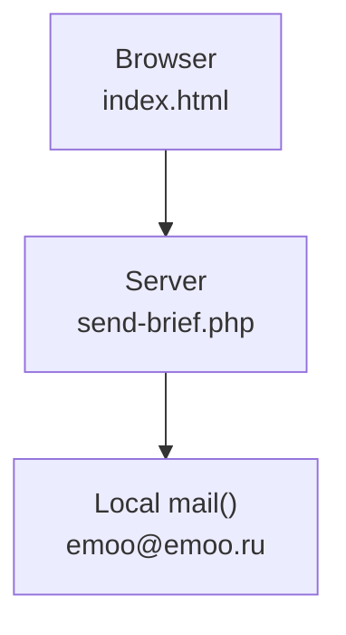
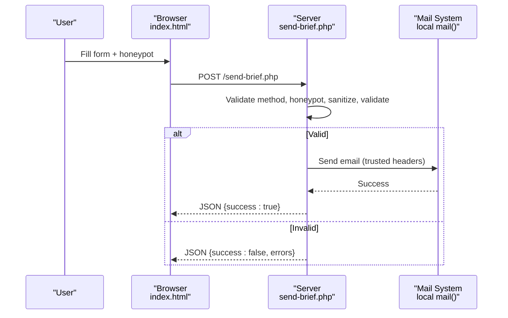
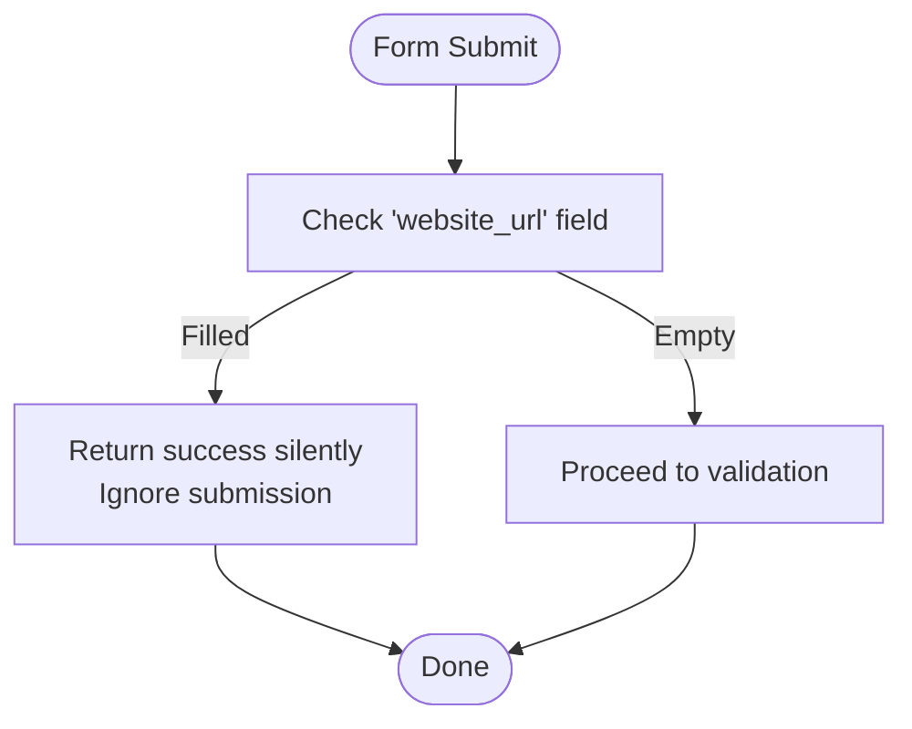
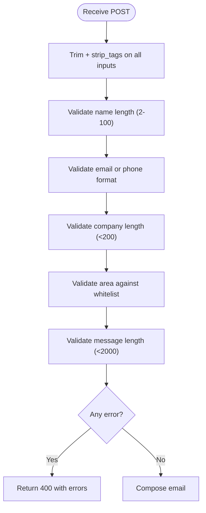
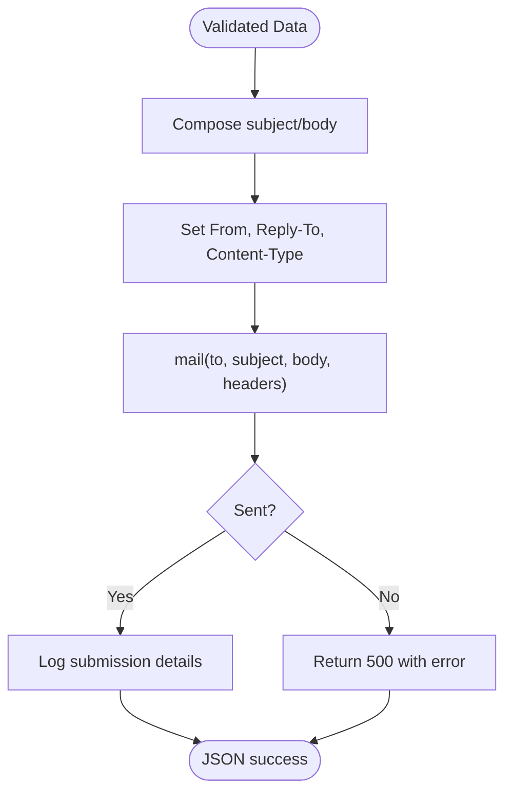
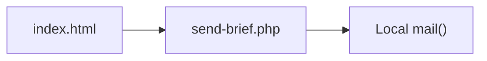

# Security Implementation

<cite>
**Referenced Files in This Document**
- [README.md](file://README.md)
- [index.html](file://index.html)
- [send-brief.php](file://send-brief.php)
</cite>

## Update Summary
**Changes Made**
- Removed all references to CSRF token system (get-csrf-token.php deleted)
- Removed HTTPS enforcement documentation (.htaccess not present)
- Removed session-based rate limiting implementation
- Updated architecture diagrams to reflect simplified honeypot-only approach
- Revised security measures section to focus on current implementation
- Updated troubleshooting guide to remove HTTPS-related issues

## Table of Contents
1. [Introduction](#introduction)
2. [Project Structure](#project-structure)
3. [Core Components](#core-components)
4. [Architecture Overview](#architecture-overview)
5. [Detailed Component Analysis](#detailed-component-analysis)
6. [Dependency Analysis](#dependency-analysis)
7. [Performance Considerations](#performance-considerations)
8. [Troubleshooting Guide](#troubleshooting-guide)
9. [Conclusion](#conclusion)
10. [Appendices](#appendices)

## Introduction
This document explains the simplified security approach implemented for the EMOO website's brief form submission. The current implementation focuses on essential security measures including honeypot bot protection, input validation and sanitization, and secure email delivery practices. The goal is to protect against common web vulnerabilities such as XSS attacks, spam submissions, and malformed data while maintaining a smooth user experience without complex security overhead.

## Project Structure
The project includes:
- A client-side form page with integrated honeypot field for bot protection
- A server-side PHP handler that validates, sanitizes, and sends emails securely
- Documentation describing the simplified security approach

**Diagram sources**
- [index.html:729-731](file://index.html#L729-L731)
- [send-brief.php:1-126](file://send-brief.php#L1-L126)

**Section sources**
- [README.md:9-26](file://README.md#L9-L26)
- [index.html:729-731](file://index.html#L729-L731)
- [send-brief.php:1-126](file://send-brief.php#L1-L126)

## Core Components
- **Honeypot field**: A hidden input prevents automated bots from submitting forms by checking if this field is filled.
- **Input validation and sanitization**: Server-side checks ensure data integrity and remove potentially harmful content before processing or sending.
- **Email security**: Local delivery via mail() with proper headers and sender configuration improves deliverability and reduces interception risk.

**Updated** Removed references to CSRF tokens, HTTPS enforcement, and rate limiting as these components are no longer present in the current implementation.

**Section sources**
- [index.html:729-731](file://index.html#L729-L731)
- [send-brief.php:21-71](file://send-brief.php#L21-L71)
- [send-brief.php:73-126](file://send-brief.php#L73-L126)

## Architecture Overview
The submission flow implements essential security layers:
1. Browser submits the form with honeypot field included.
2. Server validates method and applies honeypot check first.
3. If honeypot is empty, server sanitizes inputs, validates constraints, and processes the request.
4. If valid, the server composes and sends an email using local mail() with trusted headers.
5. Response is returned as JSON indicating success or errors.

**Diagram sources**
- [index.html:729-731](file://index.html#L729-L731)
- [send-brief.php:9-27](file://send-brief.php#L9-L27)
- [send-brief.php:29-71](file://send-brief.php#L29-L71)
- [send-brief.php:73-126](file://send-brief.php#L73-L126)

## Detailed Component Analysis

### Honeypot Bot Protection
- A hidden input named `website_url` is included in the form and styled to be invisible.
- The server rejects submissions where this field is populated, treating them as bot activity.
- This technique is lightweight and effective against simple bots without impacting human users.
- When honeypot is detected, the server returns a successful response silently to avoid alerting bots.

**Diagram sources**
- [index.html:729-731](file://index.html#L729-L731)
- [send-brief.php:21-27](file://send-brief.php#L21-L27)

**Section sources**
- [index.html:729-731](file://index.html#L729-L731)
- [send-brief.php:21-27](file://send-brief.php#L21-L27)

### Input Validation and Sanitization
- All inputs are trimmed and stripped of HTML tags to prevent XSS attacks.
- Required fields are validated: name length (2-100 characters), contact format (email or phone regex), optional company length (max 200 chars), allowed area values, and message length (max 2000 chars).
- Area field supports normalization of different Unicode characters (², –, —, -) to ensure consistent validation.
- Errors are aggregated and returned as JSON with appropriate HTTP status codes.

**Diagram sources**
- [send-brief.php:29-71](file://send-brief.php#L29-L71)

**Section sources**
- [send-brief.php:29-71](file://send-brief.php#L29-L71)

### Secure Email Delivery
- Emails are sent locally via mail() to emoo@emoo.ru, reducing exposure to external networks.
- Headers include a trusted From address (emoo@emoo.ru) and dynamic Reply-To based on the provided contact.
- Content-Type is set to plain text to avoid rendering risks.
- Successful sends are logged using error_log() for auditability and debugging.
- IP address and timestamp are included in email body for tracking purposes.

**Diagram sources**
- [send-brief.php:73-126](file://send-brief.php#L73-L126)

**Section sources**
- [send-brief.php:73-126](file://send-brief.php#L73-L126)

## Dependency Analysis
- index.html depends on send-brief.php for form submission.
- send-brief.php depends on the hosting environment's PHP mail() function and local SMTP configuration.
- No external dependencies for CSRF tokens, HTTPS enforcement, or rate limiting.

**Diagram sources**
- [index.html:729-731](file://index.html#L729-L731)
- [send-brief.php:1-126](file://send-brief.php#L1-L126)

**Section sources**
- [index.html:729-731](file://index.html#L729-L731)
- [send-brief.php:1-126](file://send-brief.php#L1-L126)

## Performance Considerations
- Honeypot checks are negligible overhead and provide immediate bot filtering.
- Input validation uses efficient string operations and regex; keep patterns minimal to avoid performance hits under load.
- Logging should be enabled judiciously to avoid disk I/O bottlenecks; consider rotating logs in production.
- The simplified approach reduces server overhead compared to complex security layers.

## Troubleshooting Guide
- **405 Method Not Allowed**: Ensure the form uses POST; GET requests are rejected intentionally.
- **400 Bad Request**: Indicates validation failures; review error messages returned by the server.
- **500 Internal Server Error**: Email sending failed; verify mail() availability and server configuration.
- **Form submissions not working**: Check that the honeypot field is properly hidden and the form posts to the correct endpoint.
- **Email delivery issues**: Verify PHP mail() function is enabled and configured correctly on the hosting server.

**Section sources**
- [send-brief.php:9-15](file://send-brief.php#L9-L15)
- [send-brief.php:76-81](file://send-brief.php#L76-L81)
- [send-brief.php:115-126](file://send-brief.php#L115-L126)

## Conclusion
The EMOO website employs a simplified but effective security model focusing on essential protections. The honeypot field provides basic bot deterrence, robust validation and sanitization prevent XSS and malformed data, and local email delivery enhances reliability. While more complex security features like CSRF tokens, HTTPS enforcement, and rate limiting have been removed, the current implementation maintains a good balance between security and simplicity for this specific use case.

## Appendices

### Configuration Examples
- Form integration:
  - Ensure the form posts to send-brief.php and includes the honeypot field.
- Email headers:
  - Use a trusted From address (emoo@emoo.ru) and dynamic Reply-To based on user input.

**Section sources**
- [index.html:729-731](file://index.html#L729-L731)
- [send-brief.php:99-111](file://send-brief.php#L99-L111)

### Security Best Practices
- Always validate and sanitize all user inputs server-side.
- Use honeypot fields to reduce bot traffic without CAPTCHA friction.
- Implement proper error handling with appropriate HTTP status codes.
- Keep dependencies updated and monitor logs for anomalies.
- Consider adding HTTPS at the web server level for additional security.
- Monitor email delivery and implement fallback mechanisms for critical communications.